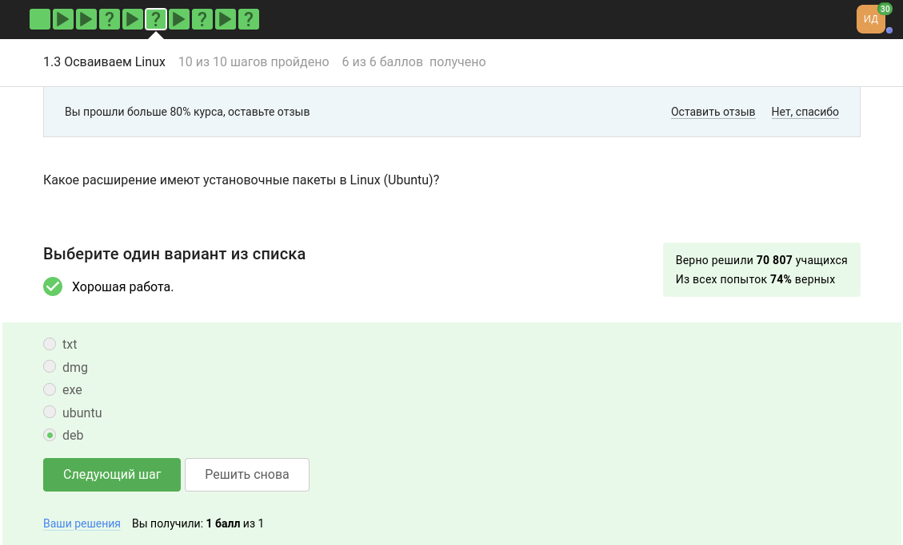
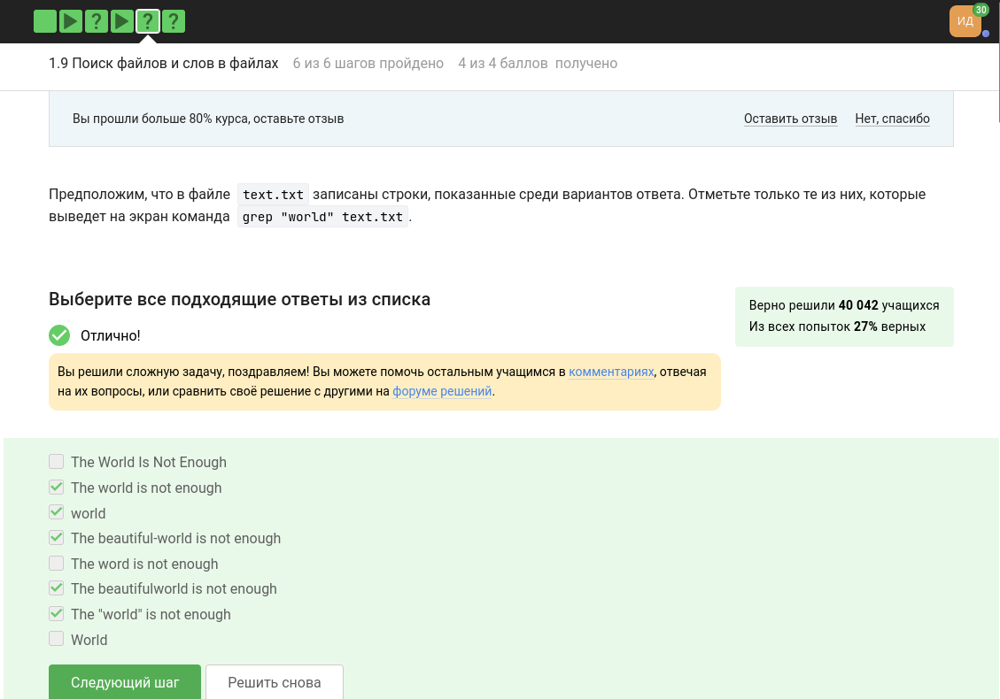
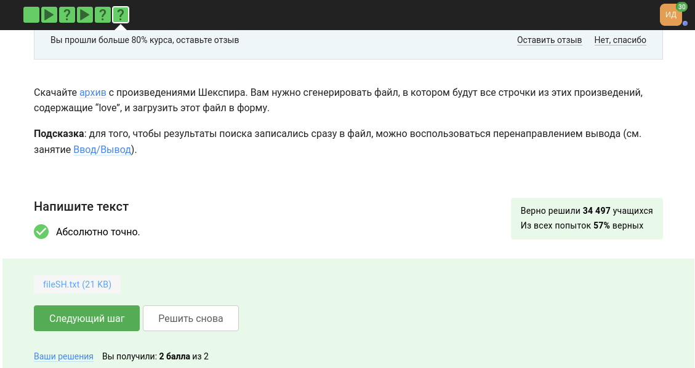

---
## Front matter
title: "Отчёт по прохождению внешнего курса на Stepik (этап 1)"
subtitle: "Введение в Linux"
author: "Дарья Эдуардовна Ибатулина"

## Generic otions
lang: ru-RU
toc-title: "Содержание"

## Bibliography
bibliography: bib/cite.bib
csl: pandoc/csl/gost-r-7-0-5-2008-numeric.csl

## Pdf output format
toc: true # Table of contents
toc-depth: 2
lof: true # List of figures
lot: true # List of tables
fontsize: 12pt
linestretch: 1.5
papersize: a4
documentclass: scrreprt
## I18n polyglossia
polyglossia-lang:
  name: russian
  options:
	- spelling=modern
	- babelshorthands=true
polyglossia-otherlangs:
  name: english
## I18n babel
babel-lang: russian
babel-otherlangs: english
## Fonts
mainfont: PT Serif
romanfont: PT Serif
sansfont: PT Sans
monofont: PT Mono
mainfontoptions: Ligatures=TeX
romanfontoptions: Ligatures=TeX
sansfontoptions: Ligatures=TeX,Scale=MatchLowercase
monofontoptions: Scale=MatchLowercase,Scale=0.9
## Biblatex
biblatex: true
biblio-style: "gost-numeric"
biblatexoptions:
  - parentracker=true
  - backend=biber
  - hyperref=auto
  - language=auto
  - autolang=other*
  - citestyle=gost-numeric
## Pandoc-crossref LaTeX customization
figureTitle: "Рис."
tableTitle: "Таблица"
listingTitle: "Листинг"
lofTitle: "Список иллюстраций"
lotTitle: "Список таблиц"
lolTitle: "Листинги"
## Misc options
indent: true
header-includes:
  - \usepackage{indentfirst}
  - \usepackage{float} # keep figures where there are in the text
  - \floatplacement{figure}{H} # keep figures where there are in the text
---

# Цель работы

  Пройти курс "Введение в Linux" на платформе [stepik.org] и получить сертификат. Для этого необходимо просмотреть видеоролики и выполнить задания, чтобы закрепить полученный материал. Процесс выполнения заданий требуется записать в виде скринкаста.

# Задание

  Пройти 3 этапа курса, записывая скринкасты, получить сертификат, сделать отчёт.

# Теоретическое введение

  Linux — это семейство операционных систем (ОС), работающих на основе одноименного ядра. Нет одной операционной системы Linux, как, например, Windows или MacOS. Есть множество дистрибутивов (набор файлов, необходимых для установки ПО), выполняющих конкретные задачи.
  
  Линус Торвальдс — первый разработчик и создатель Linux. Именно в честь него и была названа ОС. В 1991 году Линус начал работу над собственной ОС семейства Unix. Через три года появилась первая версия, доступная для скачивания. Но тогда она имела очень низкий спрос — ей пользовались буквально несколько человек. Только через 10 лет ОС Linux получила широкое распространение. Сообщество программистов подхватило идею свободного ПО, специалисты стали помогать развивать проект. В ходе курса я познакомлюсь с основными командами терминала, научусь работать с серверами, познаю текстовый редактор *vi/vim* и рисование графиков в *gnuplot*.

# Выполнение первого этапа курса

## Общая информация о курсе (1.1)

  Сначала авторизуемся на платформе [stepik.org] (рис. @fig:001).

{#fig:001 width=70%}

  Затем читаем введение к курсу: основным его правилом является самостоятельное и честное выполнение заданий. Дедлайнов нет, можно выполнять курс в любое удобное время. И переходим к первому вопросу: Как называется курс? Ответ: Введение в Linux (рис. @fig:002).
  
{#fig:002 width=70%}

  Теперь переходим к следующему заданию блока 1.1. Отмечаем все верные утверждения о курсе. Они касаются правил его прохождения, с которым я ознакомилась ранее (рис. @fig:003).
  
{#fig:003 width=70%}

## Как установить Linux (1.2)

  Первый блок первого этапа выполнен, переходим ко второму. Здесь требуется отметить, какую ОС обычно я использую. Отмечаю, что Windows (служит основной ОС на моём компьютере) и Linux (с ним я научилась работать в ходе прохождения курсов "Операционные системы" и "Архитектура компьютера") (рис. @fig:004).

{#fig:004 width=70%}

  Переходим к заданию 2 этого же блока. В нём нас спрашивают, что такое виртуальная машина. Отвечаю, что это специальная программа, предназначенная для запуска одной ОС на другой (у меня запускается Linux в виртуальной машине на Windows) (рис. @fig:005).
  
{#fig:005 width=70%}

  Далее отвечаем, что смогли запустить Линукс на своём компьютере (рис. @fig:006). Этот отчёт я делаю с Линукса.
  
{#fig:006 width=70%}

## Осваиваем Linux (1.3)

  Переходим к следующему разделу. Здесь требуется создать документ в OpenOffice/LibreOffice Writer (аналог Microsoft Word) и написать в нём шрифтом FreeMono одну-единственную строчку:

`Hello, Linux!`

  Я это сделала (рис. @fig:007), а затем сохранила документ в формате xml и отправила. Ответ засчитали.
  
{#fig:007 width=70%}

  Теперь нужно сказать, какое расширение имеют установочные пакеты в Linux (Ubuntu). Они имеют расширение *deb* (рис. @fig:008).
  
{#fig:008 width=70%}

  В следующем задании нужно поставитьсебе в систему плеер VLC (любым способом: через Software Center или скачиванием установочного пакета с сайта VLC). А затем запустить, открыть Help → About (или Shift+F1) и написать в поле ответа первую фамилию (без имени!) из вкладки Authors. Это Denis-Courmont (рис. @fig:009).
  
{#fig:009 width=70%}

  В последнем задании этого блока нужно выбрать, для чего используется Update Manager. Как очевидно из лекции к этому блоку, он используется для обновления ссылок в Software Center, для обновления установленных программ и для обновления всей системы до новой версии (рис. @fig:010).
  
{#fig:010 width=70%}

## Terminal: основы (1.4)

  В первом задании этого блока нужно выбрать все синонимы для “командной строки” (рис. @fig:011). Командную строку часто именуют консолью или терминалом.
  
{#fig:011 width=70%}

  Далее, мы уже начинаем изучать базовые команды терминала. Так, в следующем вопросе речь идёт о команде *pwd - print working directory*. Она напечатает в какой директории мы сейчас находимся. Печатаем её маленькими буквами, остальные варианты будут неверны (рис. @fig:012).
  
{#fig:012 width=70%}

  Затем нам нужно указать, какие команды полностью эквивалентны команде: *ls -A --human-readable -l /some/directory*. Из данного списка это команды *ls --almost-all --human-readable -l /some/directory* и *ls --human-readable -A  -l /some/directory* (рис. @fig:013).
  
{#fig:013 width=70%}

  Выполнить следующее задание можно, проверив все ниже приведённые команды у себя в терминале. Получаем, что в ответ записываем единственную из этого списка команду: *s /home/bi/Downloads* (рис. @fig:014).
  
{#fig:014 width=70%}

  Ещё из курса Операционных систем мы знаем, что для удаления директорий используется команда *rm -r* (рис. @fig:015).
  
{#fig:015 width=70%}

## Запуск исполняемых файлов (1.5)

  Чтобы запустить какую-либо программу через терминал, достаточно ввести её название. Вот и на это вопрос мы отвечаем, что,  если ввести в терминал команду firefox (для запуска одноименного браузера), а затем ввести туда же команду exit, то никто не закроется (рис. @fig:016). Команда exit в Linux используется для выхода из командной оболочки, в которой она запущена в данный момент, а так как мы запустили процесс в терминале, то никто не закроется.
  
{#fig:016 width=70%}

  Запуск программы с & (фоновый режим) эквивалентен запуску Ctrl+Z (приостановка программы), bg (её переход в фоновый режим) (рис. @fig:017).
  
{#fig:017 width=70%}

  Последнее задание блока звучит так: Скачайте файл с программой, сделайте его исполняемым (chmod +x), запустите (./*имя_программы*) и скопируйте то, что он выведет на экран, в форму ниже. (рис. @fig:018).
  
{#fig:018 width=70%}

## Ввод/вывод (1.6)

  По умолчанию поток ошибок выводится на экран, как мы узнаем из просмотренной лекции (рис. @fig:019).
  
{#fig:019 width=70%}

  Чтобы создать файл file.txt и записать в него поток ошибок программы program, нужно выполнить команду *program 2>> file.txt* - дозапись в файл, если он существует или *program 2> file.txt* - создание файла, если его не существует (рис. @fig:020).
  
{#fig:020 width=70%}

  Последнее задание блока звучит так: Куда деваются сообщения об ошибках (т.е. вывод в stderr) от тех программ, которые объединены в конвейер (pipe)? Для этого скачаем показанную на занятии программу interacter.py, создадим файл names.txt со списком имен (записав часть из них с ошибкой, т.е. с маленькой буквы) и построим конвейер, аналогичный тому, что был показан на видео. Запустим конвейер и посмотрим на результат! (рис. @fig:021). Мы видим, что сообщения об ошибках выводятся на экран.
  
{#fig:021 width=70%}

## Скачивание файлов из Интернета (1.7)
```
cd /home/alex/
wget -P /home/alex/Pictures -O 1.jpg http://example.com/example.jpg
```
  При выполнении следующих команд картинка окажется в директории */home/alex/1.jpg* (рис. @fig:022).
  
{#fig:022 width=70%}

  Изучив man по команде wget, мы понимаем, что, чтобы она не выводила никаких сообщений на экран (Resolving.., Connecting to.. и т.д.) необходимо передать опцию *-q* или *--quiet* (рис. @fig:023).
  
{#fig:023 width=70%}

   Если запустить `wget -r -l 1 -A jpg` и передать в качестве аргумента ссылку на эту web-страницу, то будут скачаны jpg и html файлы, но все html будут удалены (рис. @fig:024). Данная команда означает, что мы скачаем все файлы по ссылкам первого уровня, и только формата jpg.
   
{#fig:024 width=70%}

## Работа с архивами (1.8)

  Архиваторы gzip и zip отличаются тем, что gzip удаляет архив после его распаковки (рис. @fig:025).
  
{#fig:025 width=70%}

  Только архиваторы zip и tar могут создать архив из директории с файлами (рис. @fig:026).
  
{#fig:026 width=70%}

   Программе tar, чтобы запаковать файлы в *my_archive.tar.bz2* необходимо передать опции -cjf (f обозначает работу с файловой системой, с -создать (create), j - архив) (рис. @fig:027).
   
{#fig:027 width=70%}

## Работа с архивами (1.9)

  Маска команды find (*.jpg - другое расширение, *.?* - ? означает ровно 1 символ, *alexey.* - команда *find* чувствительна к регистру) НЕ найдет файл Alexey.jpeg (рис. @fig:028).
  
{#fig:028 width=70%}

  Команда *find* в данном случае вывдет только те строки, где world написан с маленькой буквы (рис. @fig:029).
  
{#fig:029 width=70%}

  Для генерации файла со строчками произведений Шекспира, содержащих слово *love*, ввожу в терминал следующий код:

```
tar -xzvf shakespeare.tar.gz
-F, --fixed-strings PATTERNS are strings
-r, --recursive like --directories=recurse
grep -Fr "love" Shakespeare/* > ~/Документы/stepik/fileSH.txt.txt   
```

   И отправляю сгенерированный файл в форму (рис. @fig:030).
   
{#fig:030 width=70%}

# Выводы

  В ходе выполнения первого этапа курса я научилась минимальным навыкам работы с ОС Linux (работа с консолью, запуск исполняемых файлов, архивация и распаковка архивов, перенаправление ввода и вывода, поиск файлов и скачивание файлов из Интернета).

# Список литературы{.unnumbered}

::: {#refs}
:::
