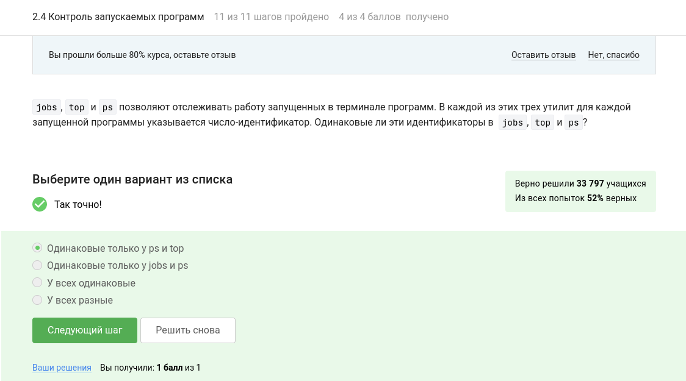

---
## Front matter
title: "Отчёт по прохождению внешнего курса на Stepik (этап 2)"
subtitle: "Введение в Linux"
author: "Дарья Эдуардовна Ибатулина"

## Generic otions
lang: ru-RU
toc-title: "Содержание"

## Bibliography
bibliography: bib/cite.bib
csl: pandoc/csl/gost-r-7-0-5-2008-numeric.csl

## Pdf output format
toc: true # Table of contents
toc-depth: 2
lof: true # List of figures
lot: true # List of tables
fontsize: 12pt
linestretch: 1.5
papersize: a4
documentclass: scrreprt
## I18n polyglossia
polyglossia-lang:
  name: russian
  options:
	- spelling=modern
	- babelshorthands=true
polyglossia-otherlangs:
  name: english
## I18n babel
babel-lang: russian
babel-otherlangs: english
## Fonts
mainfont: PT Serif
romanfont: PT Serif
sansfont: PT Sans
monofont: PT Mono
mainfontoptions: Ligatures=TeX
romanfontoptions: Ligatures=TeX
sansfontoptions: Ligatures=TeX,Scale=MatchLowercase
monofontoptions: Scale=MatchLowercase,Scale=0.9
## Biblatex
biblatex: true
biblio-style: "gost-numeric"
biblatexoptions:
  - parentracker=true
  - backend=biber
  - hyperref=auto
  - language=auto
  - autolang=other*
  - citestyle=gost-numeric
## Pandoc-crossref LaTeX customization
figureTitle: "Рис."
tableTitle: "Таблица"
listingTitle: "Листинг"
lofTitle: "Список иллюстраций"
lotTitle: "Список таблиц"
lolTitle: "Листинги"
## Misc options
indent: true
header-includes:
  - \usepackage{indentfirst}
  - \usepackage{float} # keep figures where there are in the text
  - \floatplacement{figure}{H} # keep figures where there are in the text
---

# Цель работы

  Пройти курс "Введение в Linux" на платформе [stepik.org] и получить сертификат. Для этого необходимо просмотреть видеоролики и выполнить задания, чтобы закрепить полученный материал. Процесс выполнения заданий требуется записать в виде скринкаста. Данный отчёт содержит прохождение второго этапа курса.

# Задание

  Пройти 3 этапа курса, записывая скринкасты, получить сертификат, сделать отчёт.

# Теоретическое введение

  Linux — это семейство операционных систем (ОС), работающих на основе одноименного ядра. Нет одной операционной системы Linux, как, например, Windows или MacOS. Есть множество дистрибутивов (набор файлов, необходимых для установки ПО), выполняющих конкретные задачи.
  
  Линус Торвальдс — первый разработчик и создатель Linux. Именно в честь него и была названа ОС. В 1991 году Линус начал работу над собственной ОС семейства Unix. Через три года появилась первая версия, доступная для скачивания. Но тогда она имела очень низкий спрос — ей пользовались буквально несколько человек. Только через 10 лет ОС Linux получила широкое распространение. Сообщество программистов подхватило идею свободного ПО, специалисты стали помогать развивать проект.

    В ходе курса я познакомлюсь с основными командами терминала, научусь работать с серверами, познаю текстовый редактор *vi/vim* и рисование графиков в *gnuplot*.

# Выполнение лабораторной работы

## Знакомство с сервером (2.1)

  Приступаю к выполнению первого задания данного блока. Требуется отметить, для каких задач можно использовать удаленный сервер. Просмотрев видеолекцию, отвечаю, что он используется для выполнения сложных (затратных по памяти и времени) вычислений, хранения общедоступных данных (например, доступных для всех пользователей интернета), хранения конфиденциальных данных (т.е. доступ к ним должны иметь только ограниченный круг лиц) и хранения больших объемов данных, т.е. все варианты ответов верны (рис. @fig:001).

{#fig:001 width=70%}

  Далее, требуется выбрать, какой из этих ключей можно без опаски пересылать по интернету: id_rsa и id_rsa.pub. Первый ключ - приватный, его нельзя никому передавать и показывать, а второй - публичный, то есть его мы и выберем в качестве правильного варианта ответа (рис. @fig:002).

{#fig:002 width=70%}

  Теперь необходимо поработать с сервером. задание звучит так (рис. @fig:003):
  
{#fig:003 width=70%}
  
  Вводим в онлайн-терминал следующие команды по очереди:
  
```
ssh server1.stepik-local  # заходим на сервер, используем логин box, а пароль supersecret, порт не указываем
cat /srv/files_on_server/secret  # выводим содержимое файла на удалённом сервере
# I hacked ssh! -  искомая фраза, которую выдал терминал. Её нужно запоминть или записать куда-то.
exit  # выходим с сервера
echo "I hacked ssh" > /home/box/secret  # записываем искомую фразу в **локальный** файл
```

## Обмен файлами (2.2)

  Первое задание звучит так: какая команда скопирует на сервер (в домашнюю директорию) папку stepic вместе с содержимым ее самой и всех ее подпапок? Ответ: это выполнит команда `scp -r stepic username@server:~/`, где опция -r указывает на то, что мы копируем именно директорию вместе со всем её содержимым, stepic - имя директории, scp - команда копирования с сервера, username@server - логин и пароль для доступа к серверу, :~/ - домашняя директория (двоеточие отвечает за то, что мы указываем после него, куда мы копируем) (рис. @fig:004).
  
{#fig:004 width=70%}

  Далее, нам нужно указать, какие действия могут устранить проблему, если при установке программы с помощью команды `sudo apt-get install program` терминал сообщает, что он не может найти и загрузить установочный пакет. Из предложенных вариантов ответа нам подойдут 1 и 3:

1. sudo apt-get update;
2. sudo apt-get upgrade;
3. Проверка интернет соединения и его установка, если соединения нет;
4. sudo apt-get install --only-upgrade program.

  В видео сказано, что первая команда обновит ссылки на пакеты, и тогда терминал их найдёт и обновит программу. Также, самое простое решение - проверить, есть ли проблемы с Интернетом (рис. @fig:005).
  
{#fig:005 width=70%}

   Для чего можно использовать программу Filezilla? - так выглядит следующее задание блока. Посмотрев видеолекцию, отвечаем, что она используется для копирования файлов со своего компьютера на сервер, просмотра содержимого директорий на своем компьютере и копирования файлов с сервера на свой компьютер (рис. @fig:006).
  
{#fig:006 width=70%}

  Последнее задание с онлайн-терминалом. Звучит оно так (рис. @fig:007):
  
{#fig:007 width=70%}

  Для его выполнения введём в терминал следующие команды по очереди:

```
mkdir files_on_client  # создаём директорию, в которой будут лежать файлы
scp -r box@server1.stepik-local:/srv/files_on_server/* /home/box/files_on_client/
# копируем файлы с удалённого сервера в локальный репозиторий
```

## Запуск приложений (2.3)

   Первое задание выглядит так: что можно сделать, если требуется запустить на сервере программу, для работы которой нужен не терминал, а экран? Варианты проверки наличия версии этой программы специально для терминала и настройка сервера так, чтобы он поддерживал вывод информации на экран компьютера являются правильными (рис. @fig:008).

{#fig:008 width=70%}

  Из видеолекции мы узнаём, что для доступа к справочной информации какой-либо программы использовать можно либо команду man, help (--help, -help, -h) (рис. @fig:009).

{#fig:009 width=70%}

  Нужно узнать, какие форматы данных программа FastQC, про которую говорили в лекции, может принимать на вход. Открываем хелп по ней, перенаправляемся в браузер и читаем (рис. @fig:010), а затем выбираем подходящие ответы из списка (рис. @fig:011):
  
{#fig:010 width=70%}

{#fig:011 width=70%}

  Для выполнения следующего задания (рис. @fig:012) необходимо скачать приложенный к заданию файл, установить программу Clustalw. Затем воспользовать хелпом по программе и найти команду, которая запускает в терминале Clustal на файле test.fasta и выполняет множественное выравнивание (multiple alignment). Это команда:

```
clustalw test.fasta  -align
```
  
{#fig:012 width=70%}

## Контроль запускаемых процессов (2.4)

   Первое задание выглядит так: Предположим вы запустили программы program1, program2 и program3 в фоновом режиме. После этого вы выполнили следующие действия:
1. fg %1 - отправили программу с идентификатором 1 в фоновый режим
2. Ctrl+С - остановили этот процесс
3. fg %2 - отправили программу с идентификатором 2 в фоновый режим
4. Ctrl+Z - приостановили этот процесс
5. jobs - вывели на экран список запущенных процессов

  При выполнении последней команды система покажет нам, что лишь процессы 2 и 3 запущены. Процесс 1 не будет отображаться, поскольку его мы полностью остановили (рис. @fig:013).

{#fig:013 width=70%}

  Из видеолекции мы узнаём, что PID - идентификаторы запущенных процессов одинаковы только у ps и top (рис. @fig:014).

{#fig:014 width=70%}

  С помощью команды `kill -9` можно мгновенно завершить остановленный процесс (рис. @fig:015). kill без опций остановит запущенный процесс, а про команду kill с опцией 18 не говорилось ничего.

{#fig:015 width=70%}

  Для выполнения следующего задания нужно ответить на вопрос: Что произойдет, если использовать kill (без опций) по отношению к процессу, который был приостановлен при помощи Ctrl+Z? Команда kill без опций остановит запущенный процесс, поэтому сначала нужно этот процесс возобновить (продолжить). (рис. @fig:016).

{#fig:016 width=70%}

## Многопоточные приложения (2.5)

   Поскольку приложение остановлено, оно не использует ресурсы процессора (рис. @fig:017).

{#fig:017 width=70%}

  А вот памяти оно потребляет столько же, сколько и в момент остановки (рис. @fig:018).

{#fig:018 width=70%}

  Из лекции мы узнаём, что принудительно завершить один из потоков запущенного многопоточного приложения никак нельзя (рис. @fig:019).

{#fig:019 width=70%}

  В следующем задании идёт речь о программе bowtie2. Запуск bowtie2 состоит из двух шагов - сначала запускаем подпрограмму bowtie2-build, а затем подпрограмму bowtie2. Из этих шагов можно выполнить в несколько потоков обе подпрограммы, как указано в документации.
  Приведу выдержку из документации к этой программе:
  
`--threads <int>` 
  By default bowtie2-build is using only one thread. Increasing the number of threads will speed up the index building considerably in most cases.
  
  Однако, в курсе ответ *Оба* является неверным, скорее всего потому, что курс устарел. Но, отметив вариант *Только bowtie2* как правильный, получаем свой балл (рис. @fig:020).

{#fig:020 width=70%}

  Задание звучит так (рис. @fig:021):

{#fig:021 width=70%}

  Для того, чтобы выполнить его, сделаем следующее:
 
1. Скачаем архив bowtie2 версия для 64-разрядного Linux из первого слайда (т.к. у меня 64-разрядный процессор).

2. Скачиваем референсный геном и риды со слайда с этим заданием (нужные файлы).

3. Распаковываем архив bowtie2-2.1.0-linux-x86_64.zip с помощью команды unzip (т.к. расширение у архива *zip*).

4. Переместим скачанные файлы reference.fasta и архив reads.fastq.gz в директорию с распакованным bowtie2-2.1.0.

5. Распаковываем архив reads.fastq.gz с помощью команды gunzip (т.к. архив имеет расширение gz).

6. Запускаем программу (команда `./bowtie2-build` - первый шаг) с нужным файлом и индексом (см. уроки и описание задания).

7. Запускаем программу `./bowtie2` - второй шаг с индексом и вторым файлом (см. уроки и описание задания). Лог записываем в один файл, ошибки в другой, пользуясь перенаправлением ввода-вывода из предыдущих уроков.

8. Добавляем в форму файл с ошибками (т.к. именно его требуется загрузить).

  Получаем баллы за это задание и двигаемся дальше.
  
## Менеджер терминалов tmux (2.6)

  На этом занятии мы рассмотрим менеджер терминалов tmux. Это специальная программа, которая может объединять в себе несколько терминалов, каждый из которых содержит свои процессы. Важная особенность tmux заключается в том, что если запустить его на сервере, то он будет помнить историю запусков процессов и они продолжат выполнение даже если соединение с сервером будет потеряно. Кроме того, при новом соединении с сервером можно будет подключиться к уже запущенному tmux и продолжить работу с момента потери связи.

   Задание 1: Вы открыли две вкладки в терминале. В одной из них вы запустили процесс и приостановили его. Переключившись во вторую вкладку и набрав `fg`, вы добьётесь следующего: 
   
* Процесс вернется к работе в исходной вкладке
* Процесс переместится во вторую вкладку, но останется в режиме "приостановки"
* Терминал сообщит, что нет процесса для запуска в fg
* Процесс переместится во вторую вкладку и продолжит работу 
   
  Проделав данные действия, я обнаружила, что терминал сообщит, что нет процесса для запуска в fg, поскольку вкладки здесь работают независимо друг от друга (как вкладки браузера) (рис. @fig:023).

{#fig:023 width=70%}

  Задание 2: Предположим, что в tmux осталась последняя открытая вкладка. Что произойдет, если вы введете в этой вкладке в командную строку команду `exit`? Ответ: tmux завершит работу (рис. @fig:024).

{#fig:024 width=70%}

  Следующее задание звучит так: Предположим, что вы открыли терминал, зашли в нем на сервер, запустили на этом сервере tmux и начали работу в нем. Что произойдет, если вы теперь закроете терминал? Если терминал закрыть, то соединение с сервером будет утеряно, однако tmux продолжит работу (рис. @fig:025).

{#fig:025 width=70%}

  Задание: Что произойдет, если запустить процесс в фоновом режиме в одной из вкладок tmux, а затем принудительно закрыть эту вкладку (Ctrl+B, X)? Так как вкладки не связаны друг с другом, то закроется и вкладка, и запущенный в ней в фоновом режиме процесс (рис. @fig:026).

{#fig:026 width=70%}

  Задание звучит так (рис. @fig:027):

{#fig:027 width=70%}

  В справке написано, что ответ: ctrl+b и , (рис. @fig:028).
  
{#fig:028 width=70%}

  В задании необходимо поработать со справкой по tmux и отметить все верные утверждения (рис. @fig:029).
  
{#fig:029 width=70%}

  Таким образом, выбираем утверждения 1, 4, 6 (рис. @fig:030).
  
{#fig:030 width=70%}

# Выводы

  В результате выполнения второго этапа курса я научилась работать с tmux, просматривать запущенные процессы, познакомилась с работой на сервере и запуском многопоточных приложений.

# Список литературы{.unnumbered}

::: {#refs}
:::
