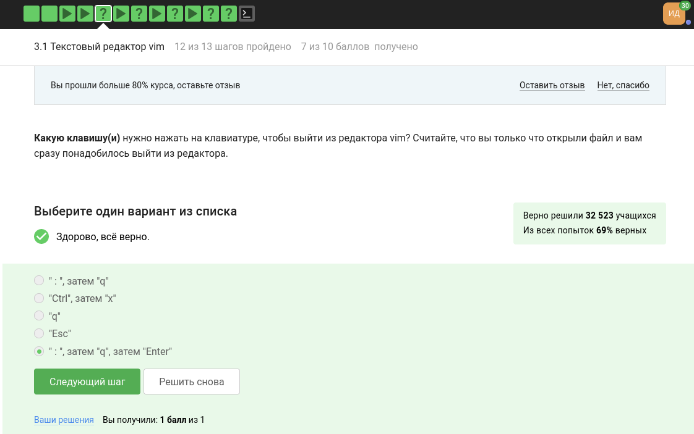
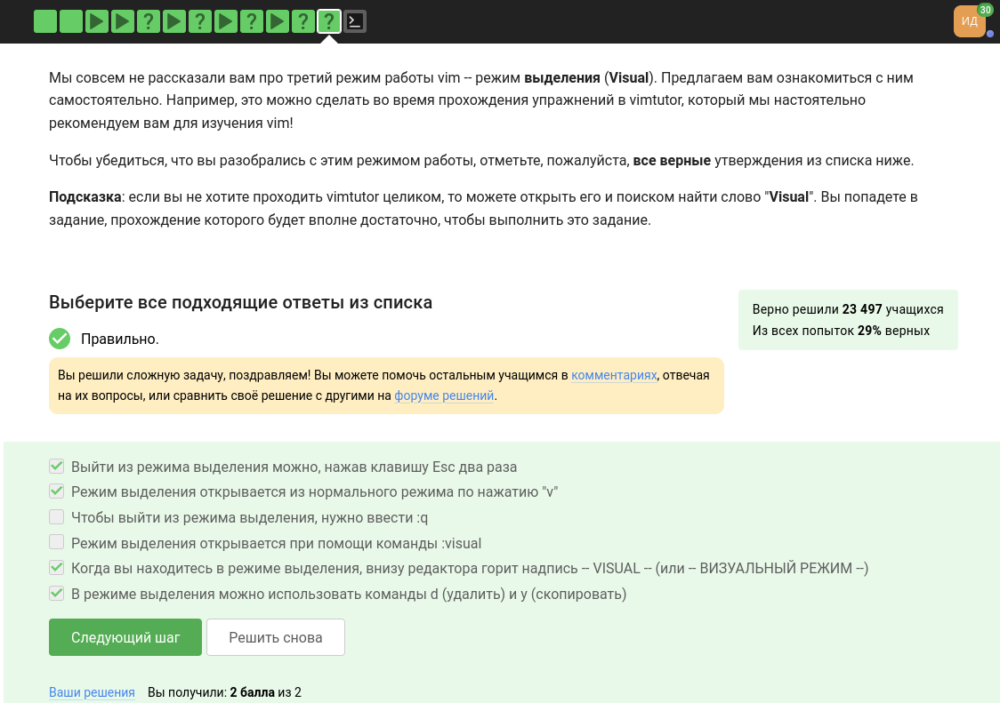

---
## Front matter
title: "Отчёт по прохождению внешнего курса на Stepik (этап 3)"
subtitle: "Введение в Linux"
author: "Дарья Эдуардовна Ибатулина"

## Generic otions
lang: ru-RU
toc-title: "Содержание"

## Bibliography
bibliography: bib/cite.bib
csl: pandoc/csl/gost-r-7-0-5-2008-numeric.csl

## Pdf output format
toc: true # Table of contents
toc-depth: 2
lof: true # List of figures
lot: true # List of tables
fontsize: 12pt
linestretch: 1.5
papersize: a4
documentclass: scrreprt
## I18n polyglossia
polyglossia-lang:
  name: russian
  options:
	- spelling=modern
	- babelshorthands=true
polyglossia-otherlangs:
  name: english
## I18n babel
babel-lang: russian
babel-otherlangs: english
## Fonts
mainfont: PT Serif
romanfont: PT Serif
sansfont: PT Sans
monofont: PT Mono
mainfontoptions: Ligatures=TeX
romanfontoptions: Ligatures=TeX
sansfontoptions: Ligatures=TeX,Scale=MatchLowercase
monofontoptions: Scale=MatchLowercase,Scale=0.9
## Biblatex
biblatex: true
biblio-style: "gost-numeric"
biblatexoptions:
  - parentracker=true
  - backend=biber
  - hyperref=auto
  - language=auto
  - autolang=other*
  - citestyle=gost-numeric
## Pandoc-crossref LaTeX customization
figureTitle: "Рис."
tableTitle: "Таблица"
listingTitle: "Листинг"
lofTitle: "Список иллюстраций"
lotTitle: "Список таблиц"
lolTitle: "Листинги"
## Misc options
indent: true
header-includes:
  - \usepackage{indentfirst}
  - \usepackage{float} # keep figures where there are in the text
  - \floatplacement{figure}{H} # keep figures where there are in the text
---

# Цель работы

  Пройти курс "Введение в Linux" на платформе [stepik.org] и получить сертификат. Для этого необходимо просмотреть видеоролики и выполнить задания, чтобы закрепить полученный материал. Процесс выполнения заданий требуется записать в виде скринкаста.

# Задание

  Пройти 3 этапа курса, записывая скринкасты, получить сертификат, сделать отчёт.

# Теоретическое введение

  Linux — это семейство операционных систем (ОС), работающих на основе одноименного ядра. Нет одной операционной системы Linux, как, например, Windows или MacOS. Есть множество дистрибутивов (набор файлов, необходимых для установки ПО), выполняющих конкретные задачи.
  
  Линус Торвальдс — первый разработчик и создатель Linux. Именно в честь него и была названа ОС. В 1991 году Линус начал работу над собственной ОС семейства Unix. Через три года появилась первая версия, доступная для скачивания. Но тогда она имела очень низкий спрос — ей пользовались буквально несколько человек. Только через 10 лет ОС Linux получила широкое распространение. Сообщество программистов подхватило идею свободного ПО, специалисты стали помогать развивать проект. В ходе курса я познакомлюсь с основными командами терминала, научусь работать с серверами, познаю текстовый редактор *vi/vim* и рисование графиков в *gnuplot*.

# Выполнение лабораторной работы

## Текстовый редактор vim (3.1)
 
  Какую клавишу(и) нужно нажать на клавиатуре, чтобы выйти из редактора vim? Считайте, что вы только что открыли файл и вам сразу понадобилось выйти из редактора. Чтобы это сделать, нужно написать: `:q` и нажать <Enter>, а чтобы редактор не спрашивал, нужно ли сохранять файл или нет, нужно было бы ещё добавить `!` после q. Однако, так как в задании сказано, что мы сразу выходим из редактора, ничего в нём не написав, то достаточно команды `:q` (рис. @fig:001).

{#fig:001 width=70%}

  Далее, нам требуется посмотреть, какие есть различия между word и WORD в vim (рис. @fig:002).

{#fig:002 width=70%}

  И отметит затем все верные утверждения про данную строку:
  
```
Strange_  TEXT  is_here. 2=2 YES!
```

  Сопоставив информацию в справке и данное задание, отмечаем верные утверждения (рис. @fig:003):
  
{#fig:003 width=70%}

  Следующее задание: нужно выбрать, какие нажатия клавиш преобразуют одну строку в другую. Данное задание можно выполнить как аналитически, так и проверить в своём vim. Я выбрала второй вариант, попробовала ввести все варианты (рис. @fig:004) и получила следующие правильные ответы (рис. @fig:005):
  
{#fig:004 width=70%}

{#fig:005 width=70%}

  Затем переходим к выполнению следующего задания: 

Предположим, что вы открыли файл в редакторе vim и хотите заменить в этом файле все строки, содержащие слово Windows, на такие же строки, но со словом Linux. Если в какой-то строке слово Windows встречается больше, чем один раз, то заменить на Linux в этой строке нужно только самое первое из этих слов.

Какую команду нужно ввести для этого в vim? Укажите необходимую команду целиком (т.е. включая ввод ":" в самом начале), однако нажатие на Enter после ввода команды обозначать никак не нужно.

  Для этого я проделала множество попыток в своём vim, и нашла соответствующую команду: `:%s/Windows/Linux` (рис. @fig:006).
  
{#fig:006 width=70%}

  Ответ верный (рис. @fig:007).
  
{#fig:007 width=70%}

  Итак, следующее задание: необходимо самостоятельно ознакомиться с режимом выделения в vim, почитав [документацию](https://vimdoc.sourceforge.net/htmldoc/visual.html "Ссылка на документацию vim") в Интернете, и отметить все верные утверждения (рис. @fig:008):
  
{#fig:008 width=70%}

## Скрипты на bash: основы (3.2)

  Первое задание звучит следующим образом: Предположим, что вы открыли терминал и у вас в нем запущена оболочка bash. Вы набираете в ней команды А1, А2, А3, а затем запускаете оболочку sh. В этой оболочке вы набираете команды B1, В2, В3 и запускаете оболочку bash. И, наконец, в этой последней оболочке вы набираете команды С1, С2, С3. Если теперь вы попробуете при помощи стрелочек вверх/вниз перемещаться по истории набранных команд, то команды из какого набора(ов) будут появляться? На своём компьютере я провела эксперимент (рис. @fig:009), и выяснила, что будут появляться команды из последнего набора, т.е. набора С (рис. @fig:010).
  
{#fig:009 width=70%}

{#fig:010 width=70%}

  Далее, следующее задание.
  
  Предположим, что вы находитесь в директории `/home/bi/Documents/` и запускаете в ней скрипт следующего содержания:

```#!/bin/bash

cd /home/bi/  # сейчас мы в папке bi
touch file1.txt  # создаём в ней файл file1.txt
cd /home/bi/Desktop/  # а теперь мы в директории bi/Desktop/
```

  Как будет выглядеть абсолютный путь до созданного файла file1.txt по окончанию работы скрипта? Ответ: `/home/bi/file1.txt` (рис. @fig:011).

{#fig:011 width=70%}

  Из видеоурока мы узнали, что имена переменных в bash могут включать цифры и символы - и _, однако **не** могут **начинаться с цифр** и содержать любые другие символы, кроме разрешённых. Соответственно, отмечаем все подходящие варианты (рис. @fig:012).
  
{#fig:012 width=70%}

  В следующем задании требуется написать скрипт на bash, который принимает на вход два аргумента и выводит на экран строку следующего вида:

```Arguments are: $1=первый_аргумент $2=второй_аргумент
```
  Ответ на задачу будет выглядеть так (рис. @fig:013):
```
echo "Arguments are:" \$1=$1 \$2=$2
```

{#fig:013 width=70%}

## Скрипты на bash: ветвления и циклы (3.3)

  Задание 1 звучит так (рис. @fig:014):
  
{#fig:014 width=70%}

  Разберём все варианты ответа:
  
* !(4 -le 3)  # !(4 <= 3), т.е. 4 > 3
* $# -ge 0  # $# считает общее число аргументов, `-ge 0` означает, что оно >= 0
* -s $0  # размер скрипта больше 0
* 5 -ge 5  # 5 >= 5
* -n $0  # имя скрипта - не пустая строка
* -e $0  # путь к скрипту существует

  Все они подходят под условие задачи, поэтому отмечаем их все (рис. @fig:015).

{#fig:015 width=70%}

  Далее, следующее задание.
  
  Изучим скрипт:

```if [[ $var -gt 5 ]] # если var > 5
then
  echo "one" # то печатаем "one"
elif [[ $var -lt 3 ]] # если var < 3
then
  echo "two" # то печатаем "two"
elif [[ $var -eq 4 ]] # если var = 4
then
  echo "three" # то печатаем "three"
else
  echo "four" # иначе печатаем "four"
fi
```

  Какие строки и в какой последовательности он выведет на экран, если сначала этот скрипт запустили задав переменную var=3, а затем запустили еще раз, но уже с var=5? Если var = 3, то напечатается следующее: *four*, если же var=5, то напечатается *four*. Ответ: four, four (рис. @fig:016).

{#fig:016 width=70%}

   В следующем задании нужно написать Напишите скрипт на bash, который принимает на вход один аргумент (целое число от 0 до бесконечности), который будет обозначать число студентов в аудитории. В зависимости от значения числа нужно вывести разные сообщения. 
Соответствие входа и выхода должно быть таким:

```0 -->  No students
1 -->  1 student
2 -->  2 students
3 -->  3 students
4 -->  4 students
5 и больше --> A lot of students
```
  
  Вот какой скрипт получился у меня, и система засчитала его как верный. Также я проверила работу данного скрипта в своём терминале и убедилась, что он работает корректно (рис. @fig:017).

```
if [[ $1 -eq 1 ]]; then
    echo "$1 student"
elif [[ $1 -gt 1 && $1 -le 4 ]]; then
    echo "$1 students"
elif [[ $1 -ge 5 ]]; then
    echo "A lot of students"
else
    echo "No students"
fi
```

{#fig:017 width=70%}

  В следующем задании требуется проанализировать скрипт на bash и ответить на вопрос по нему (рис. @fig:018):

{#fig:018 width=70%}

  Запустив этот скрипт на своём компьютере (рис. @fig:019), отмечаем правильный ответ.
  
{#fig:019 width=70%}

  В заключительном задании этого блока требуется написать скрипт (рис. @fig:020):
  
{#fig:020 width=70%}


```

while [[ 1==1 ]]

do
        group=""
        
        echo "enter your name:"
        
        read name # читаем имя
        
        if [[ -z $name ]] # если строка пустая
        
        then
        
                break # то выходим из цикла
        
        fi
        
        echo "enter your age:"
        
        read age # читаем возраст
        
        if [[ $age -eq 0 ]] # если возраст равен 0
        
        then
        
                break # то выходим из цикла
                
        fi
        
        if [[ $age -le 16 ]] # если возраст <= 16
        
        then
        
                group="child" # то группа: child
                
        elif [[ $age -le 25 ]] # если же 16 < возраст <= 25
        
        then
        
                group="youth" # то группа: youth
                
        else # иначе (если возраст > 25)
        
                group="adult" # группа: adult
                
        fi
        
        echo "$name, your group is $group"

done

echo "bye"

```

## Скрипты на bash: разное (3.4)

  Задание 1 звучит так: Какие(ая) из предложенных ниже инструкций увеличат значение переменной а на значение переменной b? Например, если в а было записано 10, в b было 5, то в а должно записаться 15. 
Выберите все подходящие варианты! Варианты ответов:

1. let "a+=b"
2. let a=a+b
3. let "a=+b"
4. let "a = a + b"
5. let a = a + b 

  Из предложенных вариантов нам подходят 1, 2 и 4 (рис. @fig:021):
  
{#fig:021 width=70%}

  Задание 2 такое: 
  
  *Пусть вы находитесь в директории /home/bi/Documents/ и запускаете в ней скрипт следующего содержания:*

```#!/bin/bash

cd /home/bi/  # переход в директорию /home/bi/
echo "`pwd`"  # вывод текущей директории
```

  Что в этом случае выведет команда `echo` на экран?

  Разберём все варианты ответа:

* /home/bi/Documents
* Код возврата команды pwd (0 в случае успешного выполнения и не 0 в случае ошибок)
* /home/bi
* pwd
* `pwd` 

  Проверим работу данной программы на своём терминале, предварительно заменив строку `/home/bi/` на `/home/deibatulina/` (рис. @fig:022). Под условие задачи подходит ответ 3, поэтому и отмечаем его.

{#fig:022 width=70%}

  Переходим к следующему заданию блока:
  
  *Мы рассказали, что можно проверить код возврата внешней программы прямо в конструкции if при помощи if `program options arguments` (действия внутри if выполнятся, если программа закончилась с кодом 0). Однако это не всегда правда! Если запуск внешней программы выводит что-то в stdout, то в проверку if поступит именно этот вывод, а не код возврата! Вы можете убедиться в этом, написав простой bash-скрипт с использованием, например, if `pwd`.*

  *Однако как быть, если хочется всё-таки запустить программу program, которая пишет что-то в stdout и потом выполнить какие-то действия если ее код возврата равен 0? Выберите все верные утверждения или правильно работающие конструкции if.*

  *Если в косых кавычках просто записано название программы, то отработает программа (и в if пойдет результат отработки программы, т.е. то, что выводится в stdout). Если же в косых кавычках помимо названия программы есть еще что-то: `pwd > file.txt`, то в if будет попадать именно код завершения. При этом квадратные скобки не нужны.*
  
  Разберём все варианты ответа:
  
* if `program > some_file.txt` # нам подходит
* Сначала var=`program` (это результат stdout), затем if [[ $var -eq 0 ]]  # не подходит
* Ничего сделать нельзя  # один верный вариант уже нашёлся значит, этот вариант не подходит
* Сначала запустить program, затем if [[ $? -eq 0 ]]  # код завершения программы пойдёт в if, подходит
* if [[ `program` -eq 0 ]] # не подойдёт, т.к. в if пойдёт результат stdout

  Таким образом, отмечаем варианты 1 и 4 и оказываемся правы.
  
  Следующий номер:
  *Посмотрите на функцию из bash-скрипта:*

```counter ()  # takes one argument
{
  local let "c1+=$1"
  let "c2+=${1}*2"
} 
```
 
  *Впишите в форму ниже строку, которую выведет на экран команда echo "counters are $c1 and $c2" если она находится в скрипте после десяти вызовов функции counter с параметрами сначала 1, затем 2, затем 3 и т.д., последний вызов с параметром 10.*

  Разбираем работу функции по шагам: c1 - локальная переменная, обратиться к ней вне функции нельзя, а что касается переменной c2, она не локальная, поэтому обратиться к ней вне функции можно: 1-м шаге (при вызове функции с параметром 1) c2 = 2, на 2-м: c2 = 2 + 2 * 2 = 6, на 3-м: c2 = 6 + 3 * 2 = 12, и т.д. На 10-м шаге значение c2 будет равно 110, поэтому искомая строка будет выглядеть так: `counters are and 110`.
  
  Вводим искомую строку в поле ответа, и получаем, что ответ верен (рис. @fig:023).
  
{#fig:023 width=70%}

  Задание с онлайн-терминалом:
  
  *Напишите скрипт на bash, который будет искать наибольший общий делитель (НОД, greatest common divisor, GCD) двух чисел. При запуске ваш скрипт не должен ничего писать на экран, а просто ждет ввода двух натуральных чисел через пробел (для этого можно использовать read и указать ему две переменные -- см. пример в видеофрагменте). После ввода чисел скрипт считает их НОД и выводит на экран сообщение "GCD is <посчитанное значение>", например, для чисел 15 и 25 это будет "GCD is 5". После этого скрипт опять входит в режим ожидания двух натуральных чисел. Если в какой-то момент работы пользователь ввел вместо этого пустую строку, то нужно написать на экран "bye" и закончить свою работу.* 

  *Вычисление НОД несложно реализовать с помощью алгоритма Евклида. Вам нужно написать функцию gcd, которая принимает на вход два аргумента (назовем их M и N). Если аргументы равны, то мы нашли НОД -- он равен M (или N), нужно выводить соответствующее сообщение на экран (см. выше). Иначе нужно сравнить аргументы между собой. Если M больше N, то запускаем ту же функцию gcd, но в качестве первого аргумента передаем (M-N), а в качестве второго N. Если же наоборот, M меньше N, то запускаем функцию gcd с первым аргументом M, а вторым (N-M).*

  Напишем скрипт и объясним его:

```

while [ true ] # пока верно

do

    read n1 n2 # считываем n1, n2
    
if [ -z $n1 ]; then # условие: если пользователь ничего не ввёл или ввёл пустую строку, то

    echo "bye"  # прощаемся с ним
    
    break
    
else # иначе

    gcd () { # вызываем функцию gcd внутри себя самой
    
    remainder=1 # остаток = 1
    
    if [ $n2 -eq 0 ] условие: если n2 = 0, то
    
    then
    
    echo "bye" # прощаемся с ним
    
    fi
    
    while [ $remainder -ne 0 ] # пока остаток не равен 0
    
    do
    
    remainder=$((n1%n2)) # находим остаток от деления n1 на n2 
    
    n1=$n2 # приравниваем теперь n1 к n2
    
    n2=$remainder # а n2 - это теперь остаток
    
    done # конец do
    
    }
    
    gcd $1 $2 # НОД от n1 n2
    
    echo "GCD is $n1" # выводим НОД

fi

done # конец do

```

  Система приняла код (рис. @fig:024).
  
{#fig:024 width=70%}


## Продвинутый поиск и редактирование (3.5)

  *Первое задание такое:* 

  *Пусть в директории /home/bi лежат файлы Star_Wars.avi, star_trek_OST.mp3, STARS.txt, stardust.mpeg, Eddard_Stark_biography.txt.*

  *Отметьте все файлы, которые найдет команда find /home/bi -iname "star*", но НЕ найдет команда find /home/bi -name "star*"?*

  **Объяснение: star* означает, что до слова никаких символов быть не может, а после слова может идти бесконечное количество символов. Также опция -iname ищет без учёта регистра, а просто -name - с учётом регистра.**
  
  Варианты:
  
* stardust.mpeg - найдут обе команды


* star_trek_OST.mp3 - найдут обе команды
* STARS.txt - найдёт только первая команда
* Star_Wars.avi - найдёт только первая команда
* Eddard_Stark_biography.txt - не найдёт ни первая, ни вторая команды

  Выбираем подходящие нам ответы и получаем сообщение о том, что всё мы сделали правильно (рис. @fig:025).
  
{#fig:025 width=70%}

  В следующем задании нужно отметить все верные утверждения об опциях команды `find`: `-path` и `-name`. Давайте сделаем это, воспользовавшись документацией об этой команде и её опциях, набрав в терминале `man find` (рис. @fig:026).
  
{#fig:026 width=70%}

  Следующее задание (рис. @fig:027).
  
{#fig:027 width=70%}
  
  Текущий каталог - это depth=1, а остальное считается просто:

/home/bi   -> depth=1

/home/bi/dir1   -> depth=2

/home/bi/dir1/dir2   -> depth=3

  Поэтому, правильный ответ - все кроме file3.
  
  Переходим к следующему заданию: необходимо выбрать ту команду, после выполнения которой создастся файл с наибольшим количеством строк в нём. Для выполнения задания прочитаем мануал по команде grep и её опциям -A, -B, -C (рис. @fig:028).
 
{#fig:028 width=70%}

  Пятое задание данного блока: (рис. @fig:029).
 
{#fig:029 width=70%}

  Итак, выполним данное задание у себя в Linux (рис. @fig:030).
 
{#fig:030 width=70%}

  Итак, для выполнения следующего задания (рис. @fig:031) нам потребуется знать это:
  
  *После обработки каждой строки sed выводит ее в выходной поток. Ключ -n запрещает это, т.е. обработанная строка не будет выводиться второй раз. Если мы уберём опцию -n, то это значит, что каждая строка будет выведена 2 раза.*

{#fig:031 width=70%}

  Делаем последнее задание данного раздела (рис. @fig:032):
  
{#fig:032 width=70%}

  Таким образом, ответ будет таким:
  
`sed 's/ [A-Z]\{2,\} / abbreviation /g' input.txt > edited.txt'` 

  Объяснение:

`''` регулярное выражение

`s` замена регулярного выражения

`\` перевод строки

`{2,\}` два и более раз

`/ abbreviation` на что меняем

`/g` (global) Операция выполняется над всеми найденными соответствиями внутри каждой из заданных строк

`input.txt > edited.txt` файл для чтения> файл для записи

## Строим графики в gnuplot (3.6)

  Делаем первое задание данного блока (рис. @fig:033):
  
{#fig:033 width=70%}

  Для его выполнения ознакомимся с мануалом по gnuplot (рис. @fig:034):
  
{#fig:034 width=70%}

  Идём дальше (рис. @fig:035):
  
{#fig:035 width=70%}

  Для этого создадим файл data.csv, куда занесём числа, как сказано в условии (рис. @fig:036):
  
{#fig:036 width=70%}

  Введём требуемые команды в gnuplot и получим следующий результат (рис. @fig:037):
  
{#fig:037 width=70%}

  Получаем правильный ответ: будет нарисовано 9 точек, название - первое значение из второго столбца.
  
  Третье задание (рис. @fig:038):
  
{#fig:038 width=70%}

  Ответ будет выглядеть следующим образом:

```set xtics ("point 1, value ".x1 x1, "point 2, value ".x2 x2, "point 3, value ".x3 x3)
, где
xtics - отсечки на осях, "point 1, value ".x1 x1 - отсечка (подпись, значение)
```
  Выполним последнее задание блока (рис. @fig:039), изучив все необходимые файлы и инструкции к заданию:
  
{#fig:039 width=70%}

  Таким образом, ответ будет:
```
a=a+1
zrot=(zrot+350)%360
set view xrot,zrot
splot -x**2-y**2
pause 0.1
if (a<50) reread

```

  Объяснение:
  
  Итак, скачиваем файл move.rot - и основа у нас есть. Теперь нам нужно подправить ровно три строки чтоб выполнились все условия.

1. График строится строкой "splot x**2+y**2". Нам нужно имеющийся график зеркально отобразить. Вспоминаем курс школьной математики (посторение функций на графике и их изменение). У нас есть функция f(x;y), на основе которой построить новую фукцию g(x;y). g(x;y) = -(f(x;y)).

2. Вращение в другую сторону. В этой задаче вращение задается строкой "zrot=(zrot+10)%360". 360 - это полный круг. Значит наше смещение вперед (которое было изначально) можно также задать и строкой "zrot=(zrot+360+10)%360" или иначе говоря "zrot=(zrot+370)%360". А теперь посмотрим на наше требование - чтоб вращалось в другую сторону, значит, по аналогии, необходимо вместо перебора на 10 сделать недобор. Тогда, это будет: `zrot=(zrot+350)%360`.

3. Обратим внимание на строку `pause 0.2`. Она ставит выполнение на паузу на определенный промежуток времени. В задании сказали перерисовывать чаще. Значит пауза должна быть меньше.

## Разное (3.7)

  Выполняем первое задание, ориентируясь на знания, полученные в ходе выполнения лабораторной работы по Операционным системам, связанной с присвоением прав для файла (рис. @fig:040):
  
{#fig:040 width=70%}

  Делаем следующее задание:
  
  *Предположим вы использовали команду sudo для создания директории dir. По умолчанию для dir были выставлены права доступа rwxr-xr-x (владелец root, группа root). Таким образом никто кроме пользователя root не может ничего записывать в эту директорию, например, не может создавать файлы в ней.* 

После выполнения какой команды user из группы group всё-таки сможет создать файл внутри dir? Укажите все верные варианты ответов!

  Варианты ответов:
  
* сhmod o+w dir
* sudo chown user dir
* chown user:group dir
* sudo chmod g+w dir
* sudo chown user:group dir
* sudo chown :group dir 

  Нам подходят ответы 2 и 5, их и выбираем. Система засчитывает их за правильные!
  
  Задание 3 данного блока (рис. @fig:041):
  
{#fig:041 width=70%}

  Решила я его, воспользовавшись информацией, которую получила при просмотре лекции.
  
  Далее, задание 4 (рис. @fig:042):
  
{#fig:042 width=70%}

  Ответ я нашла, используя мануал по команде du. Объяснение таково: стандартная команда du + человекочитаемый формат + глубина уровней.
  
  Последнее задание блока: необходимо написать как можно более короткую команду для того, чтобы в текущей директории создать 3 каталога с именами: `dir1, dir2, dir3` (рис. @fig:043):
  
{#fig:043 width=70%}

  Задача решена с использованием массива, в который мы заносим числа 1, 2, 3, не ставя между ними пробел. А в названиях всех трёх директорий, которые нужно создать, есть общее слово `dir`, его мы и пишем перед массивом. Для создания директорий существует команда `mkdir`.

# Выводы

  В результате выполнения данного этапа курса я научилась минимальным навыкам написания скриптов на bash, познакомилась с интерфейсом текстового редактора vim и порисовала графики в gnuplot.

# Список литературы{.unnumbered}

::: {#refs}
:::
