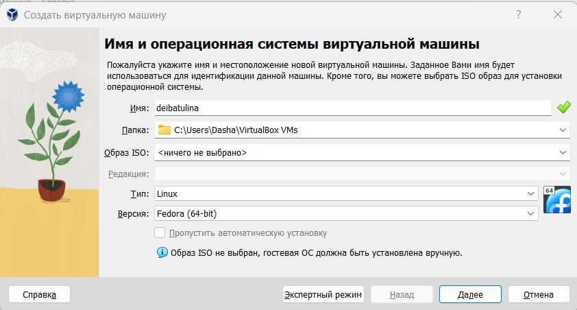
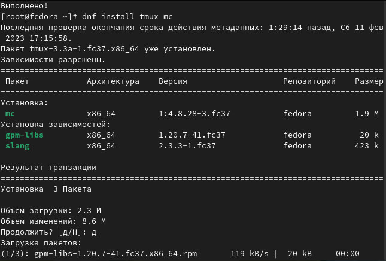

---
## Front matter
lang: ru-RU
title: Презентация по лабораторной работе №1
author:
  - Ибатулина Д.Э.
institute:
  - Российский университет дружбы народов, Москва, Россия
date: 15 февраля 2023

## i18n babel
babel-lang: russian
babel-otherlangs: english

## Formatting pdf
toc: false
toc-title: Содержание
slide_level: 2
aspectratio: 169
section-titles: true
theme: metropolis
header-includes:
 - \metroset{progressbar=frametitle,sectionpage=progressbar,numbering=fraction}
 - '\makeatletter'
 - '\beamer@ignorenonframefalse'
 - '\makeatother'
---

# Информация

## Докладчик

:::::::::::::: {.columns align=center}
::: {.column width="70%"}

  * Ибатулина Дарья Эдуардовна
  * студентка группы НКАбд-01-22
  * Российский университет дружбы народов
  * [1332226434@pfur.ru](mailto:1132226434@pfur.ru)
  * <https://github.com/deibatulina>

:::
::: {.column width="30%"}

:::
::::::::::::::

# Вводная часть

## Актуальность

- Знания и навыки, полученные мною в ходе выполнения лабораторной работы, помогут мне в будущей профессии.

## Объект и предмет исследования

- Презентация как текст
- Программное обеспечение для создания презентаций (pandoc, LaTex)
- Входные и выходные форматы презентаций (md - pdf, html)

## Цели и задачи

- Целью данной работы является приобретение практических навыков установки операционной системы на виртуальную машину, настройки минимально необходимых для дальнейшей работы сервисов.

## Материалы и методы

- Процессор `pandoc` для входного формата Markdown
- Результирующие форматы
	- `pdf`
	- `html`
- Автоматизация процесса создания: `Makefile`

# Процесс лабораторной работы

## Создание виртуальной машины и её настройка

  Для начала создадим новую виртуальную машину, для чего кликаем: машина - созадть. Затем указываем имя машины как логин в дисплейном классе, в моём случае - deibatulina, выбираем тип ОС - Linux, Fedora (64-bit).

## Установка ПО, необходимого для дальнейшей работы

  Для удобства работы устанавливаем MC (MidnightCommander), tmux.
  

# Результаты

## Итог работы

 В ходе выполнения лабораторной работы я научилась устанавливаь ОС Linux на виртуальную машину.

## Итоговый слайд

- Во время работы очень важно делать перерывы;
- Технике тоже нужен отдых, как и человеку;
- Если возникают вопросы, обратитесь к преподавателю.

