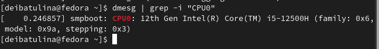

---
## Front matter
title: "Отчёт по лабораторной работе №1: Установка ОС Linux"
subtitle: "Дисциплина: Операционные системы"
author: "Дарья Эдуардовна Ибатулина"

## Generic otions
lang: ru-RU
toc-title: "Содержание"

## Bibliography
bibliography: bib/cite.bib
csl: pandoc/csl/gost-r-7-0-5-2008-numeric.csl

## Pdf output format
toc: true # Table of contents
toc-depth: 2
lof: true # List of figures
lot: true # List of tables
fontsize: 12pt
linestretch: 1.5
papersize: a4
documentclass: scrreprt
## I18n polyglossia
polyglossia-lang:
  name: russian
  options:
	- spelling=modern
	- babelshorthands=true
polyglossia-otherlangs:
  name: english
## I18n babel
babel-lang: russian
babel-otherlangs: english
## Fonts
mainfont: PT Serif
romanfont: PT Serif
sansfont: PT Sans
monofont: PT Mono
mainfontoptions: Ligatures=TeX
romanfontoptions: Ligatures=TeX
sansfontoptions: Ligatures=TeX,Scale=MatchLowercase
monofontoptions: Scale=MatchLowercase,Scale=0.9
## Biblatex
biblatex: true
biblio-style: "gost-numeric"
biblatexoptions:
  - parentracker=true
  - backend=biber
  - hyperref=auto
  - language=auto
  - autolang=other*
  - citestyle=gost-numeric
## Pandoc-crossref LaTeX customization
figureTitle: "Рис."
tableTitle: "Таблица"
listingTitle: "Листинг"
lofTitle: "Список иллюстраций"
lotTitle: "Список таблиц"
lolTitle: "Листинги"
## Misc options
indent: true
header-includes:
  - \usepackage{indentfirst}
  - \usepackage{float} # keep figures where there are in the text
  - \floatplacement{figure}{H} # keep figures where there are in the text
---

# Цель работы

  Целью данной работы является приобретение практических навыков установки операционной системы на виртуальную машину, настройки минимально необходимых для дальнейшей работы сервисов.

# Задание

  1. Установить виртуальную машину;
  2. Установить на неё дистрибутив Fedora Linux;
  3. Отключить систему безопасности SELinux;
  4. Установить драйвера;
  5. Установить программы для создания отчётов;
  6. С помощью команды dmesg получить необходимую информацию: версию ядра Линукс, частоту и модель процессора, объём доступной памяти, обнаруженный гипервизор, тип файловой системы корневого раздела, последовательность монтирования файловых систем.
  

# Теоретическое введение

  Операционная система — это комплекс взаимосвязанных программ, который действует как интерфейс между приложениями и пользователями с одной стороны и аппаратурой компьютера, с другой стороны. [1]

  VirtualBox – это специальное средство для виртуализации, позволяющее запускать операционную систему внутри другой. С помощью VirtualBox мы можем не только запускать ОС, но и настраивать сеть, обмениваться файлами и делать многое другое.

# Выполнение лабораторной работы

* Создание виртуальной машины

  Для начала создадим новую виртуальную машину, для чего кликаем: машина - созадть. Затем указываем имя машины как логин в дисплейном классе, в моём случае - deibatulina, выбираем тип ОС - Linux, Fedora (64-bit). (рис. @fig:001).

{#fig:001 width=70%}

  Затем укажем размер основной памяти виртуальной машины — от 2048 МБ. (рис. @fig:002).
 
{#fig:002 width=70%}

  Задаём размер жёсткого диска (от 80 Гб) [2]. (рис. @fig:003).
  
{#fig:003 width=70%}

  При установке на собственной технике используем заранее скачанный с официального сайта Федоры образ.
  
* Установка операционной системы на диск

  Выбираем место установки (в данном случае оно уже выставлено автоматически), язык, регион, часовой пояс. Нажимаем "завершить установку". (рис. @fig:004), (рис. @fig:005), (рис. @fig:006), (рис. @fig:007).
  
{#fig:004 width=70%}

{#fig:005 width=70%}

{#fig:006 width=70%}

{#fig:007 width=70%}

  Устанавливаем пароль и имя пользователя. (рис. @fig:008), (рис. @fig:009).
  
{#fig:008 width=70%}

{#fig:009 width=70%}

  Изымаем образ диска из дисковода.
  
* После установки

  Переключаемся на роль супер-пользователя. (рис. @fig:010).

{#fig:010 width=70%}

  Обновляем все пакеты. (рис. @fig:011).
  
{#fig:011 width=70%}

  Отключаем систему SELinux, поскольку в нашем курсе она не понадобится. (рис. @fig:012).
  
{#fig:012 width=70%}

  Для удобства работы устанавливаем MC (MidnightCommander), tmux. (рис. @fig:013).
  
{#fig:013 width=70%}

* Установка драйверов для виртуальной машины

  Переключаемся в режим супер-пользователя, заходим в tmux. Устанавливаем необходимые драйвера (предварительно в меню виртуальной машины подключив образ диска дополнений гостевой ОС) и dkms. (рис. @fig:014), (рис. @fig:015).
  
{#fig:014 width=70%}
  
.png){#fig:015 width=70%}

* Настройка раскладки клавиатуры

  Запускаем tmux. Открываем конфигурационный файл /etc/X11/xorg.conf.d/00-keyboard.conf. Редактируем его в соответствии с приведёнными указаниями. (рис. @fig:016).
  
{#fig:016 width=70%}

* Установка имени пользователя и названия хоста. 

  Устанавливаем название хоста. (рис. @fig:017).
  
{#fig:017 width=70%}

* Установка ПО, необходимого для компиляции отчётов

  При помощи команд dnf -y install pandoc, pip install pandoc-fignos pandoc-eqnos pandoc-tablenos pandoc-secnos --user, dnf -y install texlive texlive-\* установим Пандок, необходимые к нему расширения и Текстлайв. (рис. @fig:018).
  
{#fig:018 width=70%}

* Выполнение домашнего задания

  Окрываем терминал. Вводим команду dmesg | less и смотрим её вывод. (рис. @fig:019).
  
{#fig:019 width=70%}

  Информация о системе находится здесь в хаосе, поэтому выводим данные по отдельности. Получаем следующую информацию:
  
  1. Версию ядра Линукс (рис. @fig:020);
  2. Частоту процессора (рис. @fig:021);
  3. Модель процессора (рис. @fig:022);
  4. Объём доступной оперативной памяти (рис. @fig:023);
  5. Тип обнаруженного гипервизора (рис. @fig:024);
  6. Тип файловой системы корневого раздела (рис. @fig:025) (видим, что это - btrfs);
  7. Последовательность монтирования файловых систем (рис. @fig:026).

{#fig:020 width=70%}

{#fig:021 width=70%}

{#fig:022 width=70%}

{#fig:023 width=70%}

{#fig:024 width=70%}

{#fig:025 width=70%}

{#fig:026 width=70%}

* Ответы на контрольные вопросы

  1. Какую информацию содержит учётная запись пользователя?
  
  Ответ: имя пользователя, зашифрованный пароль пользователя, домашний каталог, зашифрованный командный интерпретатор, идентификационный номер пользователя (группы пользователей) - иным словом, вся информация, необходимая для регистрации в системе и дальнейшей работы с ней.
  
  2. Укажите команды терминала и приведите примеры:
  
  * для получения справки по команде (man);
  * для перемещения по файловой системе (cd);
  * для просмотра содержимого каталога (ls);
  * для определения объёма каталога (du);
  * для создания / удаления каталогов / файлов (mkdir/rm);
  * для задания определённых прав на файл / каталог (chmod + x);
  * для просмотра истории команд (history).

  3. Что такое файловая система? Приведите примеры с краткой характеристикой.
  
  Файловая система - это порядок, определяющий способ организации, хранения, и именования данных на компьютере или носителях, также служит для удобства взаимодействия с пользователем. Примеры: FAT (таблица распределения файлов), NTFS (файловая система новой технологии), ReFS (Resilent File System).
  
  4. Как посмотреть, какие файловые системы подмонтированы в ОС?
  
  Нужно использовать команду mount.
  
  5. Как удалить зависший процесс?
  
  Использовать команду kill.

# Выводы

  В ходе данной лабораторной работы я научилась устанавливать ОС Linux на виртуальную машину, настраивать необходимые для работы сервисы.

# Список литературы{.unnumbered}

 1. Кулябов Д. С. Введение в операционную систему UNIX – Лекция.
 
 2. Colvin H. VirtualBox: An Ultimate Guide Book on Virtualization with VirtualBox. — CreateSpace Independent Publishing Platform, 2015. — 70 с.
 
 3. Таненбаум Э., Бос Х. Современные операционные системы. — 4-е изд. — СПб. : Питер, 2015. — 1120 с. — (Классика Computer Science).

::: {#refs}
:::
