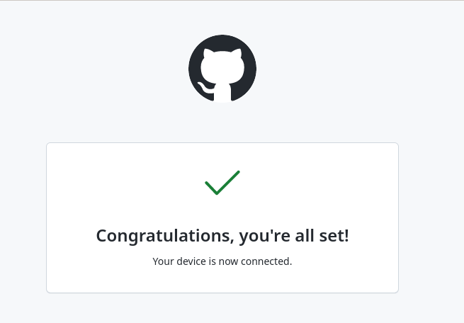
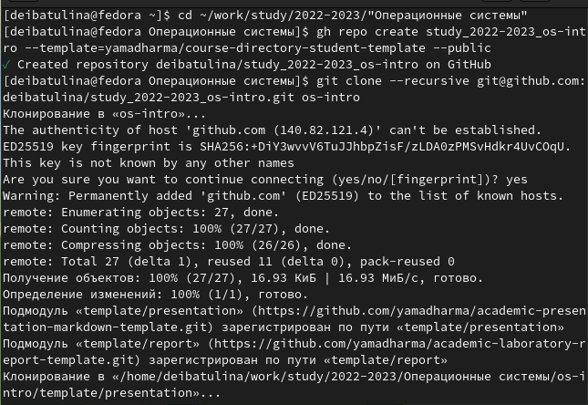

---
## Front matter
lang: ru-RU
title: Лабораторная работа №2 "Работа с Git"
author:
  - Ибатулина Д.Э.
institute:
  - Российский университет дружбы народов, Москва, Россия
date: 15 февраля 2023

## i18n babel
babel-lang: russian
babel-otherlangs: english

## Formatting pdf
toc: false
toc-title: Содержание
slide_level: 2
aspectratio: 169
section-titles: true
theme: metropolis
header-includes:
 - \metroset{progressbar=frametitle,sectionpage=progressbar,numbering=fraction}
 - '\makeatletter'
 - '\beamer@ignorenonframefalse'
 - '\makeatother'
---

# Информация

## Докладчик

:::::::::::::: {.columns align=center}
::: {.column width="70%"}

  * Ибатулина Дарья Эдуардовна
  * студентка группы НКАбд-01-22
  * Российский университет дружбы народов
  * [1132226434@pfur.ru](mailto:1132226434@pfur.ru)
  * <https://github.com/deibatulina>

:::
::: {.column width="30%"}

:::
::::::::::::::

# Вводная часть

## Актуальность

- Навыки работы с системой контрол версий Git очень важны для программиста или любого другого работника IT сферы;
- Системы контроля версий широко применяются в разработке программ и крупных проектов.

## Цели и задачи

- Изучить идеологию и применение средств контроля версий. Освоить умения по работе с Git.

- Выполнить приведённые задания и настроить каталог курса.

# Создание презентации

## Регистрация на гитхабе

  Для начала я установила Git. Также зарегистрировалась на сайте, создав свою учётную запись на гитхабе и заполнив основную информацию.
  
## Базовая настройка

  Затем я задала гиту необходимые параметры, сгенерировала ssh и gpg ключи и связала свой аккаунт на гитхабе с локальным репозиторием.
  

## Создание каталога курса

  Необходимо настроить каталог курса, как указано в соглашении об именовании, связала с локальным репозиторием:

  
## Итог работы

  Теперь я смогу добавлять все изменённые файлы (в частности, лабораторные работы) и каталоги на свой репозиторий на гитхабе посредством локального репозитория. Это безусловно очень удобно.

## Результаты

  - Я научилась работать с системой контроля версий Git;
  - Узнала о ней новую информацию, сделала базовую настройку, научилась базовым командам.

## Итоговый слайд

- Системы контроля версий - безусловно очень удобная вещь. Они позволяют организовать данные в определённую структуру и делать откат к более ранним версиям, не удаляя при этом все остальные.

## Список литературы

1. О системе контроля версий [Интернет-ресурс]. 2016. URL: https://git-scm.com/book/ru/v2/Введение-О-системе-контроля-версий.

2. Евгений Г. Системы контроля версий [Интернет-ресурс]. 2016. URL: https://glebradchenko.susu.ru/courses/bachelor/engineering/2016/SUSU_SE_2016_REP_3_VCS.pdf.

3. Системы контроля версий [Интернет-ресурс]. 2016. URL: http://uii.mpei.ru/study/courses/sdt/16/lecture02.2_vcs.slides.pdf.

