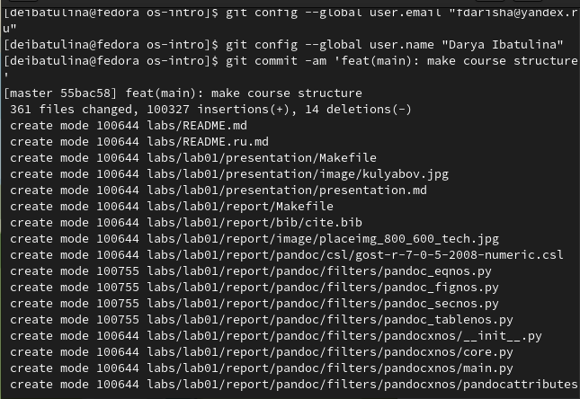

---
## Front matter
title: "Отчёт по лабораторной работе №2: Работа с Git"
subtitle: "Дисциплина: Операционные системы"
author: "Дарья Эдуардовна Ибатулина"

## Generic otions
lang: ru-RU
toc-title: "Содержание"

## Bibliography
bibliography: bib/cite.bib
csl: pandoc/csl/gost-r-7-0-5-2008-numeric.csl

## Pdf output format
toc: true # Table of contents
toc-depth: 2
lof: true # List of figures
lot: true # List of tables
fontsize: 12pt
linestretch: 1.5
papersize: a4
documentclass: scrreprt
## I18n polyglossia
polyglossia-lang:
  name: russian
  options:
	- spelling=modern
	- babelshorthands=true
polyglossia-otherlangs:
  name: english
## I18n babel
babel-lang: russian
babel-otherlangs: english
## Fonts
mainfont: PT Serif
romanfont: PT Serif
sansfont: PT Sans
monofont: PT Mono
mainfontoptions: Ligatures=TeX
romanfontoptions: Ligatures=TeX
sansfontoptions: Ligatures=TeX,Scale=MatchLowercase
monofontoptions: Scale=MatchLowercase,Scale=0.9
## Biblatex
biblatex: true
biblio-style: "gost-numeric"
biblatexoptions:
  - parentracker=true
  - backend=biber
  - hyperref=auto
  - language=auto
  - autolang=other*
  - citestyle=gost-numeric
## Pandoc-crossref LaTeX customization
figureTitle: "Рис."
tableTitle: "Таблица"
listingTitle: "Листинг"
lofTitle: "Список иллюстраций"
lotTitle: "Список таблиц"
lolTitle: "Листинги"
## Misc options
indent: true
header-includes:
  - \usepackage{indentfirst}
  - \usepackage{float} # keep figures where there are in the text
  - \floatplacement{figure}{H} # keep figures where there are in the text
---

# Цель работы

  Изучить идеологию и применение средств контроля версий. Освоить умения по работе с Git.

# Задание

1. Установить Git;
2. Сделать базовую настройку;
3. Сгенерировать ssh и gpg ключи;
4. Авторизоваться на Github;
5. Настроить каталог курса;
6. Удалить лишние файлы и отправить файлы на сервер.

# Теоретическое введение

  Системы контроля версий (Version Control System, VCS) применяются при работе нескольких человек над одним проектом. Обычно основное дерево проекта хранится в локальном или удалённом репозитории, к которому настроен доступ для участников проекта. При внесении изменений в содержание проекта система контроля версий позволяет их фиксировать, совмещать изменения, произведённые разными участниками проекта, производить откат к любой более ранней версии проекта, если это требуется.

  В классических системах контроля версий используется централизованная модель, предполагающая наличие единого репозитория для хранения файлов. Выполнение большинства функций по управлению версиями осуществляется специальным сервером. Участник проекта (пользователь) перед началом работы посредством определённых команд получает нужную ему версию файлов. После внесения изменений, пользователь размещает новую версию в хранилище. При этом предыдущие версии не удаляются из центрального хранилища и к ним можно вернуться в любой момент. Сервер может сохранять не полную версию изменённых файлов, а производить так называемую дельта-компрессию — сохранять только изменения между последовательными версиями, что позволяет уменьшить объём хранимых данных.

  Системы контроля версий поддерживают возможность отслеживания и разрешения конфликтов, которые могут возникнуть при работе нескольких человек над одним файлом. Можно объединить (слить) изменения, сделанные разными участниками (автоматически или вручную), вручную выбрать нужную версию, отменить изменения вовсе или заблокировать файлы для изменения. В зависимости от настроек блокировка не позволяет другим пользователям получить рабочую копию или препятствует изменению рабочей копии файла средствами файловой системы ОС, обеспечивая таким образом, привилегированный доступ только одному пользователю, работающему с файлом.

  Системы контроля версий также могут обеспечивать дополнительные, более гибкие функциональные возможности. Например, они могут поддерживать работу с несколькими версиями одного файла, сохраняя общую историю изменений до точки ветвления версий и собственные истории изменений каждой ветви. Кроме того, обычно доступна информация о том, кто из участников, когда и какие изменения вносил. Обычно такого рода информация хранится в журнале изменений, доступ к которому можно ограничить.

  В отличие от классических, в распределённых системах контроля версий центральный репозиторий не является обязательным.

  Среди классических VCS наиболее известны CVS, Subversion, а среди распределённых — Git, Bazaar, Mercurial. Принципы их работы схожи, отличаются они в основном синтаксисом используемых в работе команд.

# Выполнение лабораторной работы

* **Установка Git и gh**

  При помощи команды dnf install git устанавливаем систему контроля версий - Гитхаб и gh, необходимый для облегчения дальнейшей работы с гитом. (рис. @fig:001).

{#fig:001 width=70%}

* **Базовая настройка Git**

  Зададим имя и email владельца репозитория, а также кодировку utf-8 в выводе сообщений git, имя начальной ветки и параметры, создадим ключ ssh размером 4096 бит (рис. @fig:002).:
  
{#fig:002 width=70%}

  Создадим ключ ssh по алгоритму ed-25519 (рис. @fig:003):
  
{#fig:003 width=70%}

  При помощи команды gpg --full-generate-key генерируем gpg ключ, отвечаем на вопросы, которые задаёт нам система относительно ключа (рис. @fig:004):
  
{#fig:004 width=70%}

  Далее необходимо настроить учётную запись на сайте github. Я это уже проделала в прошлом семестре.
  
* **Добавление PGP ключа в GitHub**

  Выводим список ключей и копируем отпечаток приватного ключа (рис. @fig:005):
  
{#fig:005 width=70%}

  Отпечаток ключа — это последовательность байтов, используемая для идентификации более длинного, по сравнению с самим отпечатком ключа. Он идё после rsa/... .
  Копируем отпечаток в буфер обмена, настраиваем автоматические подписи коммитов (рис. @fig:006):
  
{#fig:006 width=70%}

  Вставляем скопированный ключ в поле ввода для gpg ключа на сайте github.

  Авторизуемся на Github через браузер (рис. @fig:007):
  
{#fig:007 width=70%}

  Авторизация прошла успешно (рис. @fig:008), (рис. @fig:009):
  
{#fig:008 width=70%}

{#fig:009 width=70%}

* **Настройка каталога курса**

  Необходимо настроит каталог курса, как указано в соглашении об именовании (рис. @fig:010):

{#fig:010 width=70%}

  Удаляем лишние файлы, создаём необходимые каталоги (рис. @fig:011):
  
{#fig:011 width=70%}
 
  Как мы видим, система просит авторизоваться заново, поскольку я закрыла вкладку браузера с авторизацией. Делаем это ещё раз и переходим к следующему шагу (рис. @fig:012):
  
{#fig:012 width=70%}

  Отправляем файлы на сервер (рис. @fig:013):
  
{#fig:013 width=70%}

  Далее, проверяем работу команды make (она отвечает за конвертацию файла в markdown в docx и pdf), а также команды make clean (она отвечает за удаление docx и pdf файлов, если в них есть какие-либо недочёты) (рис. @fig:014):
  
{#fig:014 width=70%}

  Всё работает! Значит, всё настроено правильно.

# Выводы

  Я научилась работать с системой контроля версий Git. Узнала о ней новую информацию, сделала базовую настройку, научилась базовым командам.
  
# Ответы на контрольные вопросы

1. Что такое системы контроля версий (VCS) и для решения каких задач они предназначаются?

  Система контроля версий - это системы, записывающие все внесённые в них изменения. Они активно применяются в разработке программ, совместных проектов, когда несколько участников работают над выполнением одного проекта и каждый выполняет свою задачу. Каждый участник получает доступ к системе контроля версий и репозиторию, где расположен проект, и вносит туда свои изменения. [1]

2. Объясните следующие понятия VCS и их отношения: хранилище, commit, история, рабочая копия.

  Хранилище - это большое пространство, где хранятся данные. Commit - запись внесённого изменения. История - это последовательность всех вносимых в проект изменений. Рабочая копия - снимок какого-либо этапа проекта.
  
  В хранилище расположено много проектов, данных и т.д. Получая доступ к нему, участник проекта вносит в него изменения (commit), эти изменения вносятся в историю, сохраняется рабочая копия проекта (проект на этапе какого-либо изменения).

3. Что представляют собой и чем отличаются централизованные и децентрализованные VCS? Приведите примеры VCS каждого вида.

  Централизованная система контроля версий предназначена для решения основной проблемы локальной системы контроля версий. Для организации такой системы контроля версий используется единственный сервер, который содержит все версии файлов. Если с сервером возникнут какие-либо неполадки, то это грозит потерей всех данных (CVS, Subversion, Perforce).
  
  В децентрализованных системах контроля версий при каждом копировании удалённого репозитория (расположенного на сервере) происходит полное копирование данных в локальный репозиторий (установленный на рабочем компьютере). Каждая копия содержит все данные, хранящиеся в удалённом репозитории. В случае, возникновения технической неисправности на стороне сервера, удаленный репозиторий можно перезаписать с любой сохраненной копии (Git). [2]

4. Опишите действия с VCS при единоличной работе с хранилищем.

  Для начала создаём удалённый репозиторий и подключаем его к основному. Затем вносим изменения в проект посредством локального репозитория, и отправляем внесённые изменения на сервер.

5. Опишите порядок работы с общим хранилищем VCS.

  Посредством определённых команд пользователь получает нужную ему версию проекта, вносит туда необходимые изменения, отправляет файлы на сервер (при этом предыдущие и последующие версии не удаляются из общего репозитория).

6. Каковы основные задачи, решаемые инструментальным средством git?

  Внесение изменений в проект несколькими участниками, просмотр истории изменений, возможность вернуться к любой версии проекта, при этом другие версии не удаляются.

7. Назовите и дайте краткую характеристику командам git.

  Перечислим наиболее часто используемые команды git.

Создание основного дерева репозитория:

```git init
```

Получение обновлений (изменений) текущего дерева из центрального репозитория:

```git pull
```
Отправка всех произведённых изменений локального дерева в центральный репозиторий:

```git push
```

Просмотр списка изменённых файлов в текущей директории:

```git status
```
Просмотр текущих изменений:

```git diff
```

Сохранение текущих изменений:

добавить все изменённые и/или созданные файлы и/или каталоги:

```git add .
```

добавить конкретные изменённые и/или созданные файлы и/или каталоги:

```git add имена_файлов
```

удалить файл и/или каталог из индекса репозитория (при этом файл и/или каталог остаётся в локальной директории):

```git rm имена_файлов
```

Сохранение добавленных изменений:

сохранить все добавленные изменения и все изменённые файлы:

```git commit -am 'Описание коммита'
```

сохранить добавленные изменения с внесением комментария через встроенный редактор:

```git commit
```

создание новой ветки, базирующейся на текущей:

```git checkout -b имя_ветки
```

переключение на некоторую ветку:

```git checkout имя_ветки
```

(при переключении на ветку, которой ещё нет в локальном репозитории, она будет создана и связана с удалённой)
отправка изменений конкретной ветки в центральный репозиторий:

```git push origin имя_ветки
```

слияние ветки с текущим деревом:

git merge --no-ff имя_ветки
Удаление ветки:

удаление локальной уже слитой с основным деревом ветки:

```git branch -d имя_ветки
```

принудительное удаление локальной ветки:

```git branch -D имя_ветки
```
удаление ветки с центрального репозитория:

```git push origin :имя_ветки
```
Стандартные процедуры работы при наличии центрального репозитория
Работа пользователя со своей веткой начинается с проверки и получения изменений из центрального репозитория (при этом в локальное дерево до начала этой процедуры не должно было вноситься изменений):

```git checkout master
git pull
git checkout -b имя_ветки
```

Затем можно вносить изменения в локальном дереве и/или ветке.

После завершения внесения какого-то изменения в файлы и/или каталоги проекта необходимо разместить их в центральном репозитории. Для этого необходимо проверить, какие файлы изменились к текущему моменту:

```git status
```

При необходимости удаляем лишние файлы, которые не хотим отправлять в центральный репозиторий.

Затем полезно просмотреть текст изменений на предмет соответствия правилам ведения чистых коммитов:

```git diff
```

Если какие-либо файлы не должны попасть в коммит, то помечаем только те файлы, изменения которых нужно сохранить. Для этого используем команды добавления и/или удаления с нужными опциями:

```git add …  
git rm …
```
Если нужно сохранить все изменения в текущем каталоге, то используем:

```git add .
```

Затем сохраняем изменения, поясняя, что было сделано:

```git commit -am "Some commit message"
```

Отправляем изменения в центральный репозиторий:

```git push origin имя_ветки
```

или

```git push
```
[3]

8. Приведите примеры использования при работе с локальным и удалённым репозиториями.

git push /-all (origin master/любая ветка)

9. Что такое и зачем могут быть нужны ветви (branches)?

  Ветки нужны для удобства работы над разными проектами. Однако, ветки можно объединять (посредством построения соединений между ними).

10. Как и зачем можно игнорировать некоторые файлы при commit?

Во время выполнения проекта могут создаваться файлы, которые не нужно добавлять в проект (например, объектные файлы, создаваемые компиляторами при написании программ, различные архивы с исходными материалами).


# Список литературы{.unnumbered}

1. О системе контроля версий [Электронный ресурс]. 2016. URL: https://git-scm.com/book/ru/v2/Введение-О-системе-контроля-версий.

2. Евгений Г. Системы контроля версий [Электронный ресурс]. 2016. URL: https://glebradchenko.susu.ru/courses/bachelor/engineering/2016/SUSU_SE_2016_REP_3_VCS.pdf.

3. Системы контроля версий [Электронный ресурс]. 2016. URL: http://uii.mpei.ru/study/courses/sdt/16/lecture02.2_vcs.slides.pdf.

::: {#refs}
:::
