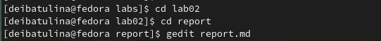
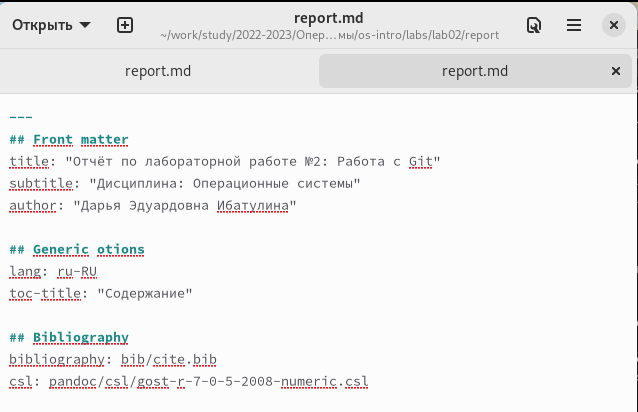
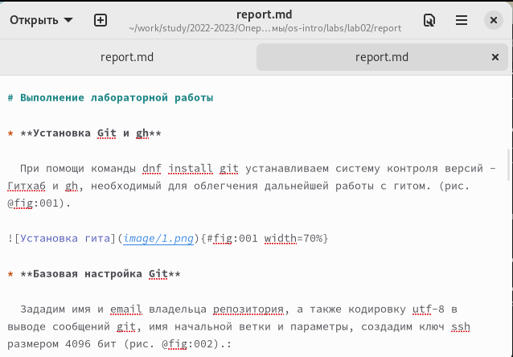
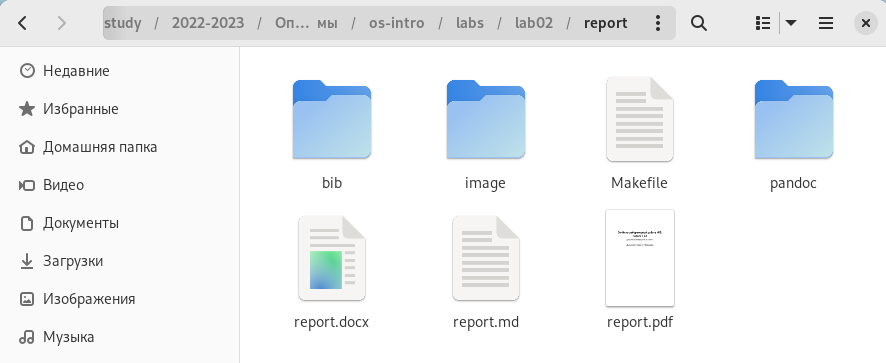

---
## Front matter
lang: ru-RU
title: "Презентация по лабораторной работе №3"
subtitle: Язык разметки Markdown
author:
  - Ибатулина Д.Э.
institute:
  - Российский университет дружбы народов, Москва, Россия
date: 16 февраля 2023

## i18n babel
babel-lang: russian
babel-otherlangs: english

## Formatting pdf
toc: false
toc-title: Содержание
slide_level: 2
aspectratio: 169
section-titles: true
theme: metropolis
header-includes:
 - \metroset{progressbar=frametitle,sectionpage=progressbar,numbering=fraction}
 - '\makeatletter'
 - '\beamer@ignorenonframefalse'
 - '\makeatother'
---

# Информация

## Докладчик

:::::::::::::: {.columns align=center}
::: {.column width="70%"}

  * Ибатулина Дарья Эдуардовна
  * студентка группы НКАбд-01-22
  * Российский университет дружбы народов
  * <https://github.com/deibatulina>

:::
::: {.column width="30%"}

:::
::::::::::::::

# Вводная часть

## Актуальность

- Язык разметки Markdown - интересная тема для изучения, поскольку заключает в себе множество особенностей и нюансов.

## Цели и задачи

- Научиться оформлять отчёты и презентации с помощью легковесного языка разметки Markdown, обрабатывать файлы в Markdown;
- Создать отчёт по лабораторной работе №2 в Markdown.

## Материалы и методы

- Процессор `pandoc` для входного формата Markdown
- Автоматизация процесса создания: `Makefile`

# Основная часть

## Начало работы

  Заданием лабораторной работы №3 было создать отчёт по лабораторной работе №2 в Markdown.
  
  Для начала я перешла в каталог с лабораторной работой №2, открыла в текстовом редакторе gedit.

## Процесс подготовки отчёта

  Далее я внесла в шаблон изменения и заполнила его данными о себе: своё ФИО, номер группы, название дисциплины, а затем приступила непосредственно к отчёту по выполненным в ходе лабораторной работы действий и их описанию. 
  

## Оформление основной части лабораторной работы

  
## Компиляция файлов в форматы .pdf, .docx

  После выполнения данной команды появились отчёты в форматах .pdf и .docx:
  

## Результаты

  В ходе выполнения лабораторной работы №3 я научилась оформлять файлы в
формате Markdown, познакомилась с синтаксисом этого языка разметки, узнала,
как компилировать файлы .md в .docx, .pdf.

## Итоговый слайд

  Мне понравилось работать с языком разметки Markdown, а также изучать его синтаксис! Я узнала много нового и полезного для себя и своей будущей профессии, поскольку буду работать с ним.

## Список использованной литературы

1. Руководство к лабораторной работе №3, Д.С. Кулябов.

