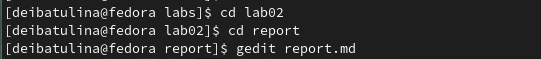
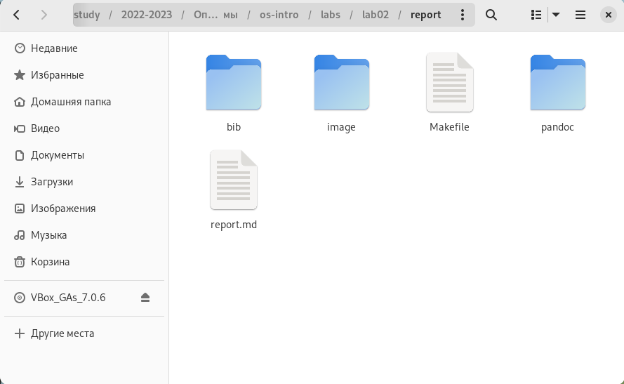
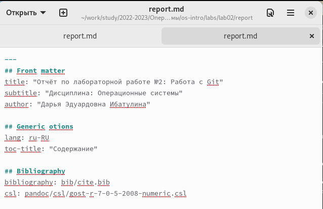
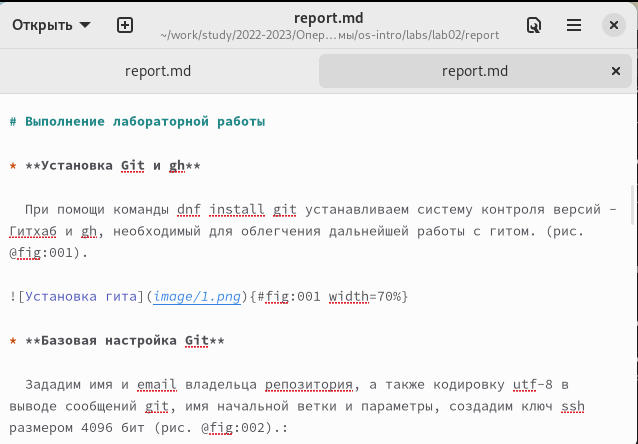
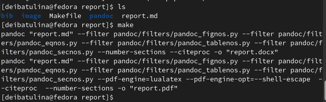
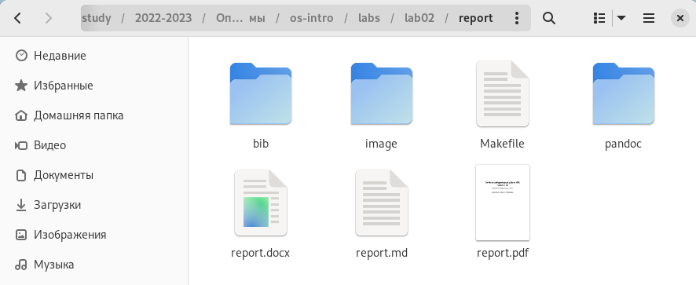
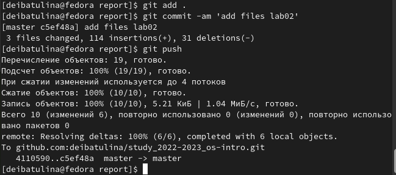

---
## Front matter
title: "Отчёт по лабораторной работе №3"
subtitle: "Дисциплина: Операционные системы"
author: "Дарья Эдуардовна Ибатулина"

## Generic otions
lang: ru-RU
toc-title: "Содержание"

## Bibliography
bibliography: bib/cite.bib
csl: pandoc/csl/gost-r-7-0-5-2008-numeric.csl

## Pdf output format
toc: true # Table of contents
toc-depth: 2
lof: true # List of figures
lot: true # List of tables
fontsize: 12pt
linestretch: 1.5
papersize: a4
documentclass: scrreprt
## I18n polyglossia
polyglossia-lang:
  name: russian
  options:
	- spelling=modern
	- babelshorthands=true
polyglossia-otherlangs:
  name: english
## I18n babel
babel-lang: russian
babel-otherlangs: english
## Fonts
mainfont: PT Serif
romanfont: PT Serif
sansfont: PT Sans
monofont: PT Mono
mainfontoptions: Ligatures=TeX
romanfontoptions: Ligatures=TeX
sansfontoptions: Ligatures=TeX,Scale=MatchLowercase
monofontoptions: Scale=MatchLowercase,Scale=0.9
## Biblatex
biblatex: true
biblio-style: "gost-numeric"
biblatexoptions:
  - parentracker=true
  - backend=biber
  - hyperref=auto
  - language=auto
  - autolang=other*
  - citestyle=gost-numeric
## Pandoc-crossref LaTeX customization
figureTitle: "Рис."
tableTitle: "Таблица"
listingTitle: "Листинг"
lofTitle: "Список иллюстраций"
lotTitle: "Список таблиц"
lolTitle: "Листинги"
## Misc options
indent: true
header-includes:
  - \usepackage{indentfirst}
  - \usepackage{float} # keep figures where there are in the text
  - \floatplacement{figure}{H} # keep figures where there are in the text
---

# Цель работы

  Научиться оформлять отчёты с помощью легковесного языка разметки Markdown.

# Задание

  * Ознакомиться с синтаксисом языка разметки Markdown;
  * Узнать, как компилируются отчёты в различных форматах из исходного файла с расширением .md;
  * Сделать отчёт по лабораторной работе №2 в формате Markdown;
  * Прикрепить отчёты по лабораторным работам №2 и 3 в форматах .md, .docx, .pdf (сделанные из .md), архивы с исходными материалами (скриншоты, Makefile).

# Теоретическое введение

- Оформление элементов текста в Markdown:

1. Заголовки:

  Чтобы создать заголовок, используем знак #:
  # Заголовок 1-го уровня, ## Заголовок 2-го уровня, и т.д. [1]
  
2. Тип начертания:

  Полужирное начертание (** с двух сторон): **ваш текст**
  Курсивное начертание (* с двух сторон): *ваш текст*
  Полужирное + курсивное начертание (*** с двух сторон): ***ваш текст***
  
3. Цитирование (>):

  > Ваша цитата...
  
4. Списки:

  Маркированный (неупорядоченный) список (Обозначаем элементы списка тире или звёздочками):
  
  - пункт 1
  - пункт 2
  - пункт 3
  
  Вложение списков (используем отступы):
  - пункт 1
  	- подпункт 1
  - пункт 2
  	- подпункт 2
  
  Упорядоченный список (используем цифры):
  
  1. Пункт 1;
  2. Пункт 2;
  3. Пункт 3.
  
  Чтобы вложить один список в другой, также используем отступы.
  
5. Гиперссылки (в квадратных скобках пишется название ссылки, а в круглых рядом - веб-сайт):

  [Мой репозиторий на Github](https://github.com/deibatulina/study_2022-2023_os-intro)
  
6. Оформление кода (код оформляется символами ``` сверху и снизу):

  ``` python
  print('Hello, world!')
  ```
  
7. Формулы и их отображение:

  Чтобы поставить нижний индекс, используем знак тильды (~):
  
  H~2~0
  
  Чтобы поставить степень, пишем знак ^ два раза:
  
  2^10^
  
  Знакомая нам со школы формула (основное тригонометрическое тождество) будет выглядеть так (заключаем формулу в знаки доллара с двух сторон):
  $\sin^2 (x) + \cos^2 (x) 1$
  
8. Оформление картинок:

  Чтобы вставить в текст иллюстрацию, нужно использовать следующий синтаксис () (рис. @fig:001):
  
{#fig:001 width=70%}

- Обработка файлов в формате Markdown (.md):

  Для того, чтобы обрабатывать файлы в таком формате, нам понадобится следующее ПО: [Pandoc - официальный сайт](https://pandoc.org/), [pandoc-citeproc](https://github.com/jgm/pandoc/releases) и [Pandoc-crossref](https://github.com/lierdakil/pandoc-crossref/releases). Все эти программы были установлены мною в ходе выполнения лабораторной работы №1.
  
  Преобразовать файл README.md можно следующим образом:

```
pandoc README.md -o README.pdf
```
  Получим файл в формате .pdf, скомпилированный из Markdown. Так же можно скомпилировать и файл в формате .docx.
  
  А ещё можно использовать Makefile (в папке с отчётом по лабораторной работе и в папке с презентацией по ней он уже есть). В данном файле указываются параметры компиляции.
 

# Выполнение лабораторной работы

  Для начала я перешла в каталог с лабораторной работой №2, открыла в текстовом редакторе gedit (рис. @fig:002).

{#fig:002 width=70%}

  Видим: в папке report уже есть Makefile (рис. @fig:003), поэтому для компиляции достаточно просто прописать команду make, затем просмотреть скомпилировавшиеся отчёты в форматах .docx и .pdf и если что-то выглядит не так, как хотелось бы, прописываем в терминале команду make clean и скомпилированные отчёты в двух форматах удаляются.
  
{#fig:003 width=70%}

  Далее я внесла в шаблон изменения и заполнила его данными о себе: своё ФИО, номер группы, название дисциплины (рис. @fig:004), а затем приступила непосредственно к отчёту по выполненным в ходе лабораторной работы действий и их описанию (рис. @fig:005). 
  
{#fig:004 width=70%}

{#fig:005 width=70%}

  !Важно! Используемые в файле изображения должны располагаться в той же папке, что и отчёт (в таком случае можем указать к папке краткий путь: image/наше_изображение).
  
  После завершения оформления отчёта я скомпилировала их, использовав команду make (рис. @fig:006):
  
{#fig:006 width=70%}

  После выполнения данной команды появились отчёты в форматах .pdf и .docx (рис. @fig:007):
  
{#fig:007 width=70%}


  Затем отправила полученные файлы на github посредством локального репозитория (рис. @fig:008):
  
{#fig:008 width=70%}


# Выводы

  В ходе выполнения лабораторной работы №3 я научилась оформлять файлы в формате Markdown, познакомилась с синтаксисом этого языка разметки, узнала, как компилировать файлы .md в .docx, .pdf.

# Список литературы{.unnumbered}

1. Руководство по выполнению лабораторной работы №3, Д.С. Кулябов, Российский Университет Дружбы Народов.

::: {#refs}
:::
