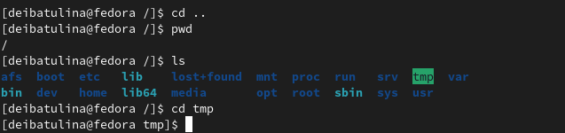
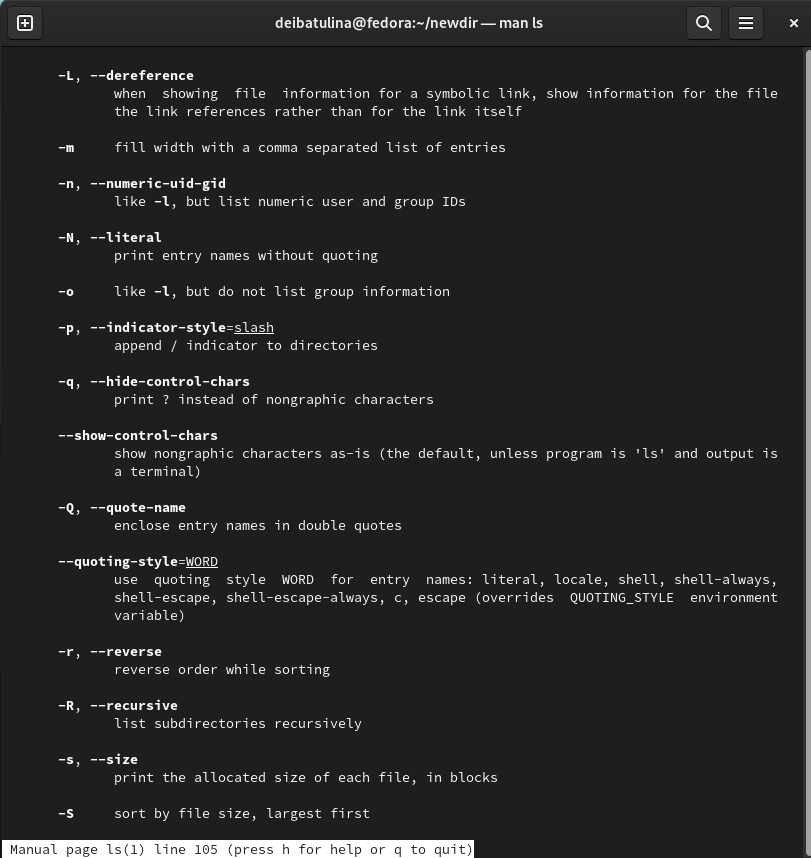
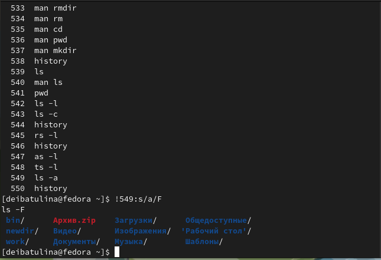

---
## Front matter
lang: ru-RU
title: "Презентация по лабораторной работе №4"
subtitle: "Основы взаимодействия пользователя с командной строкой системы Linux"
author:
  - Ибатулина Д.Э.
institute:
  - Российский университет дружбы народов, Москва, Россия
date: 03 марта 2023

## i18n babel
babel-lang: russian
babel-otherlangs: english

## Formatting pdf
toc: false
toc-title: Содержание
slide_level: 2
aspectratio: 169
section-titles: true
theme: metropolis
header-includes:
 - \metroset{progressbar=frametitle,sectionpage=progressbar,numbering=fraction}
 - '\makeatletter'
 - '\beamer@ignorenonframefalse'
 - '\makeatother'
---

# Информация

## Докладчик

:::::::::::::: {.columns align=center}
::: {.column width="70%"}

  * Ибатулина Дарья Эдуардовна
  * студентка НКАбд-01-22
  * Российский университет дружбы народов
  * [1132226434@pfur.ru](mailto:1132226434@pfur.ru)
  * <https://deibatulina.github.io/ru/>

:::
::: {.column width="30%"}

:::
::::::::::::::

# Вводная часть

## Актуальность

  Уметь взаимодействовать с командной строкой компьюетра - очень важное умение для любого IT-специалиста.

## Цели и задачи

  Научиться взаимодействовать с командной строкой Linux.
  
# Основная часть

## Начало работы

  Для работы нам понадобится терминал, в который мы будем вводить различные команды.
  

## Получение справки по команде

  Для того, чтобы получить подробню информацию по команде, используем команду man.
  

## Модификация команд

  Можно также изменять команды из буфера команд (например, добавлять к ним опции или изменять их).
  

# Заключительная часть

## Результаты

  В ходе выполнения лабораторной работы №4 я научилась взаимодействовать с командной строкой ОС Linux.

## Итоговый слайд

  Цель достигнута, работа удалась!

