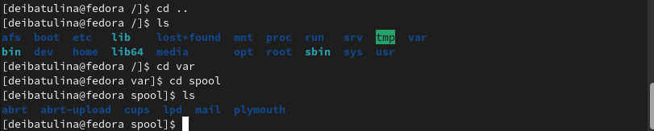
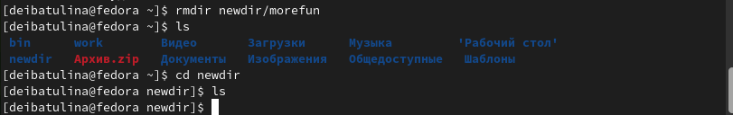

---
## Front matter
title: "Лабораторная работа №4: Основы интерфейса взаимодействия пользователя с системой Unix на уровне командной строки"
subtitle: "Дисциплина: Операционные системы"
author: "Дарья Эдуардовна Ибатулина"

## Generic otions
lang: ru-RU
toc-title: "Содержание"

## Bibliography
bibliography: bib/cite.bib
csl: pandoc/csl/gost-r-7-0-5-2008-numeric.csl

## Pdf output format
toc: true # Table of contents
toc-depth: 2
lof: true # List of figures
lot: true # List of tables
fontsize: 12pt
linestretch: 1.5
papersize: a4
documentclass: scrreprt
## I18n polyglossia
polyglossia-lang:
  name: russian
  options:
	- spelling=modern
	- babelshorthands=true
polyglossia-otherlangs:
  name: english
## I18n babel
babel-lang: russian
babel-otherlangs: english
## Fonts
mainfont: PT Serif
romanfont: PT Serif
sansfont: PT Sans
monofont: PT Mono
mainfontoptions: Ligatures=TeX
romanfontoptions: Ligatures=TeX
sansfontoptions: Ligatures=TeX,Scale=MatchLowercase
monofontoptions: Scale=MatchLowercase,Scale=0.9
## Biblatex
biblatex: true
biblio-style: "gost-numeric"
biblatexoptions:
  - parentracker=true
  - backend=biber
  - hyperref=auto
  - language=auto
  - autolang=other*
  - citestyle=gost-numeric
## Pandoc-crossref LaTeX customization
figureTitle: "Рис."
tableTitle: "Таблица"
listingTitle: "Листинг"
lofTitle: "Список иллюстраций"
lotTitle: "Список таблиц"
lolTitle: "Листинги"
## Misc options
indent: true
header-includes:
  - \usepackage{indentfirst}
  - \usepackage{float} # keep figures where there are in the text
  - \floatplacement{figure}{H} # keep figures where there are in the text
---

# Цель работы

  Приобретение практических навыков взаимодействия пользователя с системой посредством командной строки.

# Задание

1. Определите полное имя вашего домашнего каталога. Далее относительно этого каталога будут выполняться последующие упражнения.

2. Выполните следующие действия:

* Перейдите в каталог /tmp.
* Выведите на экран содержимое каталога /tmp. Для этого используйте команду ls
с различными опциями. Поясните разницу в выводимой на экран информации.
* Определите, есть ли в каталоге /var/spool подкаталог с именем cron?
* Перейдите в Ваш домашний каталог и выведите на экран его содержимое. Определите, кто является владельцем файлов и подкаталогов?

3. Выполните следующие действия:

* В домашнем каталоге создайте новый каталог с именем newdir.
* В каталоге ~/newdir создайте новый каталог с именем morefun.
* В домашнем каталоге создайте одной командой три новых каталога с именами
letters, memos, misk. Затем удалите эти каталоги одной командой.
* Попробуйте удалить ранее созданный каталог ~/newdir командой rm. Проверьте,
был ли каталог удалён.
* Удалите каталог ~/newdir/morefun из домашнего каталога. Проверьте, был ли
каталог удалён.

4. С помощью команды man определите, какую опцию команды ls нужно использовать для просмотра содержимое не только указанного каталога, но и подкаталогов, входящих в него.

5. С помощью команды man определите набор опций команды ls, позволяющий отсортировать по времени последнего изменения выводимый список содержимого каталога с развёрнутым описанием файлов.

6. Используйте команду man для просмотра описания следующих команд: cd, pwd, mkdir, rmdir, rm. Поясните основные опции этих команд.

7. Используя информацию, полученную при помощи команды history, выполните модификацию и исполнение нескольких команд из буфера команд.

# Теоретическое введение

  Приведём основные команды Unix, которые мы будем использовать в процессе выполнения лабораторной работы №4.

  В табл. @tbl:std-dir приведен краткий справочник по командам терминала Unix-систем.

: Краткий справочник по командам терминала GNU Linux {#tbl:std-dir}

| Имя команды | Описание команды                                                                                                          |
|--------------|----------------------------------------------------------------------------------------------------------------------------|
| `cd`          | Служит для перемещения по файловой системе                                                                               |
| `ls`      | Выводит список файлов, входящих в каталог     |
| `pwd`       | Печатает полное название директории, в которой находится пользователь                                           |
| `mkdir`      | Служит для создания новых каталогов |
| `rm`     | Удаление файлов и каталогов                                                                                   |
| `rmdir`      | Удаление пустых каталогов                                                                              |
| `man`       | Выводит руководство по использованию команд |
| `history`       | Служит для просмотра истории введённых команд и их модификации                                                                                 |

  Более подробно об Unix см. в [@gnu-doc:bash;@newham:2005:bash;@zarrelli:2017:bash;@robbins:2013:bash;@tannenbaum:arch-pc:ru;@tannenbaum:modern-os:ru].

# Выполнение лабораторной работы

   1. Первое задание - определить полное имя моего домашнего каталога. Делаю я это с помощью команды pwd (рис. @fig:001).

{#fig:001 width=70%}

  2. Требуется выполнить следующие действия:
  
  * Необходимо перейти в каталог /tmp. Для этого использую команду cd (рис. @fig:002).
  
{#fig:002 width=70%}

  * Нужно вывести содержимое каталога, используя различные опции команды ls (рис. @fig:003, @fig:004, @fig:005, fig:006, fig:007).
  
{#fig:003 width=70%}

  В этом случае просто выводится список файлов без какой-либо дополнительной информации о них.

{#fig:004 width=70%}

  Теперь получаем уже не просто список файлов, а также их владельца, дату последнего изменения (длинный список файлов).

{#fig:005 width=70%}

  Выводится список всех файлов, даже скрытых (имя которых гачинается с точки).

{#fig:006 width=70%}

  Комбинация alF сортирует данные файлы по папкам и для наглядности ставит слэш (/) после каждой, при этом выводя подробную информацию о файлах и показывая скрытые файлы и папки.

{#fig:007 width=70%}

 А параметр -F выводит просто список всех файлов, сортируя их по папкам и ставя слэши для наглядности.
 
  * Перейдём в подкаталог var/spool и определим, есть ли в нём подкаталог с именем cron (сделаем это, используя команды cd и ls) (рис. @fig:008).
  
{#fig:008 width=70%}

  Как видно, подкаталога с таким именем в указанной директории нет.
  
  * Теперь вывведем содержимое домашнего каталога (рис. @fig:009).
  
{#fig:009 width=70%}

  Владельцем всех файлов и каталогов являюсь я.
  
  3. Нужно выполнить следующее:
  
  * В домашнем каталоге создаю каталог с именем newdir, используя команду mkdir (рис. @fig:010).
  
{#fig:010 width=70%}

  * В этом каталоге создаём новый каталог и даём ему имя *morefun* (рис. @fig:011).
  
{#fig:011 width=70%}

  * Создадим одной командой в домашнем каталоге 3 новых директории с определёнными именами (рис. @fig:012), а затем удалим их одной командой (рис. @fig:013).
  
{#fig:012 width=70%}

{#fig:013 width=70%}

  * Попробуем удалить ранее созданный каталог ~/newdir командой rm, проверим, был ли он удалён (рис. @fig:014).
  
{#fig:014 width=70%}

  Видим, что каталог не был удалён.
  
  * Удалим каталог ~/newdir/morefun из домашнего каталога. Проверим, был ли он удалён (рис. @fig:015).
  
{#fig:015 width=70%}

  Каталог удалён.
  
  4. Необходимо узнать, какую опцию команды ls нужно использовать для просмотра содержимое не только указанного каталога, но и подкаталогов, входящих в него. Напишем команду man ls (рис. @fig:016).
  
{#fig:016 width=70%}

  Видим, что для этого можно использовать опцию -R.
  
  5. Узнаем набор опций команды ls, позволяющий отсортировать по времени последнего изменения выводимый список содержимого каталога с развёрнутым описанием файлов (рис. @fig:017).
  
{#fig:017 width=70%}

  Есть ещё одна комбинация опций, позволяющая осуществить этот запрос. И это -t -l (рис. @fig:018).
  
{#fig:018 width=70%}

  6. При помощи команды man узнаем опции следующих команд: cd (рис. @fig:019, @fig:020), pwd (рис. @fig:021), mkdir (рис. @fig:022), rmdir (рис. @fig:023), rm (рис. @fig:024).
  
{#fig:019 width=70%}

{#fig:020 width=70%}

  Команда cd служит для перемещения по каталогам. Её аргумент - директория, в которую желает переместиться пользователь.

{#fig:021 width=70%}

  Команда pwd служит для вывода полного названия директории, в которой находится пользователь.

{#fig:022 width=70%}

  Команда mkdir служит для создания директорий. Опции: -m: устанавливает режим доступа, -v: выводит сообщение для каждой созданной директории, -z: устанавливает для SELinux определённые настройки безопасности для данной директории.

{#fig:023 width=70%}

  Команда rmdir удаляет пустые каталоги. Опции: -p: удаляет не только указанную директорию, но и родительскую директорию.

{#fig:024 width=70%}

  Команда rm удаляет файлы и каталоги. Опции: -f: не даёт подсказое при удалении, -i: даёт подсказки при удалении.
  
  7. При помощи команды history (рис. @fig:025) выполним модификацию и исполнение некоторой команды из буфера команд (рис. @fig:026).
  
{#fig:025 width=70%}

{#fig:026 width=70%}

# Ответы на контрольные вопросы

1. Что такое командная строка?

  Командная строка - это текстовый интерфейс, позволяющий человеку и компьютеру взаимодействовать: пользователь вводит с клавиатуры команды, а еомпьютер их обрабатывает и исполняет.

2. При помощи какой команды можно определить абсолютный путь текущего каталога? Приведите пример.

  Определить абсолютный путь текущего каталога можно с помощью команды pwd (PrintWorkingDirectory). К примеру, полное имя моего домашнего каталога: /home/deibatulina.

3. При помощи какой команды и каких опций можно определить только тип файлов и их имена в текущем каталоге? Приведите примеры.

  При помощи команды ls с опцией -F. Например, использование команды ls -F в папке lab04/report даст нам следующее: bib/  image/  Makefile  pandoc/  report.md. Мы видим. что bib/, image/, pandoc/ - это папки, а Makefile и report.md - файлы.

4. Каким образом отобразить информацию о скрытых файлах? Приведите примеры.

  Ввести команду ls -a. Например, когда мы введём команду ls -a, находясь в домашнем каталоге, увидим следующее:
 .               .lesshst                              work
 ..              .local                                Архив.zip
 .bash_history   .mozilla                              Видео
 .bash_logout    newdir                                Документы
 .bash_profile   .ssh                                  Загрузки
 .bashrc         .texlive2021                          Изображения
 bin             .vboxclient-clipboard.pid             Музыка
 .cache          .vboxclient-draganddrop.pid           Общедоступные
 .config         .vboxclient-seamless.pid             'Рабочий стол'
 .gitconfig      .vboxclient-vmsvga-session-tty2.pid   Шаблоны

5. При помощи каких команд можно удалить файл и каталог? Можно ли это сделать одной и той же командой? Приведите примеры.

  Команда rm используется для удаления файлов и/или каталогов. Формат команды:
rm <-опции> <файл>. Если требуется, чтобы выдавался запрос подтверждения на удаление файла, то необходимо использовать опцию i. Чтобы удалить каталог, содержащий файлы, нужно использовать опцию r. Без указания
этой опции команда не будет выполняться. Например, 
1 cd
2 mkdir abs
3 rm abc
4
5 rm: abc is a directory
6
7 rm -r abc

6. Каким образом можно вывести информацию о последних выполненных пользователем командах? работы?

  Использовать команду history.

7. Как воспользоваться историей команд для их модифицированного выполнения? Приведите примеры.

  Модификация команд из буфера команд после выполнения команды history: !<номер_команды>:s/<что_меняем>/<на_что_меняем>. Например, 
1 pwd
2 ls
3 ls -a
4 ls -l
5 cd /
6 history

1 !3:s/a/F
2 ls -F

8. Приведите примеры запуска нескольких команд в одной строке.

  Для этого ипользуется символ точка с запятой (;). Например, cd; ls.

9. Дайте определение и приведите примера символов экранирования.

  Если в заданном контексте встречаются специальные символы (типа «.», «/», «*» и т.д.), надо перед ними поставить символ экранирования \ (обратный слэш).

10. Охарактеризуйте вывод информации на экран после выполнения команды ls с опцией -l.

  Данная команда выводит список файлов в формате длинного списка. При этом, на экран будет выведена следующая информация о файлах и каталогах: тип файла, права доступа, число ссылок, владелец, размер, дата последнего изменения, имя файла или каталога.

11. Что такое относительный путь к файлу? Приведите примеры использования относительного и абсолютного пути при выполнении какой-либо команды.

  Относительный путь - это путь к файлу из той папки, в которой пользователь находится в данный момент. Абсолютный путь - это полный путь к файлу из корневого каталога. Пример относительного пути (я нахожусь в в папке labs): lab04/report/report.md, пример абсолютного пути: /home/deibatulina/work/study/2022-2023/'Операционные системы'/os-intro/labs/lab04/report/report.md.

12. Как получить информацию об интересующей вас команде?

  Использовать команду man <имя интересующей Вас команды>.

13. Какая клавиша или комбинация клавиш служит для автоматического дополнения вводимых команд?

  Клавиша Tab служит для автоматического дополнения вводимых команд.

# Выводы

  В ходе выполнения лабораторной работы я научилась взаимодействовать с Linux на уровне командной строки.

# Список литературы{.unnumbered}

1. Руководство к лабораторной работе №4, Д.С. Кулябов.

::: {#refs}
:::
