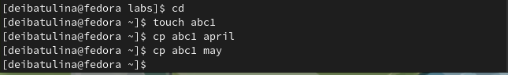
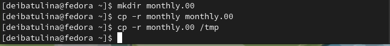
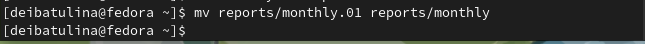
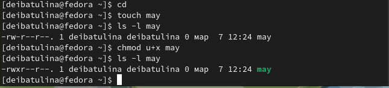
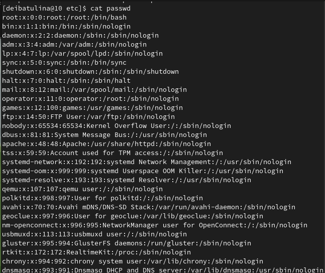
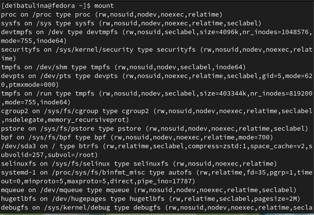

---
## Front matter
lang: ru-RU
title: "Презентация по лабораторной работе №5"
subtitle: "Анализ файловой системы Linux. Команды для работы с файлами и каталогами"
author:
  - Ибатулина Д.Э.
institute:
  - Российский университет дружбы народов, Москва, Россия
date: 10 марта 2023

## i18n babel
babel-lang: russian
babel-otherlangs: english

## Formatting pdf
toc: false
toc-title: Содержание
slide_level: 2
aspectratio: 169
section-titles: true
theme: metropolis
header-includes:
 - \metroset{progressbar=frametitle,sectionpage=progressbar,numbering=fraction}
 - '\makeatletter'
 - '\beamer@ignorenonframefalse'
 - '\makeatother'
---

# Информация

## Докладчик

:::::::::::::: {.columns align=center}
::: {.column width="70%"}

  * Ибатулина Дарья Эдуардовна
  * студентка группы НКАбд-01-22
  * Российский университет дружбы народов
  * [1132226434@pfur.ru](mailto:1132226434@pfur.ru)
  * <https://deibatulina.github.io/ru/>

:::
::: {.column width="30%"}

:::
::::::::::::::

# Вводная часть

## Актуальность

  Через терминал (командную строку) работать с файлами и каталогами очень удобно. Поэтому навыки и умения, полученные мною в ходе выполнения данной лабораторной работы пригодятся в будущей профессии и будут полезны в жизни.

## Цели и задачи

  Ознакомление с файловой системой Linux, её структурой, именами и содержанием каталогов. Приобретение практических навыков по применению команд для работы с файлами и каталогами, по управлению процессами (и работами), по проверке использования диска и обслуживанию файловой системы.

## Материалы и методы

- терминал (командная строка) ОС Linux;
- руководство к лабораторной работе №5.

# Основная часть

## Создание и копирование файлов

  Сначала я узнала, что для создания файла служит команда touch, а для его копирования - комнада cp.
  

## Создание и копирование каталогов

  Для создания директорий существует команда mkdir. Скопировать каталог можно также с помощью команды cp.

## Переименование и перемещение файлов и директорий

  Для того, чтобы переименовать каталог, служит команда mv. Она же применяется и для перемещения файлов и каталогов.
  

## Изменение прав доступа к файлу

  Чтобы изменить права доступа к файлу, применяется команда chmod с различными аргументами.
  

## Вывод содержимого файлов

  Для просмотра содеожимого файлов небольшого размера подойдёт команда cat.
  

## Просмотр используемых в ОС файлов

  Для этого можно использовать команду mount без аргументов.
  

# Заключительная часть

## Результаты

  В результате выполнения данной лабораторной работы я научилась работать с файлами и каталогами, анализировать файловую систему Linux.

## Итоговый слайд

  Работать с файлами и каталогами через терминал очень удобно. Также важно было научиться и изменять права доступа к файлам и каталогам. Теперь я умею это делать.

