---
## Front matter
title: "Отчёт по лабораторной работе №5"
subtitle: "Анализ файловой системы Linux. Команды для работы с файлами и каталогами"
author: "Дарья Эдуардовна Ибатулина"

## Generic otions
lang: ru-RU
toc-title: "Содержание"

## Bibliography
bibliography: bib/cite.bib
csl: pandoc/csl/gost-r-7-0-5-2008-numeric.csl

## Pdf output format
toc: true # Table of contents
toc-depth: 2
lof: true # List of figures
lot: true # List of tables
fontsize: 12pt
linestretch: 1.5
papersize: a4
documentclass: scrreprt
## I18n polyglossia
polyglossia-lang:
  name: russian
  options:
	- spelling=modern
	- babelshorthands=true
polyglossia-otherlangs:
  name: english
## I18n babel
babel-lang: russian
babel-otherlangs: english
## Fonts
mainfont: PT Serif
romanfont: PT Serif
sansfont: PT Sans
monofont: PT Mono
mainfontoptions: Ligatures=TeX
romanfontoptions: Ligatures=TeX
sansfontoptions: Ligatures=TeX,Scale=MatchLowercase
monofontoptions: Scale=MatchLowercase,Scale=0.9
## Biblatex
biblatex: true
biblio-style: "gost-numeric"
biblatexoptions:
  - parentracker=true
  - backend=biber
  - hyperref=auto
  - language=auto
  - autolang=other*
  - citestyle=gost-numeric
## Pandoc-crossref LaTeX customization
figureTitle: "Рис."
tableTitle: "Таблица"
listingTitle: "Листинг"
lofTitle: "Список иллюстраций"
lotTitle: "Список таблиц"
lolTitle: "Листинги"
## Misc options
indent: true
header-includes:
  - \usepackage{indentfirst}
  - \usepackage{float} # keep figures where there are in the text
  - \floatplacement{figure}{H} # keep figures where there are in the text
---

# Цель работы

  Ознакомление с файловой системой Linux, её структурой, именами и содержанием каталогов. Приобретение практических навыков по применению команд для работы с файлами и каталогами, по управлению процессами (и работами), по проверке использования диска и обслуживанию файловой системы.

# Задание

1. Выполните все примеры, приведённые в первой части описания лабораторной работы.
2. Выполните следующие действия, зафиксировав в отчёте по лабораторной работе
используемые при этом команды и результаты их выполнения:
2.1.Скопируйте файл /usr/include/sys/io.h в домашний каталог и назовите его
equipment. Если файла io.h нет, то используйте любой другой файл в каталоге
/usr/include/sys/ вместо него.
2.2. В домашнем каталоге создайте директорию ~/ski.plases.
2.3. Переместите файл equipment в каталог ~/ski.plases.
2.4. Переименуйте файл ~/ski.plases/equipment в ~/ski.plases/equiplist.
2.5. Создайте в домашнем каталоге файл abc1 и скопируйте его в каталог
~/ski.plases, назовите его equiplist2.
2.6. Создайте каталог с именем equipment в каталоге ~/ski.plases.
2.7. Переместите файлы ~/ski.plases/equiplist и equiplist2 в каталог
~/ski.plases/equipment.
2.8. Создайте и переместите каталог ~/newdir в каталог ~/ski.plases и назовите
его plans.
3. Определите опции команды chmod, необходимые для того, чтобы присвоить перечисленным ниже файлам выделенные права доступа, считая, что в начале таких прав
нет:
3.1. drwxr--r-- ... australia
3.2. drwx--x--x ... play
3.3. -r-xr--r-- ... my_os
3.4. -rw-rw-r-- ... feathers
При необходимости создайте нужные файлы.
4. Проделайте приведённые ниже упражнения, записывая в отчёт по лабораторной
работе используемые при этом команды:
4.1. Просмотрите содержимое файла /etc/password.
4.2. Скопируйте файл ~/feathers в файл ~/file.old.
4.3. Переместите файл ~/file.old в каталог ~/play.
4.4. Скопируйте каталог ~/play в каталог ~/fun.
4.5. Переместите каталог ~/fun в каталог ~/play и назовите его games.
4.6. Лишите владельца файла ~/feathers права на чтение.
4.7. Что произойдёт, если вы попытаетесь просмотреть файл ~/feathers командой
cat?
4.8. Что произойдёт, если вы попытаетесь скопировать файл ~/feathers?
4.9. Дайте владельцу файла ~/feathers право на чтение.
4.10. Лишите владельца каталога ~/play права на выполнение.
4.11. Перейдите в каталог ~/play. Что произошло?
4.12. Дайте владельцу каталога ~/play право на выполнение.
5. Прочитайте man по командам mount, fsck, mkfs, kill и кратко их охарактеризуйте,
приведя примеры.


# Теоретическое введение

  В данной лабораторной работе мы будем работать с файлами и каталогами. Для этого нам понадобятся некоторые команды в терминале. В табл. @tbl:std-dir приведены некоторые команды для работы с файлами и каталогами.

: Команды для работы с файлами и каталогами в GNU Linux {#tbl:std-dir}

| Имя команды | Описание команды                                                                                                         |
|--------------|----------------------------------------------------------------------------------------------------------------------------|
| `touch имя_файла`          |    Создание файла                                                  |
| `cat имя_файла`      | Просмотр содржимого файлов небольшого размера     |
| `less имя_файла`       |    Просмотр файла постранично                                        |
| `head [-n] имя_файла`      | Вывод по умолчанию 10 первых строк файла или n строк |
| `tail [-n] имя_файла`    | Вывод последних n строк файла |                                                                                  |
| `cp исходная_директория целевая_директория`      | Копирование файлов  и каталогов                                                                                    |
| `mkdir имя_директории`       | Создание директории                |
| `mv старый_файл новый_файл`       | Перемещение (переименование) каталогов                                                                               |


**Права доступа**

  Каждый файл или каталог имеет права доступа.
  В сведениях о файле или каталоге указываются:
– тип файла (символ (-) обозначает файл, а символ (d) — каталог);
– права для владельца файла (r — разрешено чтение, w — разрешена запись, x — разрешено выполнение, - — право доступа отсутствует);
– права для членов группы (r — разрешено чтение, w — разрешена запись, x — разрешено
выполнение, - — право доступа отсутствует);
– права для всех остальных (r — разрешено чтение, w — разрешена запись, x — разрешено
выполнение, - — право доступа отсутствует).
*Примеры:*

1. Для файла (крайнее левое поле имеет значение -) владелец файла имеет право на
чтение и запись (rw-), группа, в которую входит владелец файла, может читать файл
(r--), все остальные могут читать файл (r--):

`-rw-r--r--`

2. Только владелец файла имеет право на чтение, изменение и выполнение файла:

`-rwx------`

3. Владелец каталога (крайнее левое поле имеет значение d) имеет право на просмотр,
изменение и доступа в каталог, члены группы могут входить и просматривать его, все
остальные — только входить в каталог:

`drwxr-x--x`

**Изменение прав доступа**

  Права доступа к файлу или каталогу можно изменить, воспользовавшись командой `chmod`. Сделать это может владелец файла (или каталога) или пользователь с правами администратора.
  Формат команды:
  
`chmod режим имя_файла`
  Режим (в формате команды) имеет следующие компоненты структуры и способ записи:
  
**=** установить право
**-** лишить права
**+** дать право
**r** чтение
**w** запись
**x** выполнение
**u** (user) владелец файла
**g (group)** группа, к которой принадлежит владелец файла
**o (others)** все остальные

*Примеры:*

1. Требуется создать файл ~/may с правом выполнения для владельца:

```cd
touch may
ls -l may
chmod u+x may
ls -l may
```

2. Требуется лишить владельца файла ~/may права на выполнение:

```chmod u-x may
ls -l may
```

3. Требуется создать каталог monthly с запретом на чтение для членов группы и всех
остальных пользователей:

```cd
mkdir monthly
chmod g-r, o-r monthly
```

4. Требуется создать файл ~/abc1 с правом записи для членов группы:

```cd
touch abc1
chmod g+w abc1
```

**Анализ файловой системы**

  Файловая система в Linux состоит из фалов и каталогов. Каждому физическому носителю соответствует своя файловая система.
  Существует несколько типов файловых систем. Перечислим наиболее часто встречающиеся типы:\

- ext2fs (second extended filesystem);
- ext2fs (third extended file system);
- ext4 (fourth extended file system);
- ReiserFS;
- xfs;
- fat (file allocation table);
- ntfs (new technology file system).

  Для просмотра используемых в операционной системе файловых систем можно воспользоваться командой mount без параметров.
  
  Другой способ определения смонтированных в операционной системе файловых систем — просмотр файла/etc/fstab. Сделать это можно например с помощью команды
cat:

`cat /etc/fstab`

  Для определения объёма свободного пространства на файловой системе можно воспользоваться командой `df`, которая выведет на экран список всех файловых систем в соответствии с именами устройств, с указанием размера и точки монтирования.
  
  С помощью команды fsck можно проверить (а в ряде случаев восстановить) целостность файловой системы:
Формат команды:

`fsck имя_устройства`


Более подробно об Unix см. в [@gnu-doc:bash;@newham:2005:bash;@zarrelli:2017:bash;@robbins:2013:bash;@tannenbaum:arch-pc:ru;@tannenbaum:modern-os:ru].

# Выполнение лабораторной работы

1. Выполним все примеры, приведённые в первой части описания лабораторной работы:

  **Копирование файла в текущем каталоге:** Скопировать файл ~/abc1 в файл april и в файл may
(рис. @fig:001):

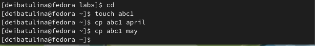{#fig:001 width=70%}

  **Копирование нескольких файлов в каталог** Скопировать файлы april и may в каталог monthly (рис. @fig:002):
  
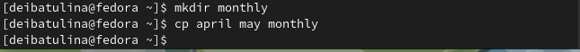{#fig:002 width=70%}

  **Копирование файлов в произвольном каталоге** Скопировать файл monthly/may в файл с именем june (рис. @fig:003):

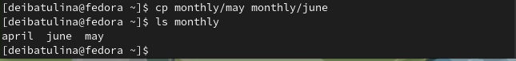{#fig:003 width=70%}

  **Копирование каталогов в текущем и произвольном каталогах** Скопировать каталог monthly в каталог monthly.00, скопировать каталог monthly.00 в каталог /tmp (рис. @fig:004):
  
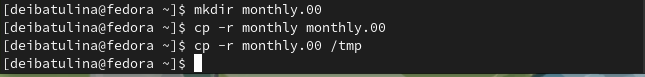{#fig:004 width=70%}

  **Переименование файлов в текущем каталоге** Изменить название файла april на july в домашнем каталоге (рис. @fig:005):
  
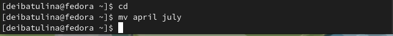{#fig:005 width=70%}

  **Перемещение файлов в другой каталог** Переместить файл july в каталог monthly.00 (рис. @fig:006):
  
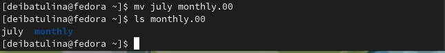{#fig:006 width=70%}

  **Переименование каталогов в текущем каталоге** Переименовать каталог monthly.00 в monthly.01 (рис. @fig:007):
  
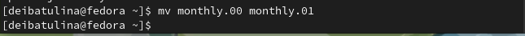{#fig:007 width=70%}

  **Перемещение каталога в другой каталог**  Переместить каталог monthly.01 в каталог reports (рис. @fig:008):
  
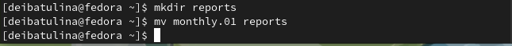{#fig:008 width=70%}

  **Переименование каталога, не являющегося текущим** Переименовать каталог reports/monthly.01 в reports/monthly (рис. @fig:009):

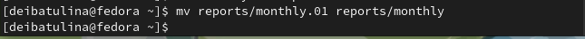{#fig:009 width=70%}

  Требуется создать файл ~/may с правом выполнения для владельца (рис. @fig:010):
  
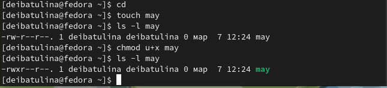{#fig:010 width=70%}

  Требуется лишить владельца файла ~/may права на выполнение (рис. @fig:011):
  
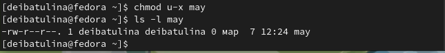{#fig:011 width=70%}

  Требуется создать каталог monthly с запретом на чтение для членов группы и всех остальных пользователей (рис. @fig:012):
  
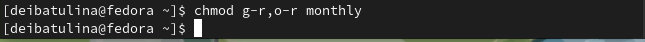{#fig:012 width=70%}

  Требуется создать файл ~/abc1 с правом записи для членов группы (рис. @fig:013):
  
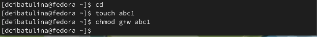{#fig:013 width=70%}

  Для просмотра используемых в операционной системе файловых систем можно воспользоваться командой mount без параметров. В результате её применения получим следующее (рис. @fig:014):
  
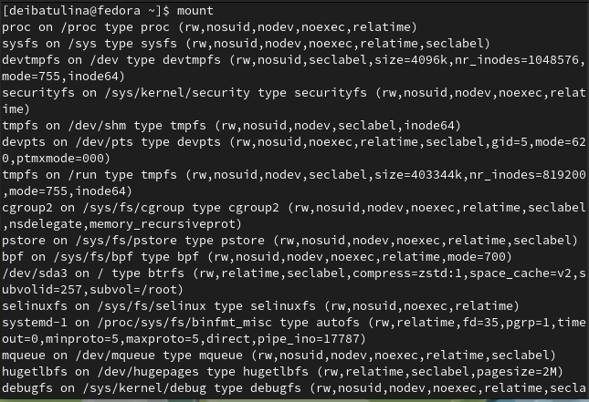{#fig:014 width=70%}

  Другой способ определения смонтированных в операционной системе файловых систем — просмотр файла/etc/fstab. Сделать это можно например с помощью команды cat (рис. @fig:015):
  
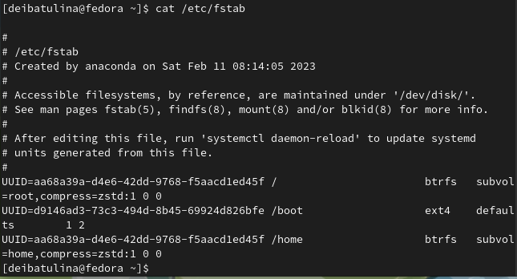{#fig:015 width=70%}

  Для определения объёма свободного пространства на файловой системе можно воспользоваться командой df, которая выведет на экран список всех файловых систем в соответствии с именами устройств, с указанием размера и точки монтирования (рис. @fig:016):

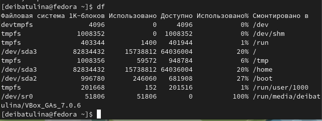{#fig:016 width=70%}

2. Скопируйте файл /usr/include/sys/io.h в домашний каталог и назовите его equipment. Если файла io.h нет, то используйте любой другой файл в каталоге /usr/include/sys/ вместо него (рис. @fig:017):

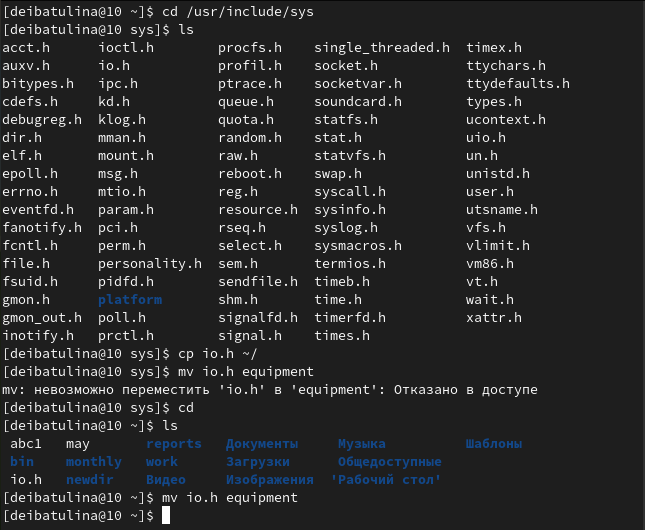{#fig:017 width=70%}

3. В домашнем каталоге создайте директорию ~/ski.plases. Переместите файл equipment в каталог ~/ski.plases. Переименуйте файл ~/ski.plases/equipment в ~/ski.plases/equiplist (рис. @fig:018):

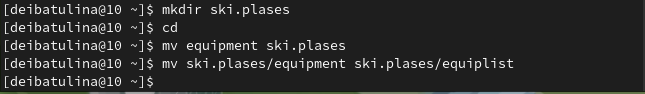{#fig:018 width=70%}

4. Создайте в домашнем каталоге файл abc1 и скопируйте его в каталог ~/ski.plases, назовите его equiplist2 (рис. @fig:019):

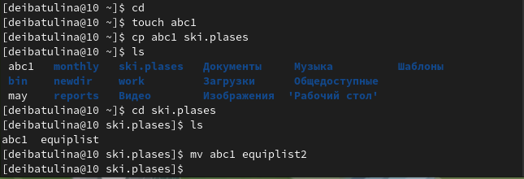{#fig:019 width=70%}

5. Создайте каталог с именем equipment в каталоге ~/ski.plases (рис. @fig:020):

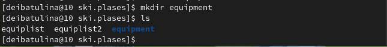{#fig:020 width=70%}

6. Переместите файлы ~/ski.plases/equiplist и equiplist2 в каталог ~/ski.plases/equipment (рис. @fig:021):

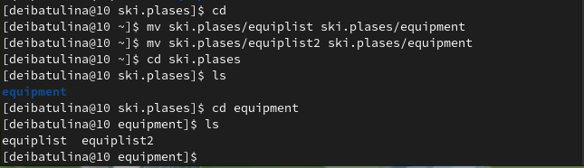{#fig:021 width=70%}

7. Создайте и переместите каталог ~/newdir в каталог ~/ski.plases и назовите его plans (рис. @fig:022):

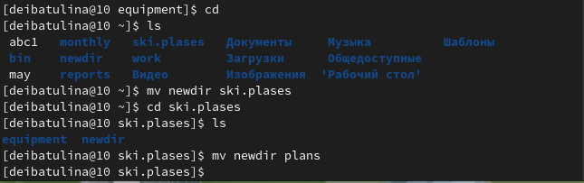{#fig:022 width=70%}

8. Определите опции команды chmod, необходимые для того, чтобы присвоить перечисленным ниже файлам выделенные права доступа, считая, что в начале таких прав нет:

8.1. drwxr--r-- ... australia: `chmod u+r,u+w,u+x,g+r,o+r`
8.2. drwx--x--x ... play: `chmod u+r,u+w,u+x,g+x,o+x`
8.3. -r-xr--r-- ... my_os: `chmod u+r,u+x,g+r,o+r`
8.4. -rw-rw-r-- ... feathers: `chmod u+r,u+w,g+r,g+w,o+r`

9. Проделайте приведённые ниже упражнения, записывая в отчёт по лабораторной работе используемые при этом команды:

9.1. Просмотрите содержимое файла /etc/password (рис. @fig:023):

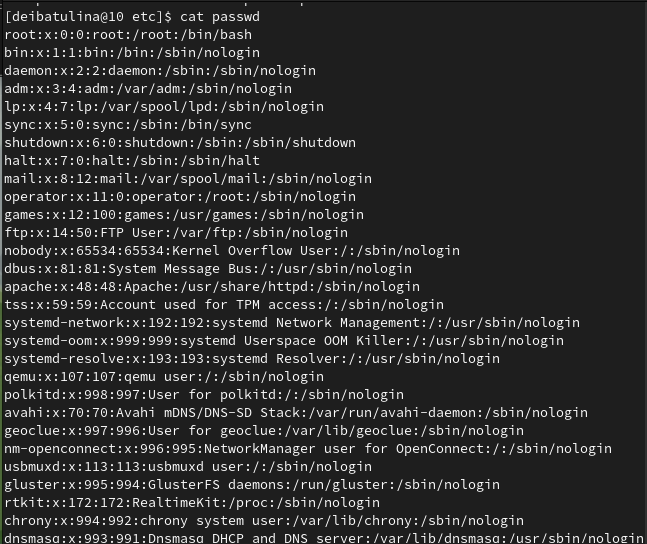{#fig:023 width=70%}

9.2. Скопируйте файл ~/feathers в файл ~/file.old (рис. @fig:024):

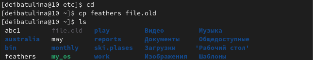{#fig:024 width=70%}

9.3. Переместите файл ~/file.old в каталог ~/play (рис. @fig:025):

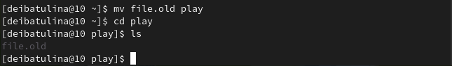{#fig:025 width=70%}

9.4. Скопируйте каталог ~/play в каталог ~/fun (рис. @fig:026):

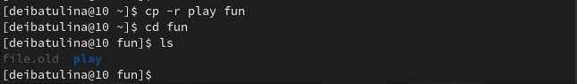{#fig:026 width=70%}

9.5. Переместите каталог ~/fun в каталог ~/play и назовите его games (рис. @fig:027):

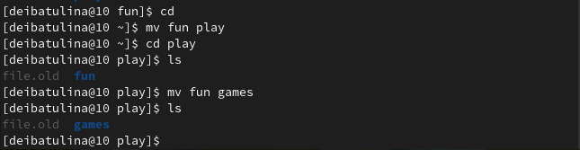{#fig:027 width=70%}

9.6. Лишите владельца файла ~/feathers права на чтение (рис. @fig:028):

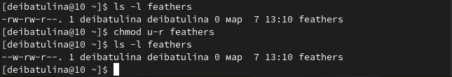{#fig:028 width=70%}

9.7. Что произойдёт, если вы попытаетесь просмотреть файл ~/feathers командой cat? (рис. @fig:029):

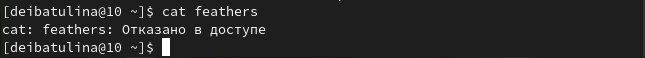{#fig:029 width=70%}

9.8. Что произойдёт, если вы попытаетесь скопировать файл ~/feathers? (рис. @fig:030):

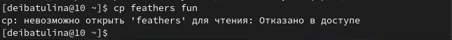{#fig:030 width=70%}

9.9. Дайте владельцу файла ~/feathers право на чтение (рис. @fig:031):

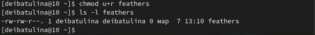{#fig:031 width=70%}

9.10. Лишите владельца каталога ~/play права на выполнение (рис. @fig:032):

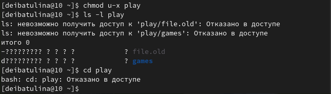{#fig:032 width=70%}

9.11. Перейдите в каталог ~/play. Что произошло? (рис. @fig:033):

{#fig:033 width=70%}

9.12. Дайте владельцу каталога ~/play право на выполнение (рис. @fig:034):

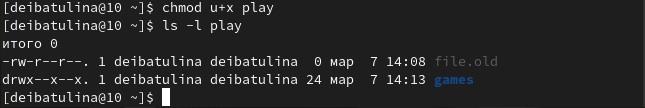{#fig:034 width=70%}

10. Прочитайте man по командам mount, fsck, mkfs, kill и кратко их охарактеризуйте, приведя примеры.

* Man по команде mount (рис. @fig:035):

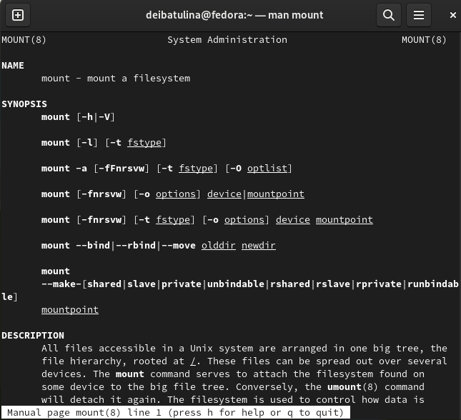{#fig:035 width=70%}

  Команда используется для просмотра используемых в операционной системе файловых систем.

* Man по команде fsck (рис. @fig:036):

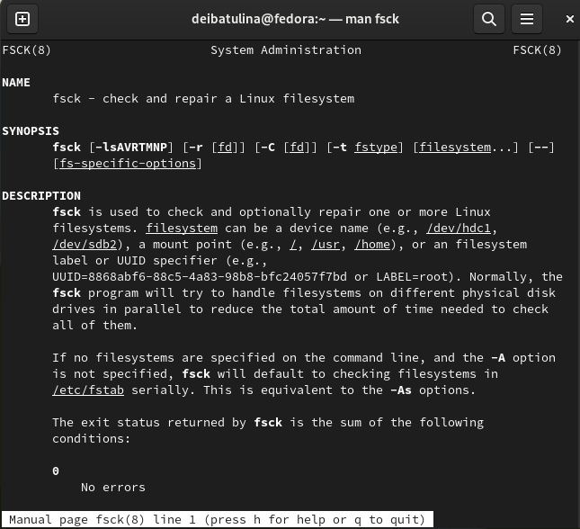{#fig:036 width=70%}

  С помощью команды fsck можно проверить (а в ряде случаев восстановить) целостность файловой системы.

* Man по команде mkfs (рис. @fig:037):

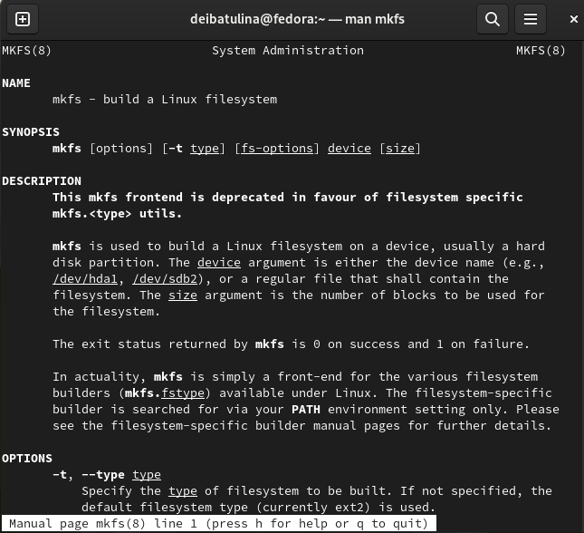{#fig:037 width=70%}

  Команда mkfs используется для создания файловой системы Linux на некотором устройстве.

* Man по команде kill (рис. @fig:038):

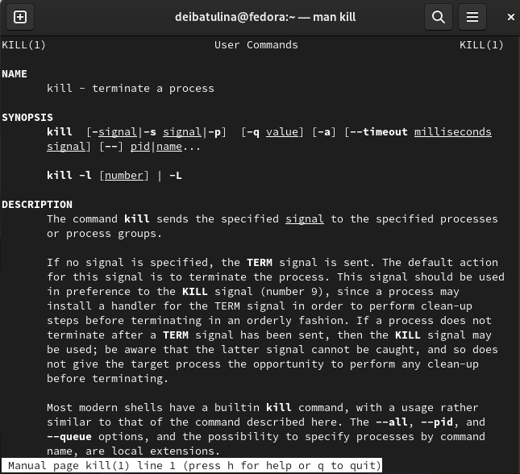{#fig:038 width=70%}

  Команда kill передаёт сигнал для немедленного прекращения процесса.

# Ответы на контрольные вопросы

1. Дайте характеристику каждой файловой системе, существующей на жёстком диске компьютера, на котором вы выполняли лабораторную работу.
ext4 - журналируемая файловая система, используемая преимущественно в операционных системах с ядром Linux, созданная на базе ext3 в 2006 году.

Основные изменения в ext4 по сравнению с ext3:
Увеличен максимальный объём одного раздела диска до 1 эксбибайта (260 байт) при размере блока 4 кибибайт;
увеличен размера одного файла до 16 тебибайт (244 байт);
введён механизм протяжённой (extent) записи файлов, уменьшающий фрагментацию и повышающий производительность (новая информация добавляется в конец области диска, выделенной заранее по соседству с областью, занятой файлом);
поднято ограничение на число вложенных каталогов с 32 000 подкаталогов до 65 535 (при этом в некоторых случаях требуется изменить константы ядра).


2. Приведите общую структуру файловой системы и дайте характеристику каждой директории первого уровня этой структуры.

/ — root каталог. Содержит в себе всю иерархию системы;

/bin — здесь находятся двоичные исполняемые файлы. Основные общие команды, хранящиеся отдельно от других программ в системе (прим.: pwd, ls, cat, ps);

/boot — тут расположены файлы, используемые для загрузки системы (образ initrd, ядро vmlinuz);

/dev — в данной директории располагаются файлы устройств (драйверов). С помощью этих файлов можно взаимодействовать с устройствами. К примеру, если это жесткий диск, можно подключить его к файловой системе. В файл принтера же можно написать напрямую и отправить задание на печать;

/etc — в этой директории находятся файлы конфигураций программ. Эти файлы позволяют настраивать системы, сервисы, скрипты системных демонов;

/home — каталог, аналогичный каталогу Users в Windows. Содержит домашние каталоги учетных записей пользователей (кроме root). При создании нового пользователя здесь создается одноименный каталог с аналогичным именем и хранит личные файлы этого пользователя;

/lib — содержит системные библиотеки, с которыми работают программы и модули ядра;

/lost+found — содержит файлы, восстановленные после сбоя работы системы. Система проведет проверку после сбоя и найденные файлы можно будет посмотреть в данном каталоге;

/media — точка монтирования внешних носителей. Например, когда вы вставляете диск в дисковод, он будет автоматически смонтирован в директорию /media/cdrom;

/mnt — точка временного монтирования. Файловые системы подключаемых устройств обычно монтируются в этот каталог для временного использования;

/opt — тут расположены дополнительные (необязательные) приложения. Такие программы обычно не подчиняются принятой иерархии и хранят свои файлы в одном подкаталоге (бинарные, библиотеки, конфигурации);

/proc — содержит файлы, хранящие информацию о запущенных процессах и о состоянии ядра ОС;

/root — директория, которая содержит файлы и личные настройки суперпользователя;

/run — содержит файлы состояния приложений. Например, PID-файлы или UNIX-сокеты;

/sbin — аналогично /bin содержит бинарные файлы. Утилиты нужны для настройки и администрирования системы суперпользователем;

/srv — содержит файлы сервисов, предоставляемых сервером (прим. FTP или Apache HTTP);

/sys — содержит данные непосредственно о системе. Тут можно узнать информацию о ядре, драйверах и устройствах;

/tmp — содержит временные файлы. Данные файлы доступны всем пользователям на чтение и запись. Стоит отметить, что данный каталог очищается при перезагрузке;

/usr — содержит пользовательские приложения и утилиты второго уровня, используемые пользователями, а не системой. Содержимое доступно только для чтения (кроме root). Каталог имеет вторичную иерархию и похож на корневой;

/var — содержит переменные файлы. Имеет подкаталоги, отвечающие за отдельные переменные. Например, логи будут храниться в /var/log, кэш в /var/cache, очереди заданий в /var/spool/ и так далее.

3. Какая операция должна быть выполнена, чтобы содержимое некоторой файловой
системы было доступно операционной системе? Монтирование тома.

4. Назовите основные причины нарушения целостности файловой системы. Как устранить повреждения файловой системы?

Отсутствие синхронизации между образом файловой системы в памяти и ее данными на диске в случае аварийного останова может привести к появлению следующих ошибок:

Один блок адресуется несколькими mode (принадлежит нескольким файлам).

Блок помечен как свободный, но в то же время занят (на него ссылается onode).

Блок помечен как занятый, но в то же время свободен (ни один inode на него не ссылается).

Неправильное число ссылок в inode (недостаток или избыток ссылающихся записей в каталогах).

Несовпадение между размером файла и суммарным размером адресуемых inode блоков.\

Недопустимые адресуемые блоки (например, расположенные за пределами файловой системы).

"Потерянные" файлы (правильные inode, на которые не ссылаются записи каталогов).

Недопустимые или неразмещенные номера inode в записях каталогов.

5. Как создаётся файловая система? С помощью команды mkfs.

6. Дайте характеристику командам для просмотра текстовых файлов.

cat - просмотр содержимого файлов небольшого размера, head - просмотр первых 10 строк файла по умолчанию, tail - просмотр n последних строк файла.

7. Приведите основные возможности команды cp в Linux.

Данная команда позволяет копировать файлы и каталоги в различные директории.

8. Приведите основные возможности команды mv в Linux.
С её помощью можно переименовывать файлы и каталоги, перемещать каталоги и файлы из/в текущих(ие) и отличных(ые) от текущих директорий.

9. Что такое права доступа? Как они могут быть изменены?

Права доступа - это возможность работать с файлом или каталогом. Изменить их можно с помощью команды chmod, если вы root-администратор (супер-пользователь) или владелец файла/каталога.

# Выводы

  В ходе выполнения лабораторной работы я научилась работать с файлами и каталогами.

# Список литературы{.unnumbered}

::: {#refs}
:::
