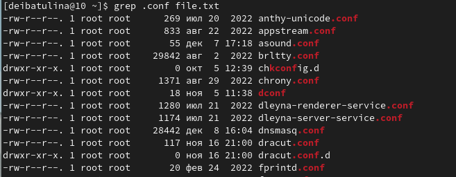
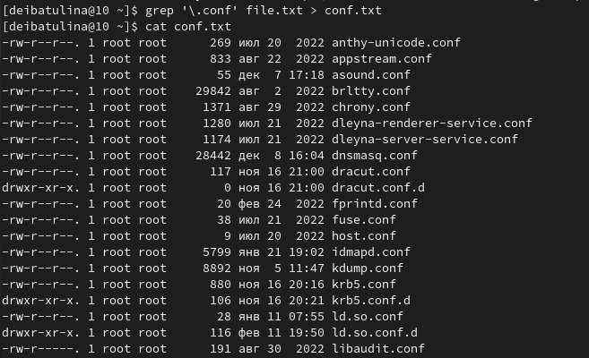
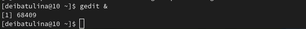
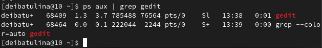
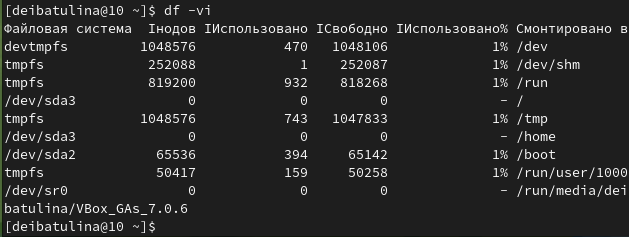
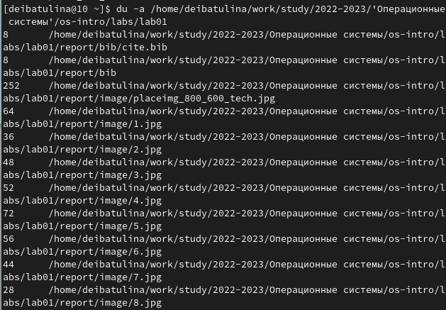
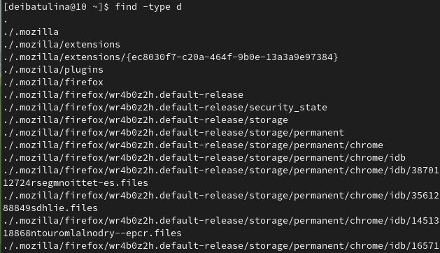

---
## Front matter
lang: ru-RU
title: "Презентация по лабораторной работе №6"
subtitle: "Поиск файлов. Перенаправление ввода-вывода. Просмотр запущенных процессов"
author:
  - Ибатулина Д.Э.
institute:
  - Российский университет дружбы народов, Москва, Россия
date: 12 марта 2023

## i18n babel
babel-lang: russian
babel-otherlangs: english

## Formatting pdf
toc: false
toc-title: Содержание
slide_level: 2
aspectratio: 169
section-titles: true
theme: metropolis
header-includes:
 - \metroset{progressbar=frametitle,sectionpage=progressbar,numbering=fraction}
 - '\makeatletter'
 - '\beamer@ignorenonframefalse'
 - '\makeatother'
---

# Информация

## Докладчик

:::::::::::::: {.columns align=center}
::: {.column width="70%"}

  * Ибатулина Дарья Эдуардовна
  * студентка группы НКАбд-01-22
  * Российский университет дружбы народов
  * [1132226434@pfur.ru](mailto:1132226434@pfur.ru)
  * <https://deibatulina.github.io/ru/>

:::
::: {.column width="30%"}

:::
::::::::::::::

# Вводная часть

## Актуальность

  Мне, как будущему IT-специалисту, важно научиться работать с ОС Linux, в частности, перенаправлять процессы ввода-вывода, искать файлы по различным параметрам.

## Цели и задачи

  Ознакомление с инструментами поиска файлов и фильтрации текстовых данных. Приобретение практических навыков: по управлению процессами (и заданиями), по проверке использования диска и обслуживанию файловых систем.

## Материалы и методы

- терминал (командная строка) ОС Linux (дистрибутив Fedora)

# Основная часть

## Поиск файлов по расширению

  Выведем имена всех файлов из file.txt, имеющих расширение .conf:
  

## Перенаправление вывода в файл

  Перенаправим вывод предыдуще команды в файл *conf.txt*:
  

## Поиск файлов по началу

  Определим, какие файлы в домашнем каталоге имеют имена, начинающиеся с символа c:
  

## Запуск процесса в фоновом режиме

  Запустим из консоли в фоновом режиме редактор gedit:
  

## Определение идентификатора процесса

  Определим идентификатор процесса gedit, используя команду ps, конвейер и фильтр grep:
  

## Завершение процесса

  Для завершения процесса gedit используем команду kill с номером процесса gedit, полученного при исполнении предыдущей команды:
  

## Использование дискового пространства файловой системы

  Команда df используется для отображения использования дискового пространства файловой системой Linux в целом:
  

## Отображение используемых файлов и каталогов на диске в файловой системе

  Команда du используется для отображения используемых файлов и каталогов на диске в файловой системе:
  

## Команда find

  Воспользовавшись справкой команды find, выведем имена всех директорий, имеющихся в домашнем каталоге:
  

# Заключительная часть

## Результаты

  В ходе выполнения данной лабораторной работы я приобрела практические навыки: по управлению процессами (и заданиями), по проверке использования диска и обслуживанию файловых систем, ознакомилась с инструментами поиска файлов и фильтрации текстовых данных.

## Итоговый слайд

  Выполнение лабораторной работы дало мне новые, интересные, а главное, полезные знания, которые пригодятся в дальнейшей работе.

