---
## Front matter
title: "Лабораторная работа №6: Поиск файлов. Перенаправление ввода-вывода. Просмотр запущенных процессов"
subtitle: "Дисциплина: Операционные системы"
author: "Дарья Эдуардовна Ибатулина"

## Generic otions
lang: ru-RU
toc-title: "Содержание"

## Bibliography
bibliography: bib/cite.bib
csl: pandoc/csl/gost-r-7-0-5-2008-numeric.csl

## Pdf output format
toc: true # Table of contents
toc-depth: 2
lof: true # List of figures
lot: true # List of tables
fontsize: 12pt
linestretch: 1.5
papersize: a4
documentclass: scrreprt
## I18n polyglossia
polyglossia-lang:
  name: russian
  options:
	- spelling=modern
	- babelshorthands=true
polyglossia-otherlangs:
  name: english
## I18n babel
babel-lang: russian
babel-otherlangs: english
## Fonts
mainfont: PT Serif
romanfont: PT Serif
sansfont: PT Sans
monofont: PT Mono
mainfontoptions: Ligatures=TeX
romanfontoptions: Ligatures=TeX
sansfontoptions: Ligatures=TeX,Scale=MatchLowercase
monofontoptions: Scale=MatchLowercase,Scale=0.9
## Biblatex
biblatex: true
biblio-style: "gost-numeric"
biblatexoptions:
  - parentracker=true
  - backend=biber
  - hyperref=auto
  - language=auto
  - autolang=other*
  - citestyle=gost-numeric
## Pandoc-crossref LaTeX customization
figureTitle: "Рис."
tableTitle: "Таблица"
listingTitle: "Листинг"
lofTitle: "Список иллюстраций"
lotTitle: "Список таблиц"
lolTitle: "Листинги"
## Misc options
indent: true
header-includes:
  - \usepackage{indentfirst}
  - \usepackage{float} # keep figures where there are in the text
  - \floatplacement{figure}{H} # keep figures where there are in the text
---

# Цель работы

  Ознакомление с инструментами поиска файлов и фильтрации текстовых данных. Приобретение практических навыков: по управлению процессами (и заданиями), по проверке использования диска и обслуживанию файловых систем.

# Задание

1. Осуществите вход в систему, используя соответствующее имя пользователя.
2. Запишите в файл file.txt названия файлов, содержащихся в каталоге /etc. Допишите в этот же файл названия файлов, содержащихся в вашем домашнем каталоге.
3. Выведите имена всех файлов из file.txt, имеющих расширение .conf, после чего
запишите их в новый текстовой файл conf.txt.
4. Определите, какие файлы в вашем домашнем каталоге имеют имена, начинавшиеся
с символа c? Предложите несколько вариантов, как это сделать.
5. Выведите на экран (по странично) имена файлов из каталога /etc, начинающиеся
с символа h.
6. Запустите в фоновом режиме процесс, который будет записывать в файл ~/logfile
файлы, имена которых начинаются с log.
7. Удалите файл ~/logfile.
8. Запустите из консоли в фоновом режиме редактор gedit.
9. Определите идентификатор процесса gedit, используя команду ps, конвейер и фильтр
grep. Как ещё можно определить идентификатор процесса?
10. Прочтите справку (man) команды kill, после чего используйте её для завершения
процесса gedit.
11. Выполните команды df и du, предварительно получив более подробную информацию
об этих командах, с помощью команды man.
12. Воспользовавшись справкой команды find, выведите имена всех директорий, имеющихся в вашем домашнем каталоге.

# Теоретическое введение

**Перенаправление ввода-вывода**

  В системе по умолчанию открыто три специальных потока:
*– stdin* — стандартный поток ввода (по умолчанию: клавиатура), файловый дескриптор 0;
*– stdout* — стандартный поток вывода (по умолчанию: консоль), файловый дескриптор **1;
*– stderr* — стандартный поток вывода сообщений об ошибках (по умолчанию: консоль), файловый дескриптор 2.
Большинство используемых в консоли команд и программ записывают результаты своей работы в стандартный поток вывода stdout. Например, команда ls выводит в стандартный поток вывода (консоль) список файлов в текущей директории. Потоки вывода и ввода можно перенаправлять на другие файлы или устройства. Проще всего это делается с помощью символов >, >>, <, <<. Рассмотрим пример.

```
# Перенаправление stdout (вывода) в файл.
# Если файл отсутствовал, то он создаётся,
# иначе -- перезаписывается.
# Создаёт файл, содержащий список дерева каталогов.
ls -lR > dir-tree.list
1>filename
# Перенаправление вывода (stdout) в файл "filename".
1>>filename
# Перенаправление вывода (stdout) в файл "filename",
# файл открывается в режиме добавления.
2>filename
# Перенаправление stderr в файл "filename".
2>>filename
# Перенаправление stderr в файл "filename",
# файл открывается в режиме добавления.
&>filename
# Перенаправление stdout и stderr в файл "filename".
```

**Конвейер**

  Конвейер (pipe) служит для объединения простых команд или утилит в цепочки, в которых результат работы предыдущей команды передаётся последующей. Синтаксис следующий:

```
команда 1 | команда 2
# означает, что вывод команды 1 передастся на ввод команде 2
```
  Конвейеры можно группировать в цепочки и выводить с помощью перенаправления в файл, например:
```
ls -la |sort > sortilg_list
```
  Вывод команды ls -la передаётся команде сортировки sort\verb, которая пишет результат в файл sorting_list\verb.

  Чаще всего скрипты на Bash используются в качестве автоматизации каких-то рутинных операций в консоли, отсюда иногда возникает необходимость в обработке stdout одной команды и передача на stdin другой команде, при этом результат выполнения команды должен быть обработан.

**Поиск файла**

  Команда find используется для поиска и отображения на экран имён файлов, соответствующих заданной строке символов.

  Формат команды:
```
find путь [-опции]
```
  Путь определяет каталог, начиная с которого по всем подкаталогам будет вестись поиск.
  Примеры:
1. Вывести на экран имена файлов из вашего домашнего каталога и его подкаталогов, начинающихся на f:

```
find ~ -name "f*" -print
```

  Здесь ~ — обозначение вашего домашнего каталога, -name — после этой опции указывается имя файла, который нужно найти, "f*" — строка символов, определяющая имя файла, -print — опция, задающая вывод результатов поиска на экран.
  
2. Вывести на экран имена файлов в каталоге /etc, начинающихся с символа p:
```
find /etc -name "p*" -print
```

3. Найти в Вашем домашнем каталоге файлы, имена которых заканчиваются символом ~ и удалить их:
```
find ~ -name "*~" -exec rm "{}" \;
```

  Здесь опция -exec rm "{}" \; задаёт применение команды rm ко всем файлам, имена которых соответствуют указанной после опции -name строке символов.
  Для просмотра опций команды find можно воспользоваться командой man.
  
**Фильтрация текста**

  Найти в текстовом файле указанную строку символов позволяет команда grep.
  Формат команды:
```
grep строка имя_файла
```

  Кроме того, команда grep способна обрабатывать стандартный вывод других команд (любой текст). Для этого следует использовать конвейер, связав вывод команды с вводом grep.
  Примеры:
1. Показать строки во всех файлах в вашем домашнем каталоге с именами, начинающимися на f, в которых есть слово begin:
```
grep begin f*
```

2. Найти в текущем каталоге все файлы, содержащих в имени «лаб»:
```
ls -l | grep лаб
```

**Проверка использования диска**

  Команда df показывает размер каждого смонтированного раздела диска.
  Формат команды:
```
df [-опции] [файловая_система]
```

  Пример:
```
df -vi
```

  Команда du показывает число килобайт, используемое каждым файлом или каталогом.
  Формат команды:

```
du [-опции] [имя_файла...]
```

  Пример.
```
du -a ~/
```

  На afs можно посмотреть использованное пространство командой
```
fs quota
```

**Управление задачами**

  Любую выполняющуюся в консоли команду или внешнюю программу можно запустить в фоновом режиме. Для этого следует в конце имени команды указать знак амперсанда &. Например:
````
gedit &
```

  Будет запущен текстовой редактор gedit в фоновом режиме. Консоль при этом не будет заблокирована. Запущенные фоном программы называются задачами (jobs). Ими можно управлять с помощью команды jobs, которая выводит список запущенных в данный момент задач. Для завершения задачи необходимо выполнить команду
```
kill %номер задачи
```

**Получение информации о процессах**

  Команда ps используется для получения информации о процессах. Формат команды:
```
ps [-опции]
```

  Для получения информации о процессах, управляемых вами и запущенных (работающих или остановленных) на вашем терминале, используйте опцию aux.
  Пример:

```
ps aux
```

  Для запуска команды в фоновом режиме необходимо в конце командной строки указать знак & (амперсанд). Пример работы, требующей много машинного времени для выполнения, и которую целесообразно запустить в фоновом режиме:
  
```
find /var/log -name "*.log" -print > l.log 
```

# Выполнение лабораторной работы

1. Осуществим вход в систему, используя соответствующее имя пользователя (рис. @fig:001):

{#fig:001 width=70%}

2. Запишем в файл file.txt названия файлов, содержащихся в каталоге /etc. Допишем в этот же файл названия файлов, содержащихся в вашем домашнем каталоге (рис. @fig:002, @fig:003):

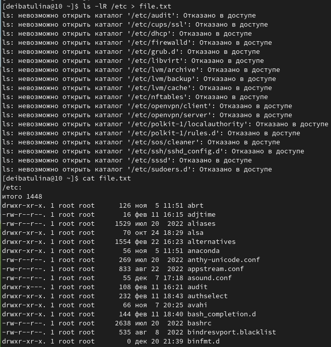{#fig:002 width=70%}

{#fig:003 width=70%}

3. Выведем имена всех файлов из file.txt, имеющих расширение .conf, после чего запишем их в новый текстовой файл conf.txt (рис. @fig:004, @fig:005):

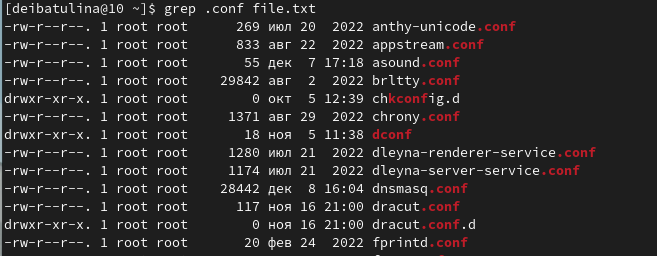{#fig:004 width=70%}

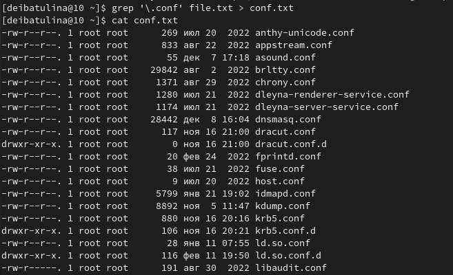{#fig:005 width=70%}

4. Определим, какие файлы в домашнем каталоге имеют имена, начинающиеся с символа c (рис. @fig:006, @fig:007):

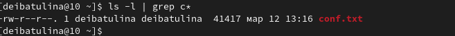{#fig:006 width=70%}

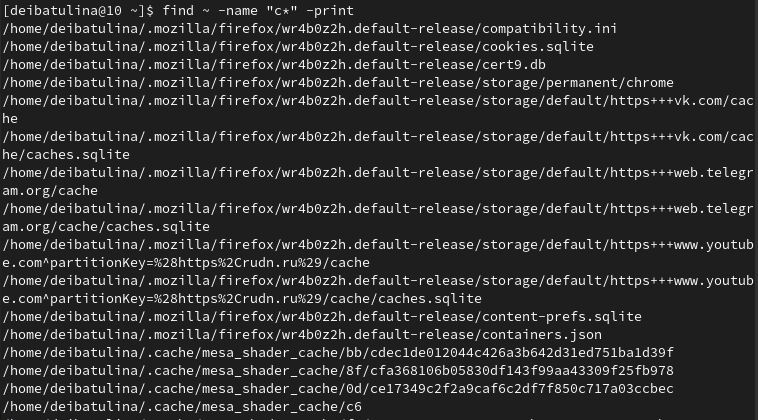{#fig:007 width=70%}

5. Выведем на экран имена файлов из каталога /etc, начинающиеся с символа h (рис. @fig:008):

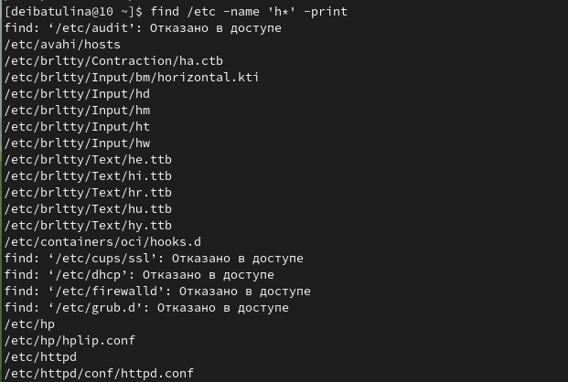{#fig:008 width=70%}

6. Запустим в фоновом режиме процесс, который будет записывать в файл ~/logfile файлы, имена которых начинаются с log (рис. @fig:009):

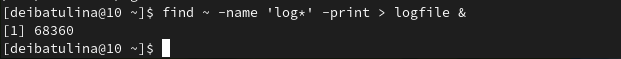{#fig:009 width=70%}

7. Удалим файл ~/logfile (рис. @fig:010):

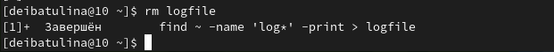{#fig:010 width=70%}

8. Запустим из консоли в фоновом режиме редактор gedit (рис. @fig:011):

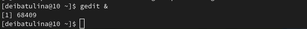{#fig:011 width=70%}

9. Определим идентификатор процесса gedit, используя команду ps, конвейер и фильтр grep (рис. @fig:012, @fig:013):

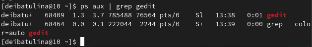{#fig:012 width=70%}

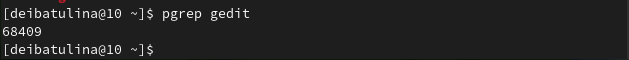{#fig:013 width=70%}

  Получим, что его ID равен 68409.
  
10. Прочтём справку (man) команды kill, после чего используем её для завершения процесса gedit (рис. @fig:014, @fig:015):

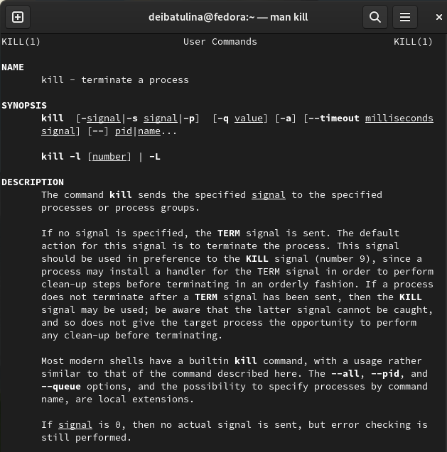{#fig:014 width=70%}

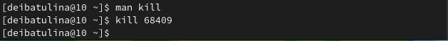{#fig:015 width=70%}

11. Выполните команды df и du, предварительно получив более подробную информацию об этих командах, с помощью команды man (рис. @fig:016, @fig:017, @fig:018, @fig:019):

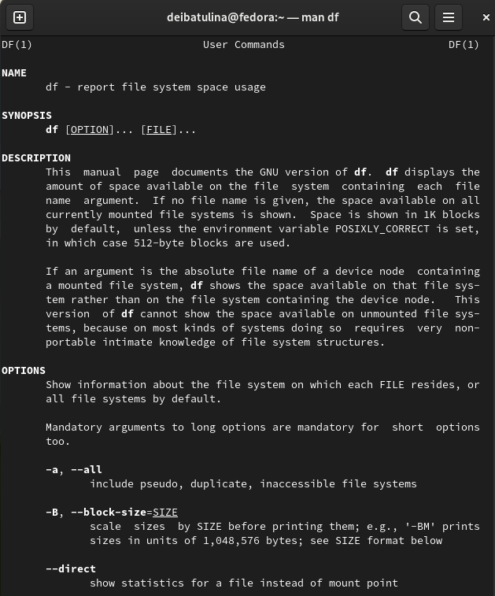{#fig:016 width=70%}

  Получаем, что команда df используется для отображения использования дискового пространства файловой системой Linux в целом.

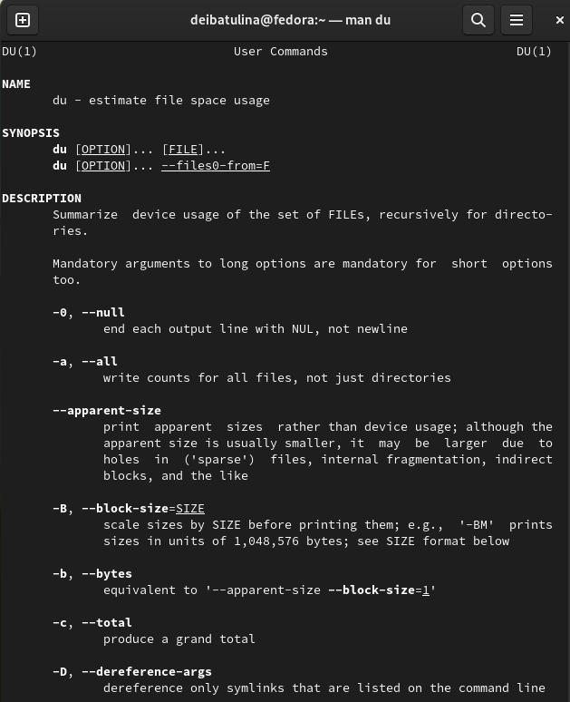{#fig:017 width=70%}

  В свою очередь, команда du используется для отображения используемых файлов и каталогов на диске в файловой системе.

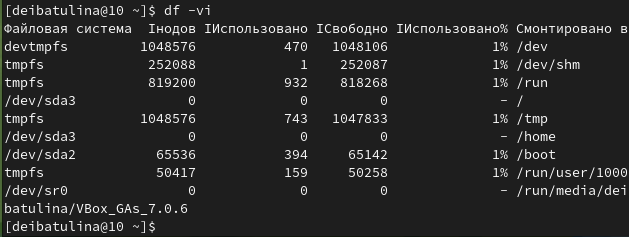{#fig:018 width=70%}

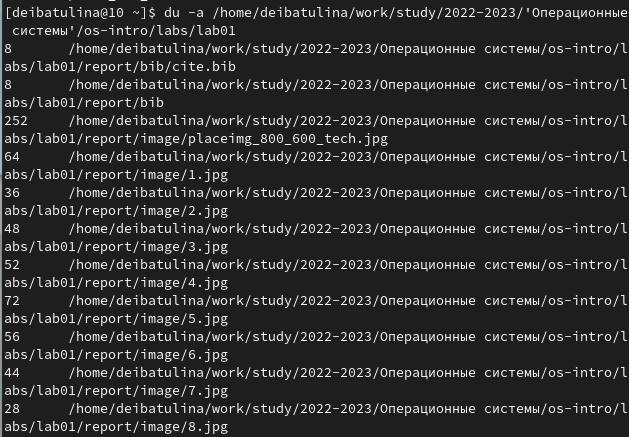{#fig:019 width=70%}

12. Воспользовавшись справкой команды find, выведем имена всех директорий, имеющихся в домашнем каталоге (рис. @fig:020, @fig:021):

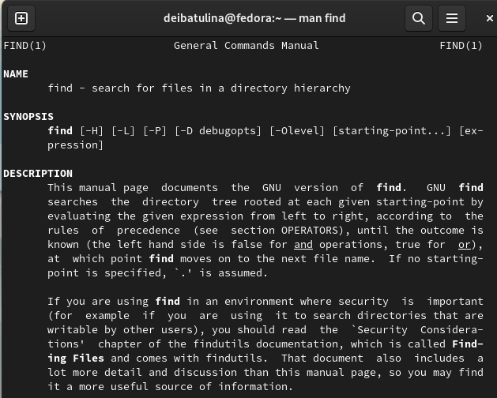{#fig:020 width=70%}

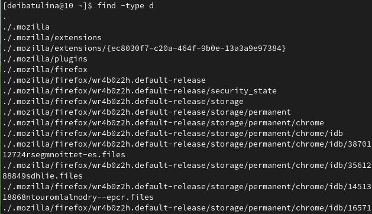{#fig:021 width=70%}

# Контрольные вопросы

1. Какие потоки ввода вывода вы знаете?

  В системе по умолчанию открыто три специальных потока:
– stdin — стандартный поток ввода (по умолчанию: клавиатура), файловый дескриптор 0;
– stdout — стандартный поток вывода (по умолчанию: консоль), файловый дескриптор 1;
– stderr — стандартный поток вывода сообщений об ошибках (по умолчанию: консоль), файловый дескриптор 2.

2. Объясните разницу между операцией > и >>.

  *>* записывает в новый файл или перезаписывает в уже существующий, в свою очередь *>>* добавляет в уже созданный файл (файл открывается в режиме дозаписи). 

3. Что такое конвейер?

  Конвейер (pipe) служит для объединения простых команд или утилит в цепочки, в которых результат работы предыдущей команды передаётся последующей. Синтаксис следующий:

```
команда 1 | команда 2
# означает, что вывод команды 1 передастся на ввод команде 2
```

4. Что такое процесс? Чем это понятие отличается от программы?

  Процесс - это любая команда, выполняемая в системе. Программа - это набор инструкций, позволяющих ЦПУ выполнять определённую задачу.

5. Что такое PID и GID?

  PID - идентификатор родительского процесса, UID, GID - реальные идентификаторы пользователя/группы, запустивших данных процесс.

6. Что такое задачи и какая команда позволяет ими управлять?

  Задачи - это запущенные фоном программы. Ими можно управлять с помощью команды jobs, которая выводит список запущенных в данный момент задач.

7. Найдите информацию об утилитах top и htop. Каковы их функции?

  Top - консольная команда, которая выводит список работающих в системе процессов и информацию о них. По умолчанию она в реальном времени сортирует их по нагрузке на процессор.
  Htop - компьютерная программа, предназначенная для вывода на терминал списка запущенных процессов и информации о них. Создана как альтернатива программы top. Написана на языке Си.

8. Назовите и дайте характеристику команде поиска файлов. Приведите примеры использования этой команды.

  Команда find используется для поиска и отображения на экран имён файлов, соответствующих заданной строке символов.

  Формат команды:
```
find путь [-опции]
```
  Путь определяет каталог, начиная с которого по всем подкаталогам будет вестись поиск.
  Примеры:
1. Вывести на экран имена файлов из вашего домашнего каталога и его подкаталогов, начинающихся на f:

```
find ~ -name "f*" -print
```

  Здесь ~ — обозначение вашего домашнего каталога, -name — после этой опции указывается имя файла, который нужно найти, "f*" — строка символов, определяющая имя файла, -print — опция, задающая вывод результатов поиска на экран.
  
2. Вывести на экран имена файлов в каталоге /etc, начинающихся с символа p:
```
find /etc -name "p*" -print
```

3. Найти в Вашем домашнем каталоге файлы, имена которых заканчиваются символом ~ и удалить их:
```
find ~ -name "*~" -exec rm "{}" \;
```

  Здесь опция -exec rm "{}" \; задаёт применение команды rm ко всем файлам, имена которых соответствуют указанной после опции -name строке символов.
  Для просмотра опций команды find можно воспользоваться командой man.

9. Можно ли по контексту (содержанию) найти файл? Если да, то как?

  Да, можно. С помощью команды:
  
```
find / -type f -exec grep -H 'текстДляПоиска' {} \;
```

10. Как определить объем свободной памяти на жёстком диске?

  С помощью команды *df -h*.

11. Как определить объем вашего домашнего каталога?

  С помощью команды *du -s*.
 
12. Как удалить зависший процесс?

  Использовать команду *kill номер_задачи*.

# Выводы

  В ходе выполнения данной лабораторной работы я приобрела практические навыки: по управлению процессами (и заданиями), по проверке использования диска и обслуживанию файловых систем, ознакомилась с инструментами поиска файлов и фильтрации текстовых данных.

# Список литературы{.unnumbered}

::: {#refs}
:::
