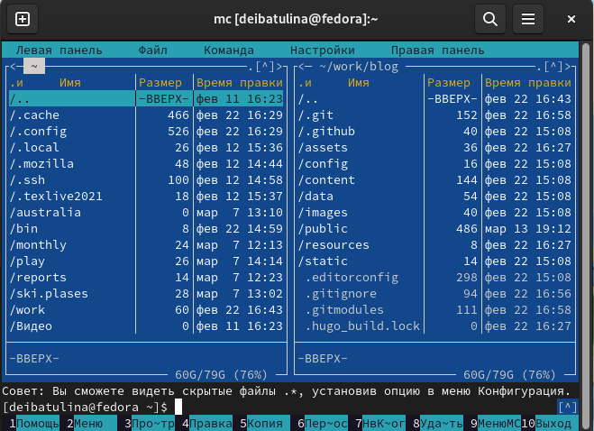
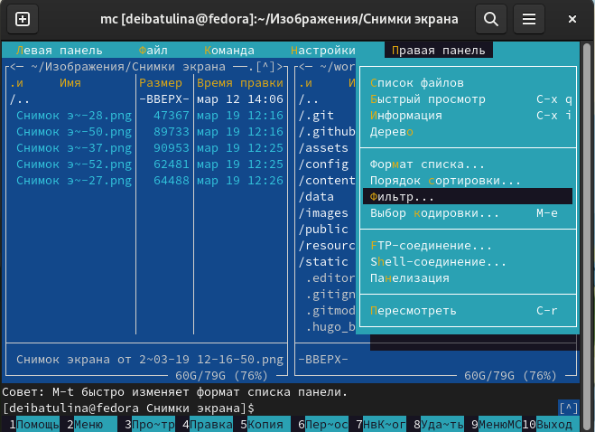
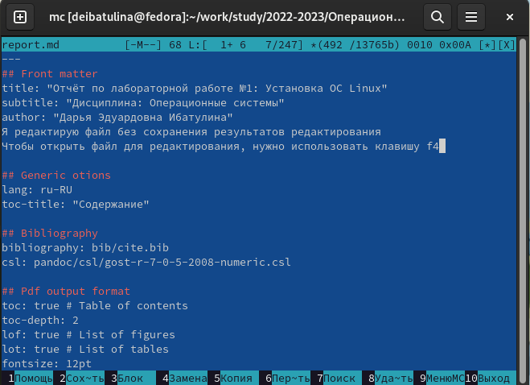
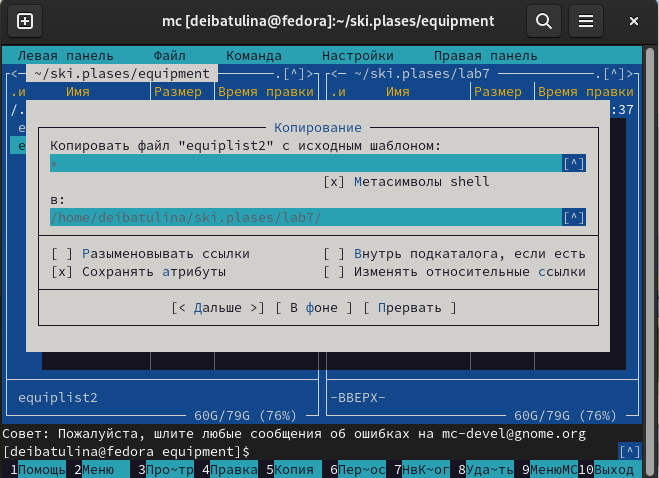
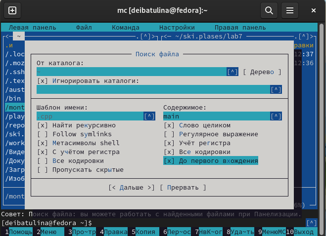
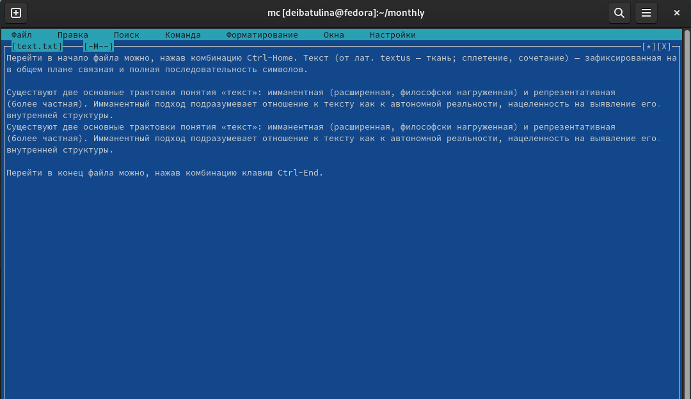
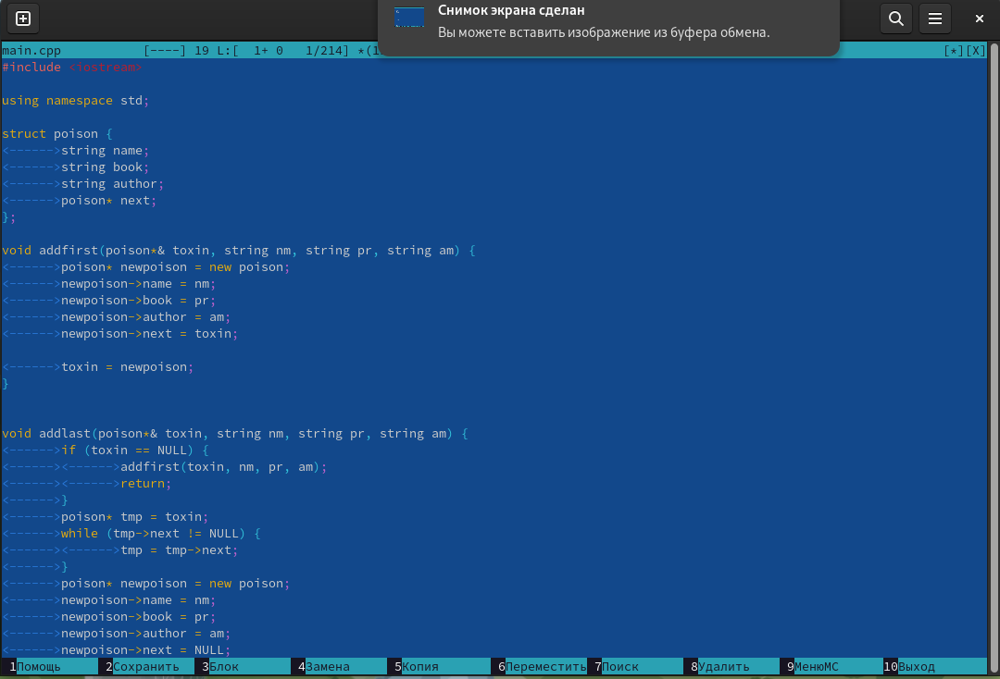

---
## Front matter
lang: ru-RU
title: "Презентация по лабораторной работе №7"
subtitle: "Командная оболочка Midnight Commander"
author:
  - Ибатулина Д.Э.
institute:
  - Российский университет дружбы народов, Москва, Россия
date: 19 марта 2023

## i18n babel
babel-lang: russian
babel-otherlangs: english

## Formatting pdf
toc: false
toc-title: Содержание
slide_level: 2
aspectratio: 169
section-titles: true
theme: metropolis
header-includes:
 - \metroset{progressbar=frametitle,sectionpage=progressbar,numbering=fraction}
 - '\makeatletter'
 - '\beamer@ignorenonframefalse'
 - '\makeatother'
---

# Информация

## Докладчик

:::::::::::::: {.columns align=center}
::: {.column width="70%"}

  * Ибатулина Дарья Эдуардовна
  * студентка группы НКАбд-01-22
  * Российский университет дружбы народов
  * [1132226434@pfur.ru](mailto:1132226434@pfur.ru)
  * <https://deibatulina.github.io/ru/>

:::
::: {.column width="30%"}

:::
::::::::::::::

# Вводная часть

## Актуальность

  Работа с mc и его встроенным редактором пригодится мне в будущей профессии.

## Цели и задачи

  Освоение основных возможностей командной оболочки Midnight Commander. Приобретение навыков практической работы по просмотру каталогов и файлов; манипуляций с ними.

# Основная часть

## Информация об mc, знакомство с программой

  Запустим в терминале mc, посмотрим на интерфейс.
  

## Подменю mc

  В mc есть различные подменю: файл, команда, настройки. Ими весьма удобно пользоваться.
  

## Открытие файла

  Для открытия файла на чтение используется клавиша f3, на редактирование - f4.
  

## Создание каталога и копирование файлов в него

  Для создания каталога служит клавиша F7, для копирования файла - F5.

## Поиск по файлам

  Выполним поиск по файлам домашнего каталога, соответствующего определённым параметрам.
  

## Работа со встроенным редактором mc

  Изменяем текст, пользуясь различными горячими клавишами, сохраняем изменения.
  

## Тексты программ на языках программирования

  Для работы с текстом на языках программирования удобно использовать подсветку синтаксиса. Включать/выключать её можно с помощью клавиш Ctrl + S.
  

# Заключительная часть

## Результаты

  В результате выполнения лабораторной работы №7 я научилась работать с mc и его встроенным редактором.

## Итоговый слайд

  Все поставленные задачи выполнены, цели достигнуты.

