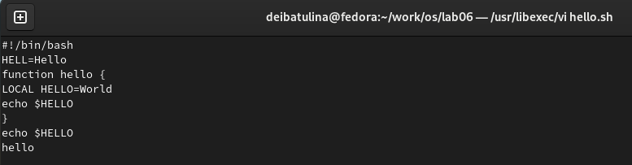
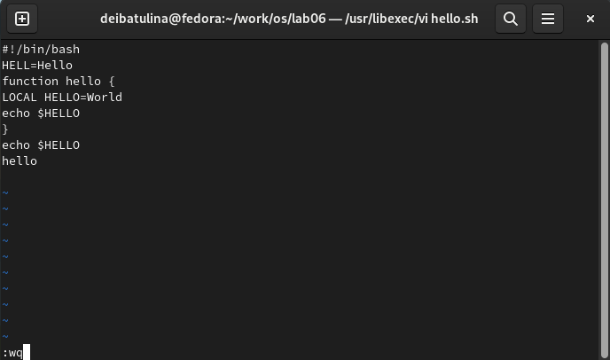
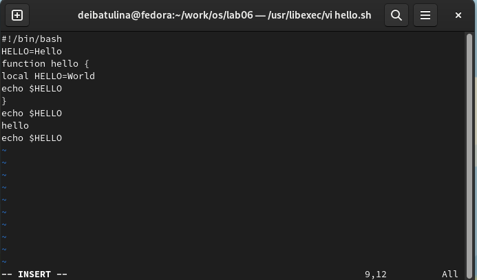
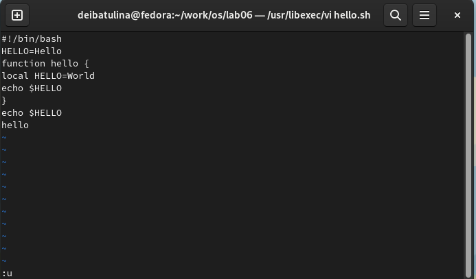

---
## Front matter
lang: ru-RU
title: "Презентация по лабораторной работе №8"
subtitle: "Текстовый редактор vi"
author:
  - Ибатуина Д.Э.
institute:
  - Российский университет дружбы народов, Москва, Россия
date: 25 марта 2023

## i18n babel
babel-lang: russian
babel-otherlangs: english

## Formatting pdf
toc: false
toc-title: Содержание
slide_level: 2
aspectratio: 169
section-titles: true
theme: metropolis
header-includes:
 - \metroset{progressbar=frametitle,sectionpage=progressbar,numbering=fraction}
 - '\makeatletter'
 - '\beamer@ignorenonframefalse'
 - '\makeatother'
---

# Информация

## Докладчик

:::::::::::::: {.columns align=center}
::: {.column width="70%"}

  * Ибатулина Дарья Эдуардовна
  * студентка группы НКАбд-01-22
  * Российский университет дружбы народов
  * [1132226434@pfur.ru](mailto:1132226434@pfur.ru)
  * <https://deibatulina.github.io/ru/>

:::
::: {.column width="30%"}

:::
::::::::::::::

# Вводная часть

## Актуальность

  Текстовый редактор vi по умолчанию установлен практически во всех дистрибутивах ОС Linux.

## Цели и задачи

  Познакомиться с операционной системой Linux. Получить практические навыки работы с редактором vi, установленным по умолчанию практически во всех дистрибутивах.

# Основная часть

## Ввод текста в файл

  Вводим текст программы в файл, который автоматически создан vi.
  

## Запись изменений в файл

  Запишем внесённые изменения в файл.
  

## Создание исполняемого файла

  Сделаем файл исполняемым, присвоив права на исполнение командой *chmod*.
  

## Редактирование существующего файла

  Поработаем с этим же файлом. Откроем на редактирование, нажав i, а затем поменяем текст программы в нём в соответствии с указаниями в лабораторной работе №8.
  

## Отмена последнего действия

  Отменим ввод последней строки.
  

# Итоговая часть

## Результаты

  В результате выполнения данной лабораторной работы я научилась работать с текстовым редактором vi.

## Итоговый слайд

  Навыки, приобретённые мною в ходе выполнения данной лабораторной работы, пригодятся мне не только в лабораторных работах, но и в будущей профессии.

