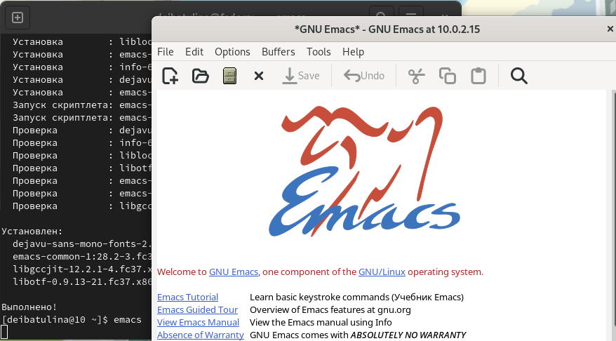
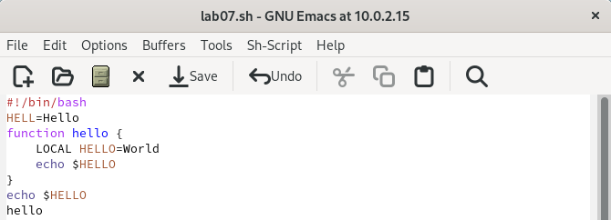
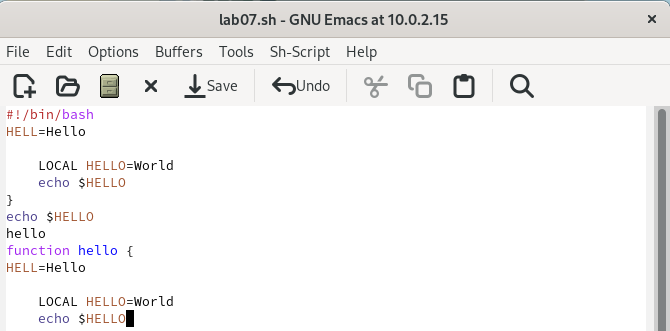
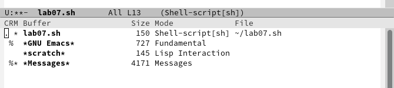
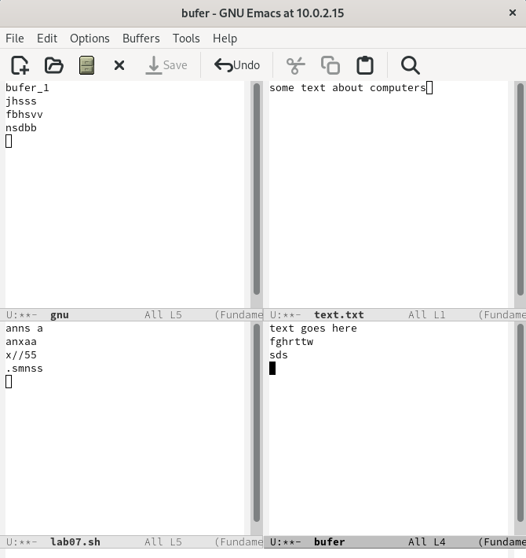
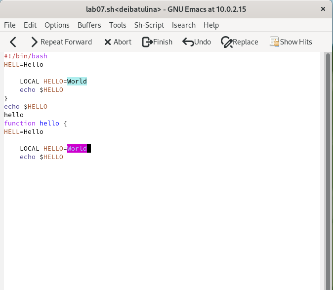
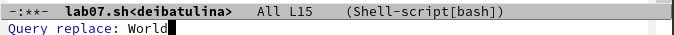
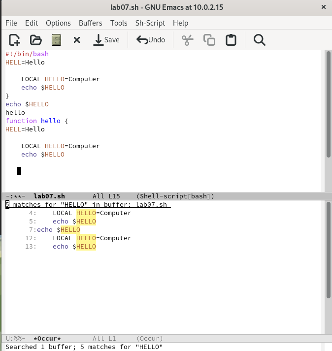

---
## Front matter
lang: ru-RU
title: "Презентация по лабораторной работе №9"
subtitle: "Текстовый редактор Emacs"
author:
  - Ибатулина Д.Э.
institute:
  - Российский университет дружбы народов, Москва, Россия
date: 01 апреля 2023

## i18n babel
babel-lang: russian
babel-otherlangs: english

## Formatting pdf
toc: false
toc-title: Содержание
slide_level: 2
aspectratio: 169
section-titles: true
theme: metropolis
header-includes:
 - \metroset{progressbar=frametitle,sectionpage=progressbar,numbering=fraction}
 - '\makeatletter'
 - '\beamer@ignorenonframefalse'
 - '\makeatother'
---

# Информация

## Докладчик

:::::::::::::: {.columns align=center}
::: {.column width="70%"}

  * Ибатулина Дарья Эдуардовна
  * студентка группы НКАбд-01-22
  * Российский университет дружбы народов
  * [1132226434@pfur.ru](mailto:1132226434@pfur.ru)
  * <https://deibatulina.github.io/ru/>

:::
::: {.column width="70%"}

:::
::::::::::::::

# Вводная часть

## Актуальность

  Знания, полученные мною в ходе выполнения данной лабораторной работы, будут полезны для моей будущей карьеры, а также для общего развития.

## Цели и задачи

  Научиться работать с текстовым редактором Emacs.

# Основная часть

## Знакомство с Emacs

  Вот как выглядит стартовая страница.
  

## Создание файла

  Создаём файл lab07.sh комбинацией клавиш C-x C-f и вводим в него текст, указанный в лабораторной работе, нажмём C-x C-s для сохранения изменений.
  

## Работа с текстом

  Скопируем область текста в буфер обмена (Alt-w), вставим её в конец файла (C-y).
  

## Перемещение курсора

  Переместим курсор в конец буфера (M->). Переместить его в начало можно, если знак *>* заменить на *<*.
  

## Работа с буферами

  Выведем список активных буферов на экран.
  

## Упраление окнами

  Поделим фрейм на 4 части (C-x 3, C-x 2). 
  

## Режим поиска

  Переключимся в режим поиска (C-s) и найдём несколько слов, присутствующих в тексте. Переключаться между результатами поиска можно, нажимая C-s.
  

## Режим поиска и замены

  Перейдём в режим поиска и замены (Alt-%), введём текст, который следует найти и заменить, нажмём Enter, затем введём текст для замены. После того как будут подсвечены результаты поиска, нажмём ! для подтверждения замены. Замены выполнены успешно.
  

## Другой режим поиска

  Испробуем другой режим поиска, нажав Alt-s o. От обычного режима его отличие состоит в том, что он открывает результаты поиска в новом окне.
  

# Заключительная часть

## Результаты

  В ходе выполнения данной лабораторной работы я научилась работать с текстовым редактором Emacs.

## Итоговый слайд

  Работа с Emacs мне очень понравилась, и данный редактор показался мне достаточно удобным в применении.

