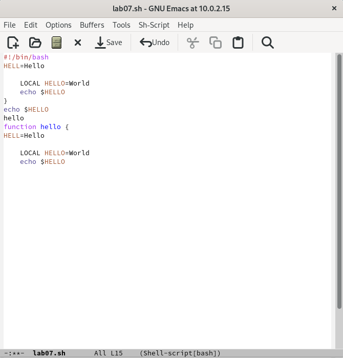

---
## Front matter
title: "Отчёт по лабораторной работе №9"
subtitle: "Текстовый редактор Emacs"
author: "Дарья Эдуардовна Ибатулина"

## Generic otions
lang: ru-RU
toc-title: "Содержание"

## Bibliography
bibliography: bib/cite.bib
csl: pandoc/csl/gost-r-7-0-5-2008-numeric.csl

## Pdf output format
toc: true # Table of contents
toc-depth: 2
lof: true # List of figures
lot: true # List of tables
fontsize: 12pt
linestretch: 1.5
papersize: a4
documentclass: scrreprt
## I18n polyglossia
polyglossia-lang:
  name: russian
  options:
	- spelling=modern
	- babelshorthands=true
polyglossia-otherlangs:
  name: english
## I18n babel
babel-lang: russian
babel-otherlangs: english
## Fonts
mainfont: PT Serif
romanfont: PT Serif
sansfont: PT Sans
monofont: PT Mono
mainfontoptions: Ligatures=TeX
romanfontoptions: Ligatures=TeX
sansfontoptions: Ligatures=TeX,Scale=MatchLowercase
monofontoptions: Scale=MatchLowercase,Scale=0.9
## Biblatex
biblatex: true
biblio-style: "gost-numeric"
biblatexoptions:
  - parentracker=true
  - backend=biber
  - hyperref=auto
  - language=auto
  - autolang=other*
  - citestyle=gost-numeric
## Pandoc-crossref LaTeX customization
figureTitle: "Рис."
tableTitle: "Таблица"
listingTitle: "Листинг"
lofTitle: "Список иллюстраций"
lotTitle: "Список таблиц"
lolTitle: "Листинги"
## Misc options
indent: true
header-includes:
  - \usepackage{indentfirst}
  - \usepackage{float} # keep figures where there are in the text
  - \floatplacement{figure}{H} # keep figures where there are in the text
---

# Цель работы

  Познакомиться с операционной системой Linux. Получить практические навыки работы с редактором Emacs.

# Задание

1. Ознакомиться с теоретическим материалом.
2. Ознакомиться с редактором emacs.
3. Выполнить упражнения.
4. Ответить на контрольные вопросы.

# Теоретическое введение

  Emacs представляет собой мощный экранный редактор текста, написанный на языке
высокого уровня Elisp.

**Основные термины**

  *Определение 1.* Буфер — объект, представляющий какой-либо текст.
Буфер может содержать что угодно, например, результаты компиляции программы
или встроенные подсказки. Практически всё взаимодействие с пользователем, в том
числе интерактивное, происходит посредством буферов.

  *Определение 2.* Фрейм соответствует окну в обычном понимании этого слова. Каждый
фрейм содержит область вывода и одно или несколько окон Emacs.

  *Определение 3.* Окно — прямоугольная область фрейма, отображающая один из буферов.
Каждое окно имеет свою строку состояния, в которой выводится следующая информация: название буфера, его основной режим, изменялся ли текст буфера и как далеко вниз
по буферу расположен курсор. Каждый буфер находится только в одном из возможных
основных режимов. Существующие основные режимы включают режим Fundamental
(наименее специализированный), режим Text, режим Lisp, режим С, режим Texinfo
и другие. Под второстепенными режимами понимается список режимов, которые включены в данный момент в буфере выбранного окна.

  *Определение 4.* Область вывода — одна или несколько строк внизу фрейма, в которой
Emacs выводит различные сообщения, а также запрашивает подтверждения и дополнительную информацию от пользователя.

  *Определение 5.* Минибуфер используется для ввода дополнительной информации и всегда отображается в области вывода.
  
  *Определение 6.* Точка вставки — место вставки (удаления) данных в буфере.
  
  *Определение 7.* Режим — пакет расширений, изменяющий поведение буфера Emacs при
редактировании и просмотре текста (например, для редактирования исходного текста
программ на языках С или Perl).

**Основы работы в Emacs**

  Для запуска Emacs необходимо в командной строке набрать emacs (или emacs & для
работы в фоновом режиме относительно консоли).
  Для работы с Emacs можно использовать как элементы меню, так и различные сочетания клавиш. Например, для выхода из Emacs можно воспользоваться меню *File*
и выбрать пункт *Quit*, а можно нажать последовательно *Ctrl-x Ctrl-c* (в обозначениях
Emacs: *C-x C-c*).

  Многие рутинные операции в Emacs удобнее производить с помощью клавиатуры, а не
графического меню. Наиболее часто в командах Emacs используются сочетания c клавишами Ctrl и Meta (в обозначениях Emacs: C- и M-; клавиша Shift в Emasc обозначается
как S-). Так как на клавиатуре для IBM PC совместимых ПК клавиши Meta нет, то вместо
неё можно использовать Alt или Esc. Для доступа к системе меню используйте клавишу
F10.
Клавиши Ctrl , Meta и Shift принято называть префиксными. Например, запись M-x
означает, что надо удерживая клавишу Meta (или Alt ), нажать на клавишу x.Для открытия
файла следует использовать команду C-x C-f (надо, удерживая клавишу Ctrl, нажать на
клавишу x , затем отпустить обе клавиши и снова, удерживая клавишу Ctrl, нажать на
клавишу f).
По назначению префиксные сочетания клавиш различаются следующим образом:
– C-x — префикс ввода основных команд редактора (например, открытия, закрытии,
сохранения файла и т.д.);
– C-c — префикс вызова функций, зависящих от используемого режима.

 В табл. @tbl:std-dir приведено краткое описание команд для работы с текстом в Emacs.

: Описание некоторых команд для работы с текстом в Emacs {#tbl:std-dir}

| Имя команды | Описание команды                                                                                                         |
|--------------|----------------------------------------------------------------------------------------------------------------------------|
| `C-d`        | Удалить символ перед текущим положением курсора            |
| `M-d `      | Удалить следующее за текущим положением курсора слово   |
| `C-k`       | Удалить текст от текущего положения курсора до конца строки |
| `M-k`      | Удалить текст от текущего положения курсора до конца предложения|
| `M-\`     | Удалить все пробелы и знаки табуляции вокруг текущего положения курсора |
| `C-q`      | Вставить символ, соответствующий нажатой клавише или сочетанию |
| `M-q`       | Выровнять текст в текущем параграфе буфера  |

# Выполнение лабораторной работы

## Основные команды Emacs

  1. Для начала  откроем emacs (рис. @fig:001).

{#fig:001 width=70%}

  2. Затем создаём файл lab07.sh комбинацией клавиш C-x C-f и вводим в него текст, указанный в лабораторной работе (рис. @fig:002).
  
{#fig:002 width=70%}

  3. Теперь сохраняем файл с помощью комбинации C-x C-s (рис. @fig:003).
  
{#fig:003 width=70%}

  4. Редактируем текст:
  
  4.1. Вырезаем одной командой (C-k) целую строку (рис. @fig:004).
  
{#fig:004 width=70%}

  4.2. Вставляем её в конец файла (C-y) (рис. @fig:005).
  
{#fig:005 width=70%}

  4.3. Скопируем область текста в буфер обмена (Alt-w), вставим её в конец файла (C-y) (рис. @fig:006).
  
{#fig:006 width=70%}

  4.4. Вновь выделяем эту же область и вырезаем её (C-w) (рис. @fig:007).
  
{#fig:007 width=70%}

  4.5. Отменим последнее действие (C-/) (рис. @fig:008).
  
{#fig:008 width=70%}

  5. Команды по перемещению курсора.
  
  6.1. Переместим курсор в начало строки (C-a) (рис. @fig:009).
  
{#fig:009 width=70%}
  
  6.2. Переместим курсор в конец строки (C-e) (рис. @fig:010).
  
  {#fig:010 width=70%}
  
  6.3. Переместим курсор в начало буфера (M-<) (рис. @fig:011).
  
  {#fig:011 width=70%}
  
  6.4. Переместим курсор в конец буфера (M->) (рис. @fig:012).
  
{#fig:012 width=70%}

  7. Управление буферами.
  
  7.1. Выведем список активных буферов на экран (C-x C-b) (рис. @fig:013).
  
{#fig:013 width=70%}

  7.2. Переместимся во вновь открытое окно (C-x) o со списком открытых буферов и переключимся на другой буфер (рис. @fig:014).
  
{#fig:014 width=70%}
  
  7.3. Закроем это окно (C-x 0) (рис. @fig:015).
  
{#fig:015 width=70%}
  
  7.4. Теперь вновь переключимся между буферами, но уже без вывода их списка на экран (C-x b) (рис. @fig:016).
  
{#fig:016 width=70%}
  
  8. Управление окнами.
  
  8.1. Создадим новый файл (рис. @fig:017).
  
{#fig:017 width=70%}
  
  8.2. Поделим фрейм на 4 части: разделим фрейм на два окна по вертикали (C-x 3), а затем каждое из этих окон на две части по горизонтали (C-x 2). В каждом из четырёх созданных окон откроем новый буфер (файл) и введём несколько строк текста (рис. @fig:018).
  
{#fig:018 width=70%}
  
  9. Режим поиска.
  
  9.1. Переключимся в режим поиска (C-s) и найдём несколько слов, присутствующих в тексте. Переключаться между результатами поиска можно, нажимая C-s. (рис. @fig:019).
  
{#fig:019 width=70%}

  9.2. Выйдем из режима поиска, нажав C-g (рис. @fig:020).
  
{#fig:020 width=70%}

  9.3. Перейдём в режим поиска и замены (Alt-%), введём текст, который следует найти и заменить, нажмём Enter, затем введём текст для замены. После того как будут подсвечены результаты поиска, нажмём ! для подтверждения замены. Замены выполнены успешно (рис. @fig:021, @fig:022, @fig:023).
  
{#fig:021 width=70%}

{#fig:022 width=70%}

{#fig:023 width=70%}
  
  9.4. Испробуем другой режим поиска, нажав Alt-s o. От обычного режима его отличие состоит в том, что он открывает результаты поиска в новом окне (рис. @fig:024).
  
{#fig:024 width=70%}

# Ответы на контрольные вопросы

1. Кратко охарактеризуйте редактор emacs.

Emacs — один из наиболее мощных и широко распространённых редакторов, используемых в мире UNIX. Написан на языке высокого уровня Lisp.

2. Какие особенности данного редактора могут сделать его сложным для освоения новичком?

Большое разнообразие сложных комбинаций клавиш, которые необходимы для редактирования файла и в принципе для работа с Emacs.

3. Своими словами опишите, что такое буфер и окно в терминологии emacs’а.

Буфер - это объект в виде текста. Окно - это прямоугольная область, в которой отображен буфер.

4. Можно ли открыть больше 10 буферов в одном окне?
Да, можно.

5. Какие буферы создаются по умолчанию при запуске emacs?

Emacs использует буферы с именами, начинающимися с пробела, для внутренних целей. Отчасти он обращается с буферами с такими именами особенным образом — например, по умолчанию в них не записывается информация для отмены изменений.

6. Какие клавиши вы нажмёте, чтобы ввести следующую комбинацию C-c | и C-c C-|?

Ctrl + c, а потом | и Ctrl + c Ctrl + |

7. Как поделить текущее окно на две части?

С помощью команды Ctrl + x 3 (по вертикали) и Ctrl + x 2 (по горизонтали).

8. В каком файле хранятся настройки редактора emacs?

Настройки emacs хранятся в файле .emacs, который хранится в домашней дирректории пользователя. Кроме этого файла есть ещё папка .emacs.

9. Какую функцию выполняет клавиша *->* и можно ли её переназначить?

Выполняет функцию стереть, думаю можно переназначить.

10. Какой редактор вам показался удобнее в работе vi или emacs? Поясните почему.

Для меня удобнее был редактор Emacs, поскольку в Emacs больше функций, и он более продвинут по сравнению с Vi.

# Выводы

  В результате выполнения данной лабораторной работы я научилась работать с текстовым редактором Emacs.

# Список литературы{.unnumbered}

1. Руководство к выполнению лабораторной работы №9, Д.С. Кулябов.
