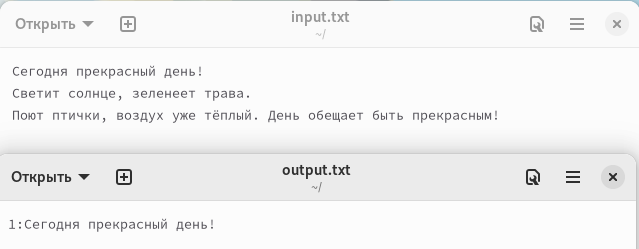
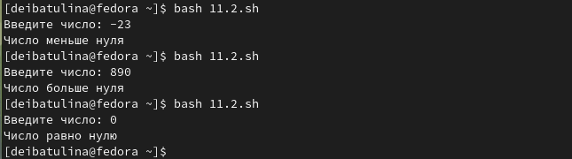
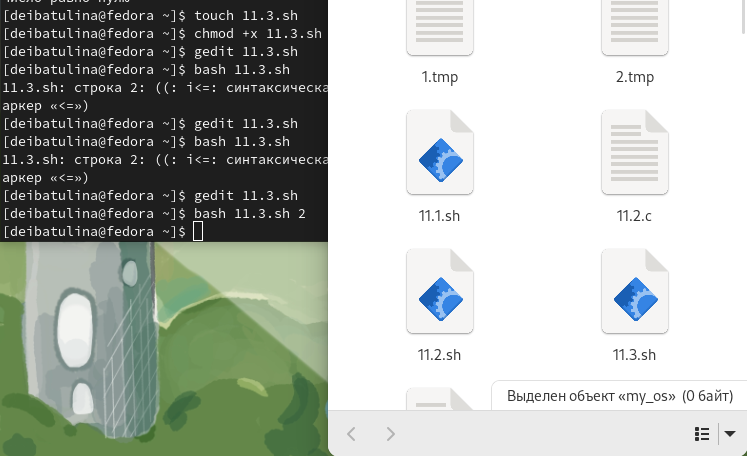
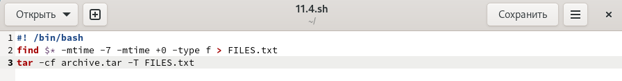

---
## Front matter
lang: ru-RU
title: "Презентация по лабораторной работе №11"
subtitle: "Программирование в командном процессоре ОС UNIX. Ветвления и циклы."
author:
  - Ибатулина Д.Э.
institute:
  - Российский университет дружбы народов, Москва, Россия
date: 8 апреля 2023

## i18n babel
babel-lang: russian
babel-otherlangs: english

## Formatting pdf
toc: false
toc-title: Содержание
slide_level: 2
aspectratio: 169
section-titles: true
theme: metropolis
header-includes:
 - \metroset{progressbar=frametitle,sectionpage=progressbar,numbering=fraction}
 - '\makeatletter'
 - '\beamer@ignorenonframefalse'
 - '\makeatother'
---

# Информация

## Докладчик

:::::::::::::: {.columns align=center}
::: {.column width="70%"}

  * Ибатулина Дарья Эдуардовна
  * студентка группы НКАбд-01-22
  * Российский университет дружбы народов
  * [1132226434@pfur.ru](mailto:1132226434@pfur.ru)
  * <https://deibatulina.github.io/ru/>

:::
::: {.column width="30%"}

:::
::::::::::::::

# Вводная часть

## Актуальность

  Умение программировать в командном процессоре ОС Unix - очень важный навык для любого IT-специалиста.

## Цели и задачи

  Изучить основы программирования в оболочке ОС UNIX. Научиться писать более сложные командные файлы с использованием логических управляющих конструкций и циклов.

# Основная часть

## Командный файл, находящий введённую строку в одном файле и выводящий эти строки с их номеарми в другой
  

## Командный файл, печатающий строку в соответствии с результатом выполнения программы на языке Си
  

## Написать командный файл, создающий указанное число файлов, пронумерованных последовательно от 1 до N
  

## Командный файл, с помощью команды tar запаковывающий в архив изменённые менее недели назад файлы в указанной директории
  

# Итоговая часть

## Результаты

  В результате выполнения данной лабораторной работы я научилась писать командные файлы, используя ветвления и циклы.

## Итоговый слайд

  Навыки, приобретённые мною в ходе выполнения данной лабораторной работы, пригодятся мне не только в лабораторных работах, но и в будущей профессии.

