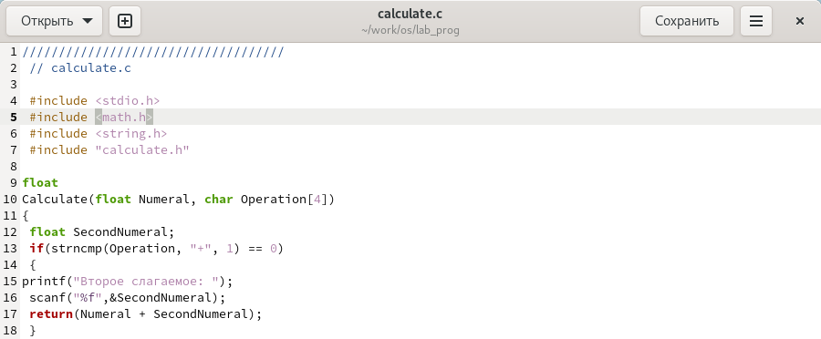
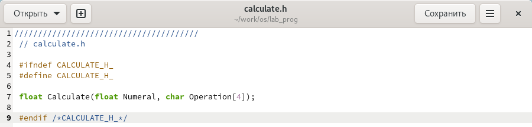
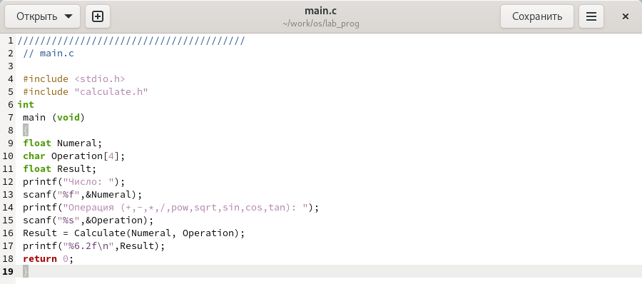
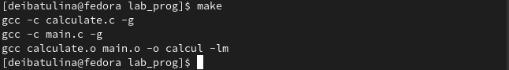
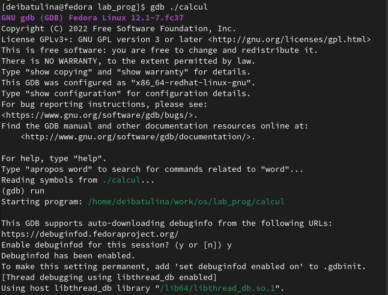
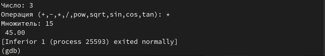
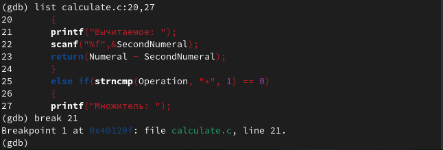
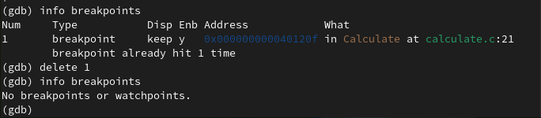
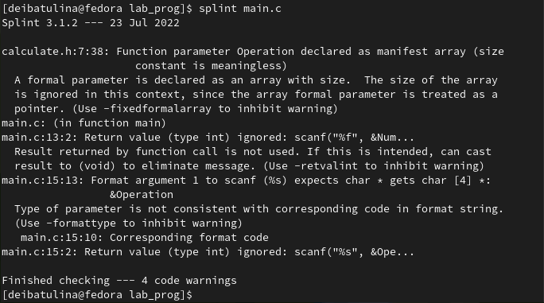

---
## Front matter
lang: ru-RU
title: "Презентация по лабораторной работе №13"
subtitle: "Средства, применяемые при разработке программного обеспечения в ОС типа UNIX/Linux"
author:
  - Ибатулина Д.Э.
institute:
  - Российский университет дружбы народов, Москва, Россия
date: 29 апреля 2023

## i18n babel
babel-lang: russian
babel-otherlangs: english

## Formatting pdf
toc: false
toc-title: Содержание
slide_level: 2
aspectratio: 169
section-titles: true
theme: metropolis
header-includes:
 - \metroset{progressbar=frametitle,sectionpage=progressbar,numbering=fraction}
 - '\makeatletter'
 - '\beamer@ignorenonframefalse'
 - '\makeatother'
---

# Информация

## Докладчик

:::::::::::::: {.columns align=center}
::: {.column width="70%"}

  * Ибатулина Дарья Эдуардовна
  * студентка группы НКАбд-01-22
  * Российский университет дружбы народов
  * [1132226434@pfur.ru](mailto:1132226434@pfur.ru)
  * <https://deibatulina.github.io/ru/>

:::
::: {.column width="30%"}

:::
::::::::::::::

# Вводная часть

## Актуальность

  Умение создавать приложения и разрабатывать ПО в ОС типа Unix - очень важный навык для любого IT-специалиста.

## Цели и задачи

  Приобрести простейшие навыки разработки, анализа, тестирования и отладки приложений в ОС типа UNIX/Linux на примере создания на языке программирования С калькулятора с простейшими функциями.

# Основная часть

## Реализация калькулятора на языке программирования Си
  

## Интерфейсный файл calculate.h

## Основной файл main.c, реализующий интерфейс пользователя к калькулятору

## Компиляция программы
  

## Запуск прогарммы в отладчике gdb
  

## Пример работы программы
  

## Постановка точки останова

## Удаление точки останова

## Диагностика ошибок и предупреждений

# Итоговая часть

## Результаты

  В результате выполнения данной лабораторной работы я научилась основам разработки программного обеспечения в ОС типа Unix/Linux.

## Итоговый слайд

  Навыки, приобретённые мною в ходе выполнения данной лабораторной работы, пригодятся мне не только в лабораторных работах, но и в будущей профессии.

