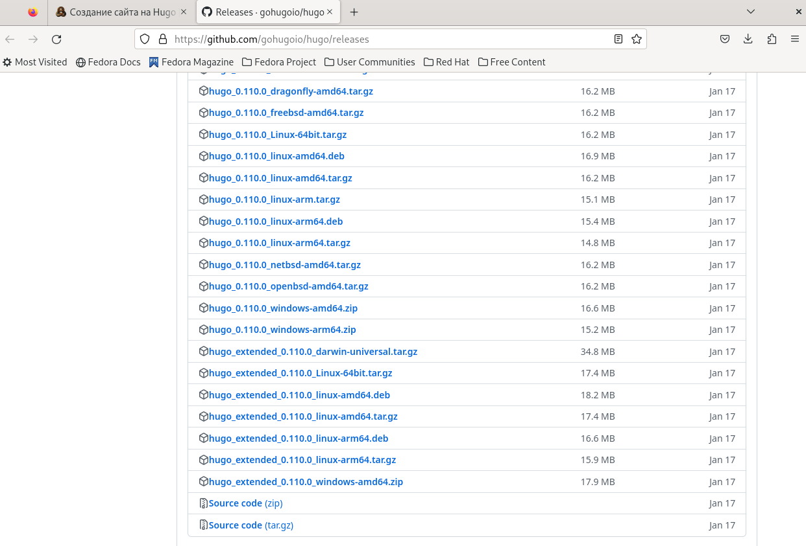
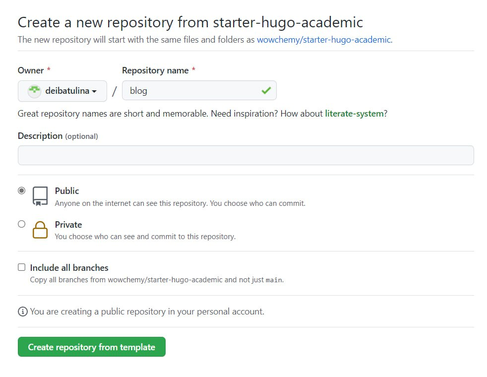
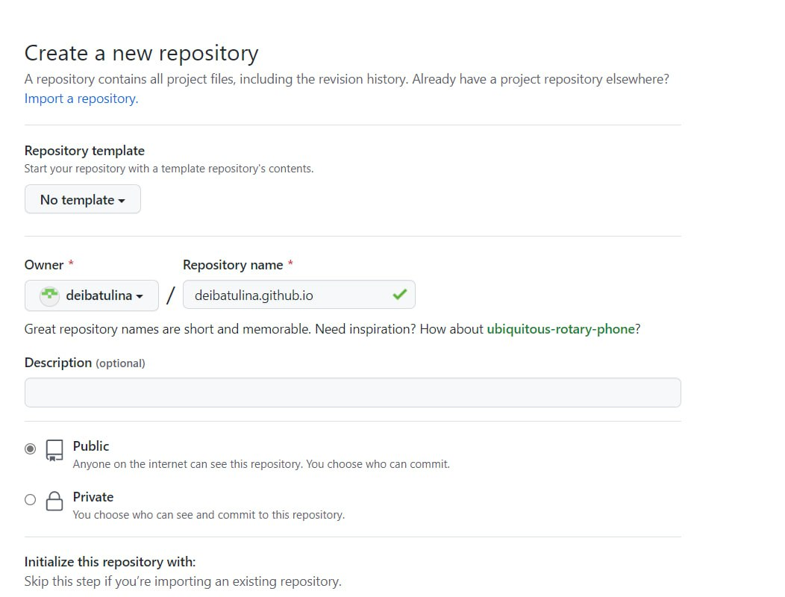

---
## Front matter
lang: ru-RU
title: "Первый этап индивидуального проекта"
subtitle: "Персональный сайт научного работника"
author:
  - Ибатулина Д.Э.
institute:
  - Российский университет дружбы народов, Москва, Россия
date: 23 февраля 2023

## i18n babel
babel-lang: russian
babel-otherlangs: english

## Formatting pdf
toc: false
toc-title: Содержание
slide_level: 2
aspectratio: 169
section-titles: true
theme: metropolis
header-includes:
 - \metroset{progressbar=frametitle,sectionpage=progressbar,numbering=fraction}
 - '\makeatletter'
 - '\beamer@ignorenonframefalse'
 - '\makeatother'
---

# Информация

## Докладчик

:::::::::::::: {.columns align=center}
::: {.column width="70%"}

  * Ибатулина Дарья Эдуардовна
  * студентка группы НКАбд-01-22
  * Российский университет дружбы народов
  * [1132226434@pfur.ru](mailto:1132226434@pfur.ru)
  * <https://deibatulina.github.io/ru/>

:::
::: {.column width="30%"}

:::
::::::::::::::

# Вводная часть

## Актуальность

  Создавать сайт - безусловно важное умение, особенно для IT-специалиста. Поскольку я обучаюсь на направлении "Компьютерные и информационные науки", значит далее планирую заниматься начуной деятельностью, и без персонального сайта, на котором я смогу размещать свои статьи, работы и т.д., не обойтись.

## Цели и задачи

  Размещение на Github pages заготовки для персонального сайта.

# Основная часть

## Вводное слово

  Переходим непосредственно к выполнению первого этапа нашего проекта.
  
## Установка необходимого ПО

  Начнём с установки необходимого ПО. Для этого переходим в репозиторий на Github и скачиваем нужный архив (Linux-64bit, hugo extended):

## Скачивание шаблона темы сайта и размещение его на хостинге Git

   Переходим на github.com и создаём репозиторий blog. В нём будет располагаться сайт, доступный только с данного компьютера:
  

## Промежуточный результат

  Открываем наш сайт (виден он только с этого компьютера):
  

## Размещение заготовки сайта на Github pages

  Теперь создаём второй репозиторий, в котором будет располагаться наш сайт, открытый для доступа всем:
  

### Открытие сайта в браузере

  Теперь на наш собственный сайт есть ссылка, которую можно открыть с любого компьютера:
  

# Результаты

## Итоги

  Я научилась создавать заготовку сайта, используя генератор Hugo. Он обладает рядом преимуществ: большая библиотека шаблонов и готовых тем, поддержка разных языков и предоставление расширенных возможностей языка разметки Markdown.

## Итоговый слайд

  В первом этапе проекта я создала заготовку сайта, а в следующем буду заполнять его своими данными. В итоге, у меня получится полный собственный сайт научного работника.

