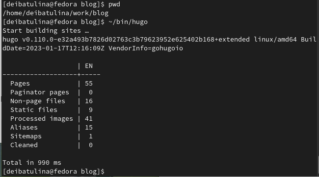
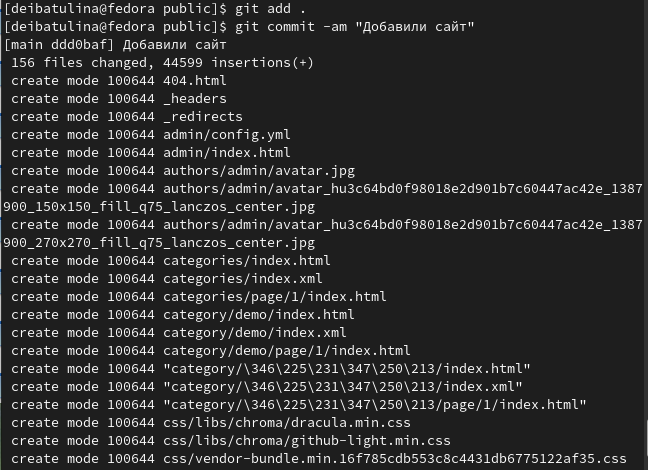

---
## Front matter
title: "Отчёт по выполнению первого этапа индивидуального проекта"
subtitle: "Персональный сайт научного работника"
author: "Дарья Эдуардовна Ибатулина"

## Generic otions
lang: ru-RU
toc-title: "Содержание"

## Bibliography
bibliography: bib/cite.bib
csl: pandoc/csl/gost-r-7-0-5-2008-numeric.csl

## Pdf output format
toc: true # Table of contents
toc-depth: 2
lof: true # List of figures
lot: true # List of tables
fontsize: 12pt
linestretch: 1.5
papersize: a4
documentclass: scrreprt
## I18n polyglossia
polyglossia-lang:
  name: russian
  options:
	- spelling=modern
	- babelshorthands=true
polyglossia-otherlangs:
  name: english
## I18n babel
babel-lang: russian
babel-otherlangs: english
## Fonts
mainfont: PT Serif
romanfont: PT Serif
sansfont: PT Sans
monofont: PT Mono
mainfontoptions: Ligatures=TeX
romanfontoptions: Ligatures=TeX
sansfontoptions: Ligatures=TeX,Scale=MatchLowercase
monofontoptions: Scale=MatchLowercase,Scale=0.9
## Biblatex
biblatex: true
biblio-style: "gost-numeric"
biblatexoptions:
  - parentracker=true
  - backend=biber
  - hyperref=auto
  - language=auto
  - autolang=other*
  - citestyle=gost-numeric
## Pandoc-crossref LaTeX customization
figureTitle: "Рис."
tableTitle: "Таблица"
listingTitle: "Листинг"
lofTitle: "Список иллюстраций"
lotTitle: "Список таблиц"
lolTitle: "Листинги"
## Misc options
indent: true
header-includes:
  - \usepackage{indentfirst}
  - \usepackage{float} # keep figures where there are in the text
  - \floatplacement{figure}{H} # keep figures where there are in the text
---

# Цель работы

  Размещение на Github pages заготовки для персонального сайта.

# Задание

  1. Установить необходимое программное обеспечение.
  2. Скачать шаблон темы сайта.
  3. Разместить его на хостинге git.
  4. Установить параметр для URLs сайта.
  5. Разместить заготовку сайта на Github pages.

# Теоретическое введение

  Для сайта не всегда нужна работа с базами данных, запросы к API и сложный бэкенд. Во многих случаях достаточно обычного HTML-документа, но красивого и с единым стилем для всех страниц. Разумеется, можно сверстать что-то подходящее самостоятельно, но можно воспользоваться инструментом, который получает на вход текст, картинки и другой контент и генерирует из этого страницу. Такой подход позволяет сэкономить время и получить результат в сжатые сроки. К тому же, результат будет высокого качества.

  В Сети есть множество генераторов, различающихся по различным параметрам. Я буду использовать генератор Hugo, обладающий рядом преимуществ [1] :

  * Hugo написан на Go, что обеспечивает высокую скорость работы. Разработчики заявляют о скорости генерации менее 1 мс на страницу, а средний веб-сайт генерируется за 1 секунду;

  * включены расширенные возможности языка разметки Markdown, позволяющие встраивать новые типы контента;

  * встроенные шаблоны для работы с SEO, оптимизацией и аналитикой;

  * открытый исходный код проекта;

  * большая библиотека готовых тем, которые можно брать за основу для собственных проектов;

  * строенные средства адаптации сайтов к другим языкам (i18n).

  Возможностями генератора Hugo пользуются не только обычные пользователи, но и большие компании. К примеру, с помощью Hugo сделана страница поддержки сервиса 1Password, портал с курсами Godot Tutorials и документация Linode.

# Выполнение лабораторной работы

  Начнём с установки необходимого ПО. Для этого переходим в репозиторий на Github и скачиваем нужный архив (Linux-64bit, hugo extended) (рис. @fig:001):

{#fig:001 width=70%}

  Далее в домашне папке мы создаём папку bin, в которую положим исполняемый файл hugo, скачанный в предыдущем пункте (рис. @fig:002):
  
{#fig:002 width=70%}

  Затем переходим на github.com и создаём репозиторий blog (рис. @fig:003):
  
{#fig:003 width=70%}

  Следующий шаг - клонировать этот репозиторий (рис. @fig:004) в каталог work с помощью знакомой нам команды (рис. @fig:005):
  
{#fig:004 width=70%}

{#fig:005 width=70%}

  Далее переходим в каталог blog и выводим список файлов (рис. @fig:006):
  
{#fig:006 width=70%}

  Загружаем модули hugo (рис. @fig:007):
  
{#fig:007 width=70%}

  В каталоге blog мы видим каталог public, который в данный момент нам не понадобится, поэтому удаляем его (рис. @fig:008):
  
{#fig:008 width=70%}

  Теперь мы имеем возможность открывать созданный нами сайт с нашего компьютера (сайт будет доступен только с него) (рис. @fig:009), (рис. @fig:010):
  
{#fig:009 width=70%}

{#fig:010 width=70%}

  Копируем ссылку localhost и вставляем в браузер (рис. @fig:011):
  
{#fig:011 width=70%}

  Просматривать данный сайт пока имею возможность только я с моего компьютера.
  Теперь создадим репозиторий на github, в котором будет размещён общедоступный сайт (рис. @fig:012):
  
{#fig:012 width=70%}

  Поднимаемся в терминале на структуру выше и выводим список файлов и видим, что в каталоге work помещены каталоги study (для лабораторных работ) и work (для индивидуального проекта) (рис. @fig:013):
  
{#fig:013 width=70%}

  Теперь клонируем репозиторий для общедоступного сайта (github.io) в каталог work (рис. @fig:014):
  
{#fig:014 width=70%}

  Переключаемся на ветку main (рис. @fig:015):
  
{#fig:015 width=70%}

  Создаём в репозитории файл README.md, а затем отправляем изменённые файлы на Github, используя хорошо знакомые нам команды (рис. @fig:016):
  
{#fig:016 width=70%}

  Переходим в браузер и проверяем, что файл README.md находится в нужном репозитории на гитхабе (рис. @fig:017):
  
{#fig:017 width=70%}

  Теперь добавляем подмодуль, в нашем репозитории должен появиться каталог public (рис. @fig:018):
  
{#fig:018 width=70%}

  Однако, этого не происходит, поскольку в файле .gitignore прописано игнорирование файлов с именем public. Это необходимо исправить, отредактировав данный файл (рис. @fig:019):
  
{#fig:019 width=70%}

  Сохраняем изменения в файле и проверяем, что всё в порядке (рис. @fig:020):
  
{#fig:020 width=70%}

  Повторяем комнаду, отвечающую за добавление подмодуля (рис. @fig:021):
  
{#fig:021 width=70%}

  На этот раз всё прошло успешно и тепер мы выполняем построение нашего сайта (рис. @fig:022):
  
{#fig:022 width=70%}

  Проверяем, что в блоге появиля каталог public (рис. @fig:023):
  
{#fig:023 width=70%}

  Убеждаемся, что каталог для редактирования сайта на компьютере связан с нужной веткой на гитхабе (рис. @fig:024):
  
{#fig:024 width=70%}

  Добавляем на гитхаб все изменённые файлы и каталоги, отправляем изменения на сервер (рис. @fig:025, @fig:026):
  
{#fig:025 width=70%}

{#fig:026 width=70%}

  Теперь удостоверяемся, что все изменённые каталоги добавлены на гитхаб (рис. @fig:027):
  
{#fig:027 width=70%}

  Остался поледний шаг: открываем наш сайт в браузере (рис. @fig:028):
  
{#fig:028 width=70%}

  Наш сайт можно теперь открывать с любого компьютера! Заполнять его своими данными предстоит нам в следующем этапе проекта.

# Выводы

  Цель достигнута - на GithubPages размещена заготовка моего сайта.

# Список литературы{.unnumbered}

* (Статья на Habr.com - интернет-ресурсе для IT-специалистов)[https://habr.com/ru/post/700640/]

::: {#refs}
:::
