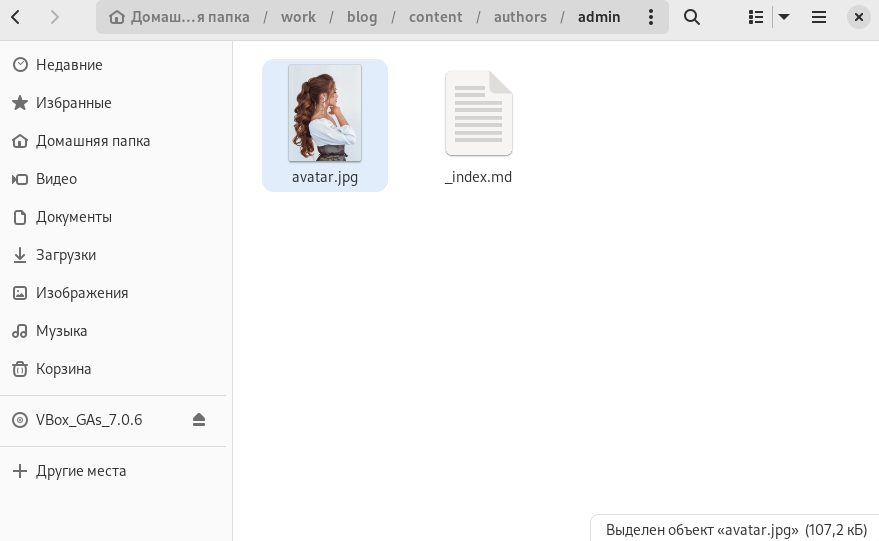
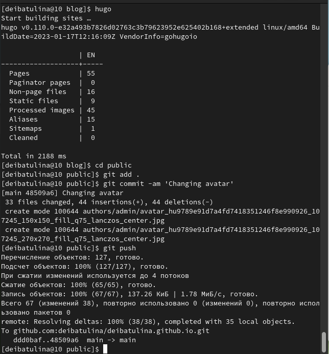
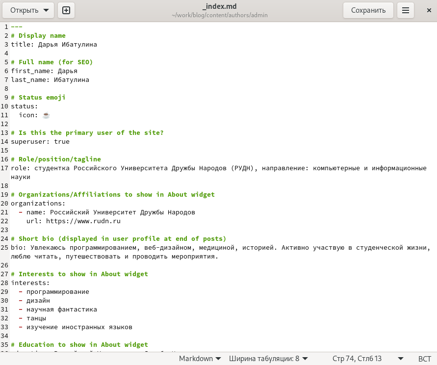
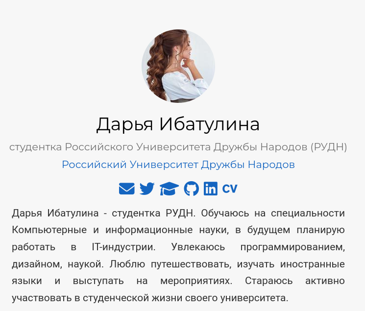
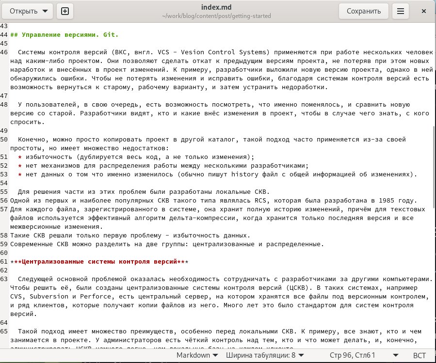
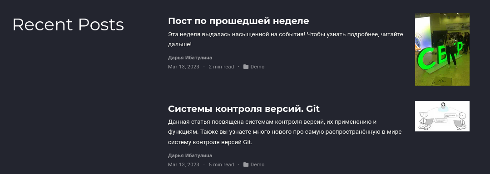

---
## Front matter
lang: ru-RU
title: "Презентация по второму этапу индивидуального проекта"
subtitle: "Персональный сайт научного работника"
author:
  - Ибатулина Д.Э.
institute:
  - Российский университет дружбы народов, Москва, Россия
date: 14 марта 2023

## i18n babel
babel-lang: russian
babel-otherlangs: english

## Formatting pdf
toc: false
toc-title: Содержание
slide_level: 2
aspectratio: 169
section-titles: true
theme: metropolis
header-includes:
 - \metroset{progressbar=frametitle,sectionpage=progressbar,numbering=fraction}
 - '\makeatletter'
 - '\beamer@ignorenonframefalse'
 - '\makeatother'
---

# Информация

## Докладчик

:::::::::::::: {.columns align=center}
::: {.column width="70%"}

  * Ибатулина Дарья Эдуардовна
  * студентка группы НКАбд-01-22
  * Российский университет дружбы народов
  * [1132226434@pfur.ru](mailto:1132226434@pfur.ru)
  * <https://deibatulina.github.io/ru/>

:::
::: {.column width="30%"}

:::
::::::::::::::

# Вводная часть

## Актуальность

  Создание своего сайта - очень важный навык, тем более для IT-специалиста. Кроме того,это очень интересно, познавательно и увлекательно!

## Цели и задачи

  Добавить свои данные к сайту, разместить две публикации на нём.

# Основная часть

## Добавление аватарки

  Первым делом необходимо добавить фотографию к своему сайту.
  

## Отправка изменений на сервер

  Каждое внесённое изменение необходимо отправлять на сервер. Для этого напишем команду hugo и уже знакомые нам команды: git add ., git commit -am '', git push.
  

## Добавление информации о владельце сайта

  ля этого переходим в каталог ~/work/blog/content/authors/admin и находим файл *index.md*. В него и будем вносить изменения. Напишем биографию, интересы, информацию об образовании.
  

## Проверка изменений на сайте

  Затем проверяем, добавилась ли изменённая нами информация.
  

## Добавление статьи

  Теперь добавим статью по теме: "Системы контроля версий. Git.".
  

## Добавление поста по прошедшей неделе

  Для этого переходим в каталог ~/work/blog/content/post/ и создаём в нём каталог для нашего поста. Я назвала его: *post_of_last_week*. Переходим в него, предварительно скопировав файл со статьёй из предыдущего пункта и изменив в нём текст. Также при желании можно добавить в созданный каталог фотографию, назвав её так: *featured.png* или *featured.jpg*.
  
## Проверка изменений на сайте

  Мы видим, что оба наши поста размещены на сайте в разделе "Posts".
  

## Результаты

  В результате я научилась добавлять информацию о себе и даже сделала две публикации.

## Итоговый слайд

  Работа над собственным сайтом мне понравилась. К тому же, это полезный опыт для моей карьеры.

