---
## Front matter
title: "Отчёт по второму этапу индивидуального проекта"
subtitle: "Персональный сайт научного работника"
author: "Дарья Эдуардовна Ибатулина"

## Generic otions
lang: ru-RU
toc-title: "Содержание"

## Bibliography
bibliography: bib/cite.bib
csl: pandoc/csl/gost-r-7-0-5-2008-numeric.csl

## Pdf output format
toc: true # Table of contents
toc-depth: 2
lof: true # List of figures
lot: true # List of tables
fontsize: 12pt
linestretch: 1.5
papersize: a4
documentclass: scrreprt
## I18n polyglossia
polyglossia-lang:
  name: russian
  options:
	- spelling=modern
	- babelshorthands=true
polyglossia-otherlangs:
  name: english
## I18n babel
babel-lang: russian
babel-otherlangs: english
## Fonts
mainfont: PT Serif
romanfont: PT Serif
sansfont: PT Sans
monofont: PT Mono
mainfontoptions: Ligatures=TeX
romanfontoptions: Ligatures=TeX
sansfontoptions: Ligatures=TeX,Scale=MatchLowercase
monofontoptions: Scale=MatchLowercase,Scale=0.9
## Biblatex
biblatex: true
biblio-style: "gost-numeric"
biblatexoptions:
  - parentracker=true
  - backend=biber
  - hyperref=auto
  - language=auto
  - autolang=other*
  - citestyle=gost-numeric
## Pandoc-crossref LaTeX customization
figureTitle: "Рис."
tableTitle: "Таблица"
listingTitle: "Листинг"
lofTitle: "Список иллюстраций"
lotTitle: "Список таблиц"
lolTitle: "Листинги"
## Misc options
indent: true
header-includes:
  - \usepackage{indentfirst}
  - \usepackage{float} # keep figures where there are in the text
  - \floatplacement{figure}{H} # keep figures where there are in the text
---

# Цель работы

  Продолжить работу над проектом: заполнить шаблон сайта своими данными.

# Задание

  Добавить к сайту данные о себе.

  *Список добавляемых данных:*
  
* Разместить фотографию владельца сайта;
* Разместить краткое описание владельца сайта (Biography);
* Добавить информацию об интересах (Interests);
* Добавить информацию от образовании (Education);
* Сделать пост по прошедшей неделе;
* Добавить пост на тему по выбору:
  - Управление версиями. Git;
  - Непрерывная интеграция и непрерывное развертывание (CI/CD).

# Теоретическое введение

  Сайт, или веб-сайт (от англ. website: web — «паутина, сеть» и site — «место», букв. — «место, сегмент, часть в сети»), также веб-узел, — одна или несколько логически связанных между собой веб-страниц; также место расположения контента сервера. Обычно сайт в Интернете представляет собой массив связанных данных, имеющий уникальный адрес и воспринимаемый пользователями как единое целое. Веб-сайты называются так, потому что доступ к ним происходит по протоколу HTTP.
  
  Индивидуальный проект подразумевает размещение заготовки персонального сайта научного работника на GithubPages - сайт, созданный в репозитории GitHub.
  
  На сайте пользователь может размещать фотографии, посты, публиковать информацию о себе и указывать способы связи. Контент сайта зависит от его тематики и цели создания.
  
  При создании сайта я буду использовать язык разметки YAML, который расшифровывается как "ещё один язык разметки".

# Выполнение лабораторной работы

  Первым делом необходимо добавить фотографию к своему сайту. Для этого я перехожу в папку ~/work/blog/content/authors/admin. В этой папке есть фотография с названием avatar.jpg. Я подгружаю вместо неё свою фотографию (рис. @fig:001):

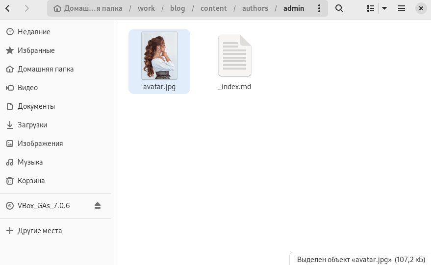{#fig:001 width=70%}

  Далее в терминале перехожу в каталог ~/work/blog и ввожу команду hugo, которая "построит" наш сайт. Затем отправляю изменения из локального репозитория на сервер GitHub, перейдя в папку ~/blog/public (рис. @fig:002):
  
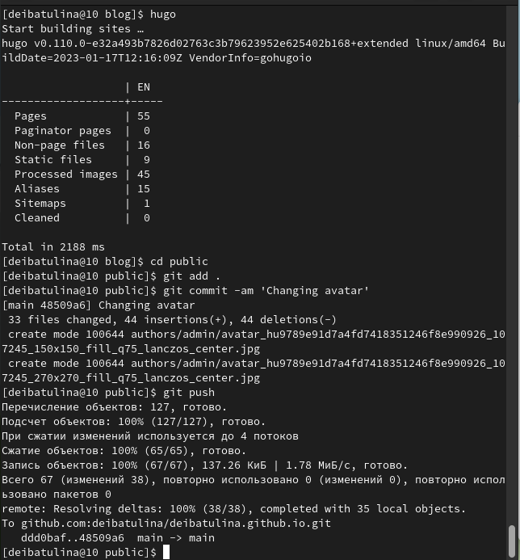{#fig:002 width=70%}

  Заходим на свой сайт в браузере (deibatulina.github.io) и убеждаемся, что все изменения применены (рис. @fig:003). Обратим внимание, что отправка изменений на сервер требует немного времени (буквально несколько минут):
  
{#fig:003 width=70%}

  Теперь требуется разместить биографию. Для этого переходим в каталог ~/work/blog/content/authors/admin и находим файл *index.md*. В него и будем вносить изменения. Напишем биографию, интересы, информацию об образовании (рис. @fig:004):
  
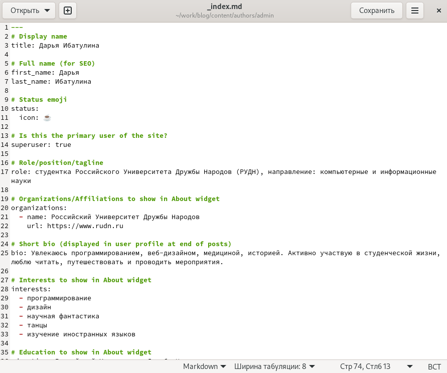{#fig:004 width=70%}

  Снова проделываем предыдущие шаги: пишем команду hugo (из blog) и отправляем изменения на Git (из public) (рис. @fig:005):
  
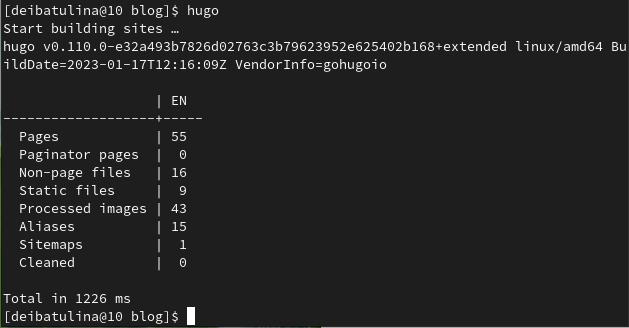{#fig:005 width=70%}

  Затем проверяем, добавилась ли изменнная нами информация (рис. @fig:006):
  
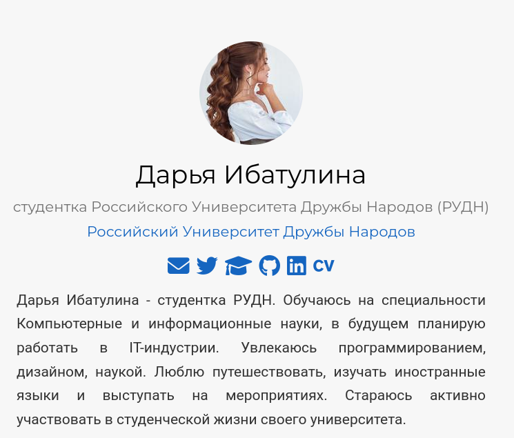{#fig:006 width=70%}

  Теперь добавим статью по теме: "Системы контроля версий. Git.". Для этого перейдём в файл *index.md*, расположенный в каталоге: ~/work/blog/content/post/getting-started (рис. @fig:007):
  
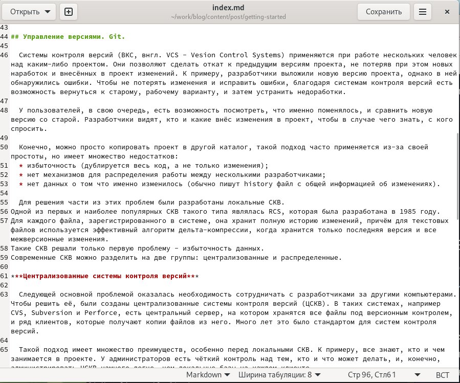{#fig:007 width=70%}

  Обращаю внимание, что можно добавить к своей статье картинку: в этом же каталоге добавляем картинку с названием *featured*, например: *featured.png*. Снова проделываем предыдущие шаги: пишем команду hugo (из blog) и отправляем изменения на Git (из public). Немного ждём и проверяем, отправились ли изменения на сервер (рис. @fig:008, @fig:009): 
  
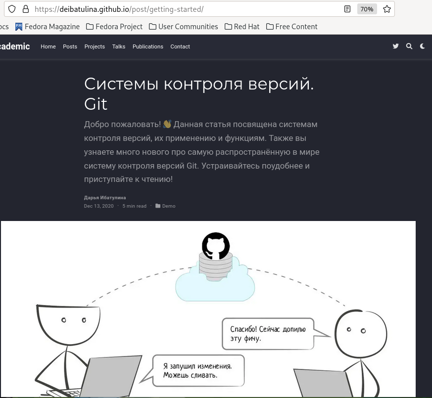{#fig:008 width=70%}

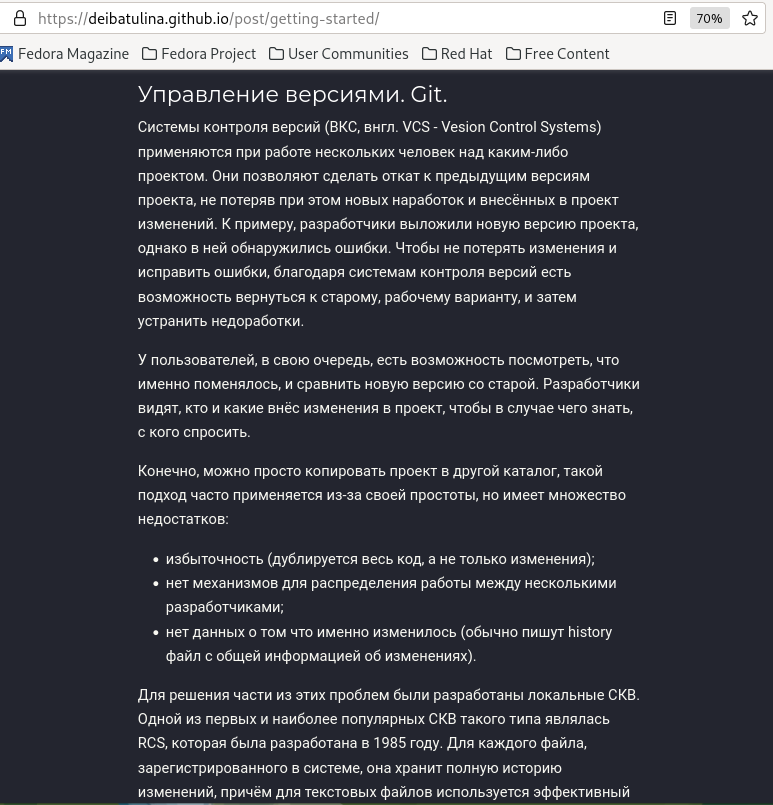{#fig:009 width=70%}

  Последний шаг второго этапа - добавить пост по прошедшей неделе. Для этого переходим в каталог ~/work/blog/content/post/ и создаём в нём каталог для нашего поста. Я назвала его: *post_of_last_week*. Переходим в него, предварительно скопировав файл со статьёй из предыдущего пункта и изменив в нём текст. Также при желании можно добавить в созданный каталог фотографию, назвав её так: *featured.png* или *featured.jpg*. Снова проделываем предыдущие шаги: пишем команду hugo (из blog) и отправляем изменения на Git (из public). Проходит немного времени и мы переходим на сайт и видим, что наш пост по прошедшей неделе уже там находится (рис. @fig:010, @fig:011)!
  
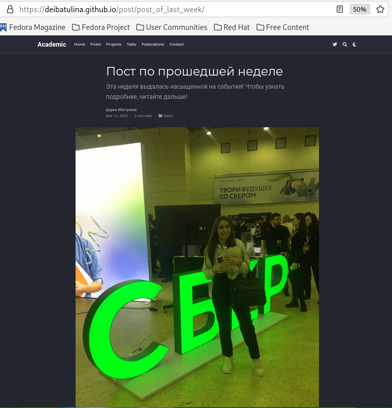{#fig:010 width=70%}

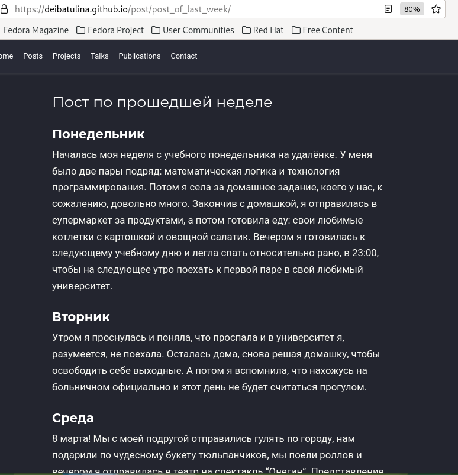{#fig:011 width=70%}

  Мы видим, что оба наши поста размещены на сайте в разделе "Posts" (рис. @fig:012):
  
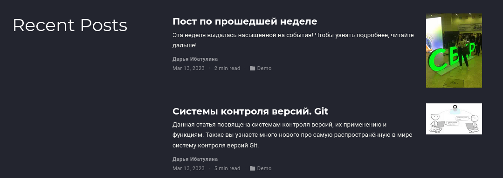{#fig:012 width=70%}
  
  
# Выводы

  В результате выполнения второго этапа индивидуального проекта я научилась добавлять информацию о себе и даже сделала две публикации.

# Список литературы{.unnumbered}

::: {#refs}
:::
