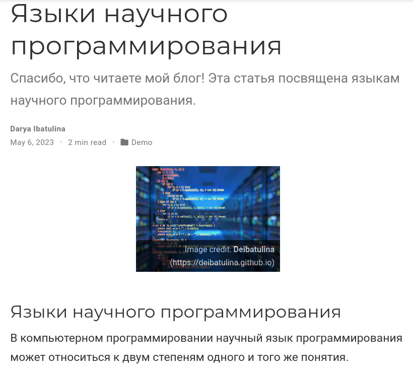

---
## Front matter
title: "Отчёт по пятому этапу индивидуального проекта"
subtitle: "Персональный сайт научного работника"
author: "Дарья Эдуардовна Ибатулина"

## Generic otions
lang: ru-RU
toc-title: "Содержание"

## Bibliography
bibliography: bib/cite.bib
csl: pandoc/csl/gost-r-7-0-5-2008-numeric.csl

## Pdf output format
toc: true # Table of contents
toc-depth: 2
lof: true # List of figures
lot: true # List of tables
fontsize: 12pt
linestretch: 1.5
papersize: a4
documentclass: scrreprt
## I18n polyglossia
polyglossia-lang:
  name: russian
  options:
	- spelling=modern
	- babelshorthands=true
polyglossia-otherlangs:
  name: english
## I18n babel
babel-lang: russian
babel-otherlangs: english
## Fonts
mainfont: PT Serif
romanfont: PT Serif
sansfont: PT Sans
monofont: PT Mono
mainfontoptions: Ligatures=TeX
romanfontoptions: Ligatures=TeX
sansfontoptions: Ligatures=TeX,Scale=MatchLowercase
monofontoptions: Scale=MatchLowercase,Scale=0.9
## Biblatex
biblatex: true
biblio-style: "gost-numeric"
biblatexoptions:
  - parentracker=true
  - backend=biber
  - hyperref=auto
  - language=auto
  - autolang=other*
  - citestyle=gost-numeric
## Pandoc-crossref LaTeX customization
figureTitle: "Рис."
tableTitle: "Таблица"
listingTitle: "Листинг"
lofTitle: "Список иллюстраций"
lotTitle: "Список таблиц"
lolTitle: "Листинги"
## Misc options
indent: true
header-includes:
  - \usepackage{indentfirst}
  - \usepackage{float} # keep figures where there are in the text
  - \floatplacement{figure}{H} # keep figures where there are in the text
---

# Цель работы

  Научиться создавать заготовку сайта на Github Pages.

# Задание

  Добавить к сайту все остальные элементы:

* Сделать записи для персональных проектов;
* Сделать пост по прошедшей неделе.;
* Добавить пост на тему по выбору:
- Языки научного программирования.

# Теоретическое введение

  Сайт, или веб-сайт (от англ. website: web — «паутина, сеть» и site — «место», букв. — «место, сегмент, часть в сети»), также веб-узел, — одна или несколько логически связанных между собой веб-страниц; также место расположения контента сервера. Обычно сайт в Интернете представляет собой массив связанных данных, имеющий уникальный адрес и воспринимаемый пользователями как единое целое. Веб-сайты называются так, потому что доступ к ним происходит по протоколу HTTP.
  
  Индивидуальный проект подразумевает размещение заготовки персонального сайта научного работника на GithubPages - сайт, созданный в репозитории GitHub.
  
  На сайте пользователь может размещать фотографии, посты, публиковать информацию о себе и указывать способы связи. Контент сайта зависит от его тематики и цели создания.
  
  При создании сайта я буду использовать язык разметки YAML, который расшифровывается как "ещё один язык разметки".

# Выполнение лабораторной работы

  Сначала мы сделаем записи для персональных проектов (рис. @fig:001).

{#fig:001 width=70%}

  Результат видим на сайте (рис. @fig:002).
  
{#fig:002 width=70%}

  Теперь напишем пост по прошедшей неделе (рис. @fig:003).
  
{#fig:003 width=70%}

  Пост отображается на сайте (рис. @fig:004).
  
{#fig:004 width=70%}

  Напоследок, пишем пост на тему: "Языки научного программирования" (рис. @fig:005).
  
{#fig:005 width=70%}

  И видим, что наш пост появился на сайте (рис. @fig:006).
  
{#fig:006 width=70%}

# Выводы

  В ходе выполнения пятого этапа индивидуального проекта я научилась делать записи для персональных проектов.

# Список литературы{.unnumbered}

::: {#refs}
:::
