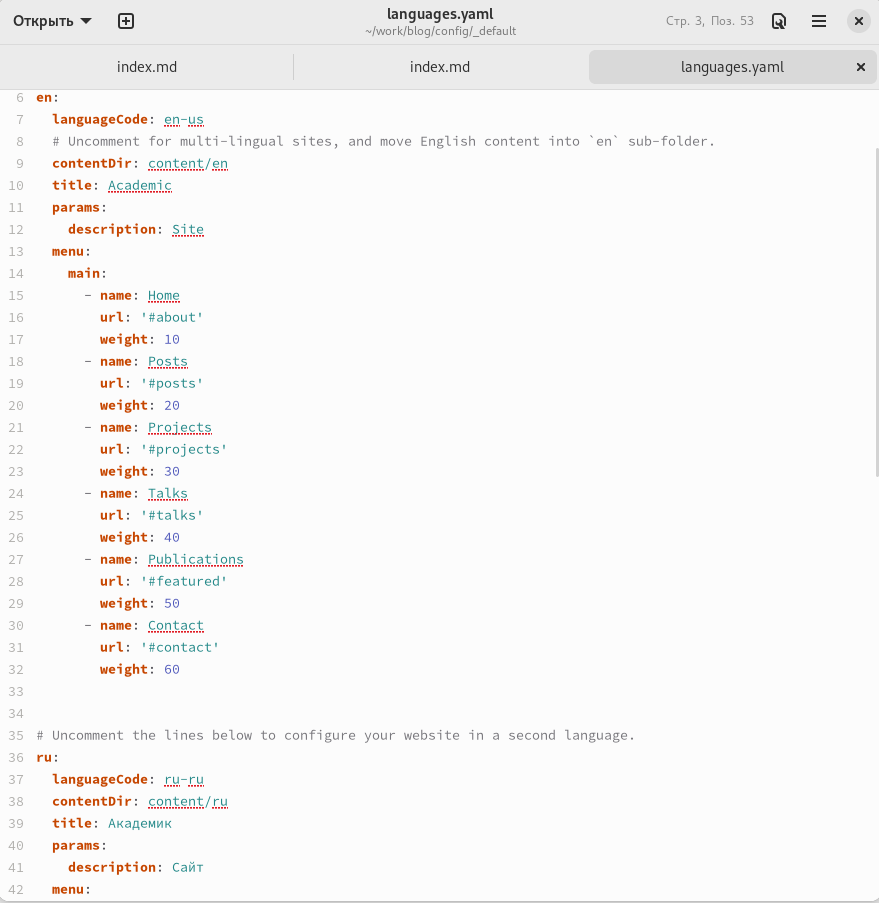
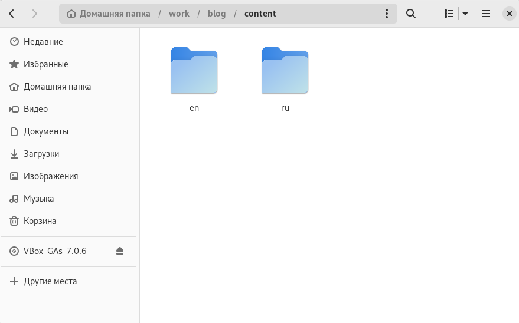
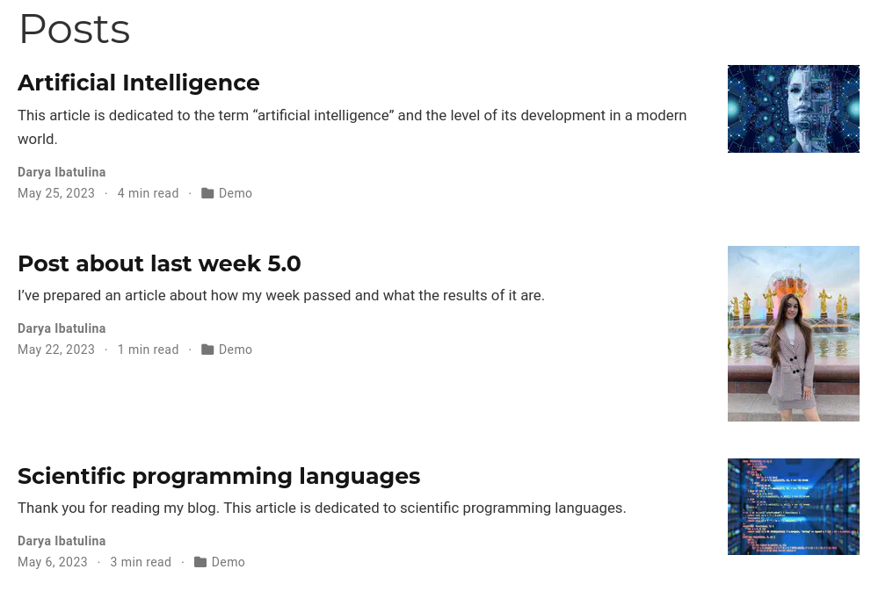
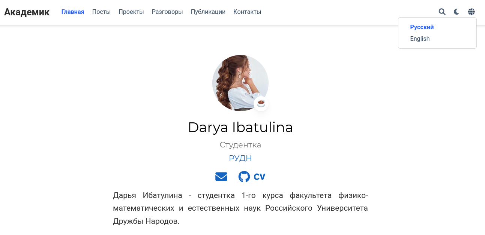

---
## Front matter
lang: ru-RU
title: "Презентация по шестому этапу индивидуального проекта"
subtitle: "Персональный сайт научного работника"
author:
  - Ибатулина Д.Э.
institute:
  - Российский университет дружбы народов, Москва, Россия
date: 25 мая 2023

## i18n babel
babel-lang: russian
babel-otherlangs: english

## Formatting pdf
toc: false
toc-title: Содержание
slide_level: 2
aspectratio: 169
section-titles: true
theme: metropolis
header-includes:
 - \metroset{progressbar=frametitle,sectionpage=progressbar,numbering=fraction}
 - '\makeatletter'
 - '\beamer@ignorenonframefalse'
 - '\makeatother'
---

# Информация

## Докладчик

:::::::::::::: {.columns align=center}
::: {.column width="70%"}

  * Ибатулина Дарья Эдуардовна
  * студентка группы НКАбд-01-22
  * Российский университет дружбы народов
  * [1132226434@pfur.ru](mailto:1132226434@pfur.ru)
  * <https://deibatulina.github.io>

:::
::: {.column width="30%"}

:::
::::::::::::::

# Вводная часть

## Актуальность

  Создание своего сайта очень важно для каждого современного человека, а в особенности это актуально для IT-специалиста.

## Цели и задачи

  Необходимо сделать на сайте поддержку двух языков, опубликовать пост по прошедшей неделе и статью на свободную тему.

# Основная часть

## Элементы сайта на двух языках

  В файлах languages.yaml и menus.yaml создаём элементы на английском языке.
  

## Папка content

  Данная папка разбита на 2 папки: en и rus.
  

## Контент на английском языке

  Добавляем посты на английском языке.
  

## Два языка на сайте

  Теперь на сайте отображается иконка смены языков.
  

# Заключительная часть

## Результаты

  Я научилась делать поддержку двуязычного сайта, попрактиковалась в написании постов.

## Итоговый слайд

  Работа над индивидуальным проектом невероятно увлекательна для меня!

